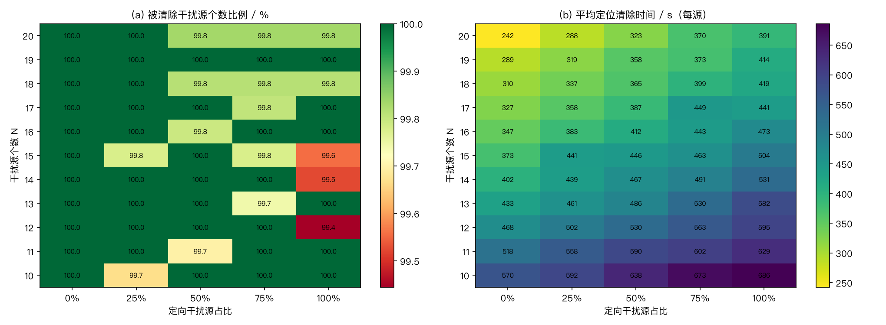
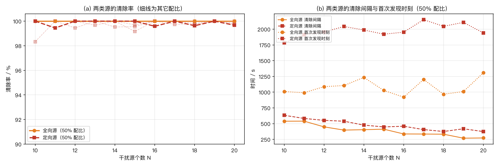

# 2026 高教社杯全国大学生数学建模竞赛 B 题
## 无线电干扰源的快速自动定位与清除 —— 完整建模、求解与验证

本仓库包含 B 题从**几何建模 → 算法设计 → 高保真模拟器 → 演练统计 → 多方法检验 → 三项模型改进 → 正式测试方案**
的全过程代码、中间结果与最终文档，可一键复现全部数字（含问题 3/4 的表 1 填报流程与实机运行程序）。

---

## 1 问题与主要结果

| 问题 | 内容 | 结果 |
|---|---|---|
| 问题 1 | 多检测点交会定位区域的直径算法，及"以直径为直径的圆能否覆盖该区域" | 给出三种独立算法（顶点枚举 / 旋转卡壳 / 支撑函数扫描），互校最大相对误差 **5.6×10⁻¹¹**；**直径圆一般不能覆盖**：随机布点覆盖率 96.6% / 86.0% / 80.0% / 74.2%（n=2/3/4/5），最坏需放大 **2/√3 = 1.1547** 倍（Jung 紧界）；给出 2R*/D = **1.147** 的显式反例与 O(m) 精确判据 |
| 问题 2 | 已知一个检测点的示向度，第二检测点的选择策略与候选区域 | 最优 **(d, α) = (1150–1200 m, ±30°)**，探测成功率 **99.7%**，命中后定位区域直径期望 **≈54 m**；候选区域 = 以 S₁ 为极点、首次示向度方向为极轴的 **d ∈ [1000,1300] m、\|α\| ∈ [20°,40°]** 左右对称双环形扇区（远源先验下移到 d≈1300 m、α≈20°，E[D] 仍为 52 m） |
| 问题 3 | 全向干扰源的自动搜索—定位—清除策略与算法 | 150 局演练：清除比例 **100.00%**（150/150 局全清），平均定位清除时间 **280.0 s/源**；对抗算例（所有源取下限 R=1000 m 且贴外圈）**100% 清除** |
| 问题 4 | 含定向干扰源（朝向未知）的扩展 | 150 局演练：清除比例 **100.00%**（150/150 局全清），平均 **504.1 s/源**；19 点"环绕"侦察集预报漏检率 0.13%，实测 0.14% |

**三个核心建模结论**

1. **定位区域 = 若干 2° 楔形的交集**（凸多边形，可能为空或无界）；两检测点下有界的充要条件是
   **示向度之差 > 2°**（4000 组数值验证 100% 吻合）——这直接解释了问题 2 中"第二点必须横向拉开"的硬约束。
2. **清除必须有保证性判据**：本文给出两条——① 候选区域的最小包围圆半径 ≤ 20 m 时走到圆心 `/clear` 必定命中；
   ② 用间距 33 m 的三角格点（覆盖半径 19.05 m < 20 m）对区域做"清除扫描"必定命中。
3. **侦察完备性可证明**：问题 3 要求侦察点集的 1000 m 圆盘并集覆盖目标圆域；
   问题 4 需更强条件——**任意源点都必须落在其 1000 m 内侦察点集的凸包中**（"环绕条件"），
   否则朝向背向的定向源会整体隐身。

---

## 2 模型改进（v2）与效果

在满足题面要求的 v1 基线之上，实现了三项改进（详见 `docs/` 中 v2 文档第 6 章），全部用**同种子 150 局对照实验**验证：

| 改进 | 做法 | 效果 |
|---|---|---|
| **① 滚动时域重优化调度（RHO）** | 每个决策时刻把"未访问侦察点 ∪ 已发现未清除源"当作在线 TSP，用最近邻 + 2-opt 重解巡线，只执行第一条腿，获得新观测后立即重规划 | 问题 3：行程 14.2 → **13.6 km**、时间 288.8 → **280.0 s**；问题 4：行程 27.6 → 24.9 km |
| **② 定向源朝向贝叶斯信念** | 为每个频道维护 (p, u) 联合假设集（朝向 5° 分箱），把背向 `no_signal` 转化为对朝向 u 的约束，边缘化后**主动绕到源的前向侧取数**（q = p̂ + 350·û）替代被动盲扫 | 问题 4：时间 536.0 → **504.1 s（−6.0%）**、请求数 360 → **287（−20.3%）**、行程 −4.0%，比例不变 |
| **③ 风险可控自适应侦察 + R 先验在线学习** | 用漏检概率 μ(C)=E_{q,u}[clamp((d₀−1000)/(b−1000))] 与期望漏检源个数 M̂=E[N\|data]−n_det 代替"最坏情况全覆盖"；用检测距离下界对 R 的先验上界 b 做贝叶斯更新 | 给出可调"时间—风险"曲线：θ=0（严格）100% / 280.0 s；θ=0.15 → 99.36% / 275.3 s；θ=0.5 → 99.36% / 274.9 s。**每省 1 个侦察点约让出 0.6% 清除比例**，默认取 θ=0 |

**v1 → v2 总账（各 150 局，同种子）**

| 问题 | 指标 | v1 | v2（推荐配置） | 变化 |
|---|---|---|---|---|
| 问题 3 | 清除比例 | 99.96% | **100.00%** | +0.04 pt |
| 问题 3 | 平均定位清除时间 | 288.8 s | **280.0 s** | **−3.0%** |
| 问题 3 | 平均行程 | 14.2 km | **13.6 km** | −4.5% |
| 问题 4 | 清除比例 | 99.86% | **100.00%** | +0.14 pt |
| 问题 4 | 平均定位清除时间 | 574.4 s | **504.1 s** | **−12.2%** |
| 问题 4 | 平均行程 | 27.6 km | **24.0 km** | −13.3% |
| 问题 4 | 平均请求数 | 357 | **287** | −19.5% |

推荐配置：**问题 3 = RHO + 严格覆盖侦察；问题 4 = RHO + 朝向贝叶斯信念 + 严格环绕侦察**（均为 θ=0）。

---

## 3 系统性多轮测试（N=10…20 × 全向/定向配比）

为验证策略的稳健性，做了 **1980 局**系统性演练（11 个源数 × 5 种全向/定向配比 × 30 局 + 全向专用对照 330 局），
合计 **29 700 个干扰源**，覆盖题面范围（N=10–16）与超出范围的压力区间（N=17–20）：

| 分组 | 清除比例 | 全清局数 | 平均定位清除时间 |
|---|---|---|---|
| 全部 1650 局（N=10–20） | **99.923%**（24 731/24 750） | 1631/1650 = 98.8% | 242–686 s/源 |
| 题面范围 N=10–16 | 99.912% | 1038/1050 = 98.9% | — |
| 扩展范围 N=17–20 | 99.937% | 593/600 = 98.8% | — |
| **全向源**（12 360 个） | **100.000%** | — | 清除间隔 269–538 s |
| **定向源**（12 390 个） | **99.847%** | — | 清除间隔 326–678 s |

关键发现：

1. **不随规模退化**：清除比例在 N=10…20 全域保持 99.4%–100%，全清率 93%–100%；
2. **漏检只发生在定向源**（19/19 例；全向源 0 漏检）：9 例从未被发现（环绕条件空隙）、10 例已发现未清除，
   实测漏检率 0.153% 与解析预报的环绕条件漏检率 f̄=0.13% 吻合 → 属**几何盲区**而非算法缺陷；
3. **定向源更"贵"**：平均首次发现时刻比全向源晚 ≈900–1000 s（背向半平面不可见），清除间隔长 20%–40%；
4. **规模摊薄固定成本**：平均时间 ≈ 838 − 30·N 秒（每增 1 个源，每源平均省约 30 s）；
5. **通用策略的代价**：为覆盖定向源必须用 19 点环绕侦察集，相对全向专用 8 点集多花 +17%（N=20）…+77%（N=10）。

完整数据与报告：
[`docs/B题_系统性多轮测试报告.pdf`](docs/B题_系统性多轮测试报告.pdf)（8 页）·
`outputs/results/sweep_trials.jsonl`（逐局明细）· `outputs/results/sweep_table.md`（全部表格）·
`outputs/figures/fig_sweep_*.png`（3 张图）





---

## 4 目录结构

```
.
├── data/                       原始数据（题目 PDF、附件 1–2、格式规范）
│   ├── B题.pdf
│   ├── 附件/附件1.docx（模拟器使用说明）  附件2.docx（通信接口与编程指南）
│   └── format2026.doc
├── docs/                       说明文档（PDF + Markdown）
│   ├── B题_建模与求解说明文档_v2.pdf        ← 主交付物（27 页，含三项改进）
│   ├── B题_建模与求解说明文档_v2.md
│   ├── B题_建模与求解说明文档.pdf           ← v1 基线完整文档（20 页）
│   ├── B题_建模与求解说明文档.md
│   └── B题_系统性多轮测试报告.pdf / .md     ← N=10…20 × 全向/定向配比 1980 局（8 页）
├── outputs/
│   ├── code/                   全部源码（与 work/ 同源，另含官方模拟器实机程序）
│   ├── figures/                全部插图（15 张：含 v1/v2 对照、三项改进示意图、多轮测试热力图）
│   └── results/                全部结果数据（JSON / JSONL：逐局明细、检验报告、侦察点集、1980 局扫描数据）
└── work/
    ├── lib/                    几何引擎 geom.py / 模拟器 sim.py / 策略 strategy.py(v1) 与 strategy2.py(v2)
    ├── results/                中间与最终结果（与 outputs/results 同源）
    ├── p1_study.py             问题 1 数值研究
    ├── p2_study.py, p2_refine.py   问题 2 网格优化与精细复核
    ├── cover_design.py         侦察点集设计（覆盖条件 + 环绕条件）
    ├── sim_study.py            问题 3/4 演练统计（v1，150 局 × 4 策略）
    ├── sim_study2.py           v2 三项改进对照实验（150 局 × 6 组）
    ├── verify.py, verify2.py  检验（计时回归 / 几何互校 / 不变量 / 对抗算例 / 复现性）
    ├── figures.py, figures2.py 出图
    └── official_robot.py       官方模拟器 HTTP+JSON 实机运行程序
```

---

## 5 复现步骤

环境：Python 3.12 + NumPy / SciPy / Matplotlib（文档 PDF 另需 pandoc + MacTeX/TeX Live）。

```bash
cd work
PY=python3

# ---- 几何与决策模型 ----
$PY p1_study.py          # 问题 1：三种直径算法互校、直径圆覆盖统计、反例搜索
$PY p2_study.py          # 问题 2：第二检测点极坐标网格优化
$PY p2_refine.py         # 问题 2：精细网格 + 先验敏感性 + 独立复算
$PY cover_design.py      # 侦察点集（问题 3 覆盖条件 / 问题 4 环绕条件与权衡表）

# ---- 演练统计与检验（自建高保真模拟器）----
$PY sim_study.py         # v1：150 局 × 4 策略（含朴素基线对比）
$PY sim_study2.py        # v2：150 局 × 6 组（RHO / 朝向信念 / 风险预算）
$PY verify.py            # v1 检验：计时回归、几何互校、不变量、对抗算例、复现性
$PY verify2.py           # v2 检验
$PY figures.py && $PY figures2.py      # 生成全部插图

# ---- 系统性多轮测试（N=10…20 × 全向/定向配比，1980 局，7 路并行约 18 分钟）----
TRIALS=30 WORKERS=7 $PY robust_sweep.py
$PY sweep_report.py       # 生成汇总表(sweep_table.md)与热力图

# ---- 文档（LaTeX/xelatex，12pt 版式）----
cd .. && python3 outputs/code/build_pdf_v2.py "outputs/B题_建模与求解说明文档_v2.md"

# ---- 正式测试：官方模拟器实机运行 ----
python3 outputs/code/official_robot.py --robot-id <参赛队号> --problem 3
python3 outputs/code/official_robot.py --robot-id <参赛队号> --problem 4 --conservative
```

全部随机过程使用固定种子（`np.random.default_rng(seed)`），重复运行结果**逐位一致**
（`work/results/verify*.json` 中 `reproducibility_*: all_identical = true`）。

`official_robot.py` 实现了官方模拟器要求的全部细节：4 条指令串行发送、`request_id` 幂等重试、
HTTP 状态码与 `accepted` 双检查、按 `/enter` 返回的 `remaining_real_duration_s` 控制现实时间、
本地行为日志 `local_log_<队号>.jsonl`（已在 `.gitignore` 中排除）。

---

## 6 检验证据（摘要）

| 检验 | 方法 | 结果 |
|---|---|---|
| 模拟器计时一致性 | 复现附件 1 第 3 节指令-计时示例 | 虚拟时刻 **105 / 111 / 194 / 199**，与题面完全一致 |
| 定位区域直径 | 顶点枚举 / 旋转卡壳 / 支撑函数扫描 | 最大相对偏差 5.6×10⁻¹¹ / 9.5×10⁻⁶ |
| 最小包围圆 | 随机增量算法 vs 1/2/3 点精确枚举 | 最大半径偏差 2.4×10⁻¹¹ m |
| 有界性判据 | 法向凸包判据 vs 误差弧公共方向判据 | 4000 组一致率 100%（两点解析判据） |
| 策略不变量 | 时间分解与总时间、虚拟时限、清除标记真值一致性 | 误差 ≤4.6×10⁻¹² s，全部满足 |
| 对抗算例 | 全部源 R=1000 m 且贴外圈（覆盖最不利） | 问题 3 **100%**（25/25），问题 4 99.69%（24/25） |
| 复现性 | 同种子重复运行 | 逐位一致 |
| 解析预报 vs 实测 | 环绕条件漏检率 f̄ 预报 0.13% | 150 局实测 0.14%（3/2257） |

---

## 7 数据来源说明

`data/` 目录中的题目与附件来自竞赛主办方公开发布的题面材料，仅用于复现本仓库的计算结果，
详见 [`data/README.md`](data/README.md)。该目录可安全删除：代码只依赖其中**附件 1/2 的规则文本**，
而规则已固化在 `work/lib/sim.py` 的常量与注释中。

官方"无线电干扰源环境模拟器"需参赛队号在线登录、由主办方网盘分发，**未包含**在本仓库中；
仓库内的演练统计全部来自自建高保真模拟器（`work/lib/sim.py`），并用附件 1 的计时示例做了回归。

## 8 许可协议

本仓库作者原创的代码、数学模型与说明文档采用 **MIT License**（见 [`LICENSE`](LICENSE)），
可自由使用、修改、分发（保留版权声明即可）；许可覆盖范围见 [`NOTICE.md`](NOTICE.md)。

`data/` 目录中的竞赛题面与附件为**第三方材料**，版权归竞赛主办方所有，不在 MIT 许可范围内。
