# 无线电干扰源的快速自动定位与清除

> 全文合稿（问题一至四）。问题一、二、三以 `main` 分支 `paper/B题_问题1-3.md` 为底；问题四按 `pjx` 的 26 点环抱证书与三段式合并巡回写入。

## 摘要

针对目标圆域内无线电干扰源的快速定位与清除，本文将测向误差写成有界集合，而不是随机噪声。各检测点对应一个张角 $2^\circ$ 的误差锥，定位区域就是这些锥的公共交集。四问共用同一套几何对象：问题一给出交会多边形的直径与覆盖判定，问题二在此之上选择第二检测点，问题三用覆盖网搜索全向源，问题四把覆盖改成环抱证书以检出定向源。程序可在官方模拟器上直接运行。

问题一把定位区域看成凸多边形。直径 $d$ 是全部顶点连线（边和对角线）里最长的一条；以 $d$ 为直径的圆，圆心只能取这条线段的中点，再检验各顶点到中点是否都不超过半径。等边三角形给出反例：第三顶点到中点为 $\sqrt{3}\,d/2>d/2$。两站交会算例直径 $d=70.419$ m，直径圆可以覆盖；三站环绕时直径圆盖不住，但最小包围圆半径 $16.288$ m，仍小于 $20$ m 的清除半径。能否一次清除由最小包围圆半径是否不超过 $20$ m 决定，与直径圆是否覆盖无关。

问题二的关键是：干扰源到 $S_1$ 的距离未知，第二点只能落在某个候选区域里，再按假设从中选出一个点。候选区由交会角约束给出，分居示向度两侧，呈蝶形。四种假设对应四个点，均由同一张网格上的明确准则给出；时间流派 $(500,250)$ 的成功样本期望约 $268$ s，用于问题三。问题四因定向波束改用小侧偏。两次仍压不进 $20$ m 时，沿当前长轴的法向再切一刀，远目标直径可由 $164.5$ m 压到 $33.1$ m。计入平均时间的，只包括最小包围圆半径已经不超过 $20$ m 的成功样本。

问题三把未知源数变成有限点判空：按接收半径下界 $1000$ m 铺七点覆盖网（原点加 $1150$ m 六等分），最坏间隙 $988.5$ m、余量 $11.5$ m。机器狗原点扫频、按时间赌注 $(500,250)$ 追击、环网补漏。正式测试三局均 $100\%$ 清除，平均定位清除时间 $285.34$ s/个（$259.48$–$323.51$ s）。同一策略在官方模拟器 $19$ 局演练中 19/19 全清，平均 $352\pm 31$ s/个（$290$–$402$ s）。关掉覆盖网补漏后清除率降至 $56.3\%$。

问题四定向源使无信号失去距离含义。判空改为方位环绕：探针绕候选点的最大间隙不超过 $180^\circ$。采用含圆外停点的 $26$ 点骨架（$400$ m$\times 6$、$1300$ m$\times 8$、$1900$ m$\times 12$），粗网格最坏间隙恰为 $180.0^\circ$；第二点改小侧偏。正式测试三局均 $100\%$ 清除，平均 $600.26$ s/个（$518.78$–$698.52$ s）。同一策略官方 $17$ 局演练 17/17 全清，平均 $593\pm 95$ s/个（$411$–$740$ s）。把证书换成七点网或圆内环绕，清除率分别降至 $94.1\%$ 与 $96.0\%$。

**关键词：** 交会定位；误差锥；最小包围圆；第二检测点；覆盖网；环抱证书；定向干扰源

## 一、问题重述

目标区域是半径 $1800$ m 的圆盘。无人机器狗可在圆内直线移动，速度 $5$ m/s；停下后对指定频道测向，单次 $5$ s。测向误差有界：真实方位角与示向度之差不超过 $\delta=1^\circ$。有效接收半径 $R\in[1000,1500]$ m。机器狗走到距源不超过 $20$ m 处，即可光学定位并激光清除；不超过 $5$ m 时信号过强，无法测向，但可直接清除。

问题一给出若干检测点及其示向度，要求计算交会得到的多边形定位区域的直径，并判断以该直径为直径的圆能否覆盖该区域。这里的定位区域只由示向度误差锥交会得到，不叠加目标圆域或接收半径圆盘。

问题二已知某全向干扰源已在第一检测点测得示向度，要求给出第二个检测点的选择策略及其候选区域。所谓较好的定位，是指两次（必要时三次）测向后，定位区域的最小包围圆半径不超过 $20$ m，从而一次进圈即可清除，同时尽量缩短移动与测量时间。

问题三的圆内有 $10$–$16$ 个全向干扰源，分别占用频道 $1$–$20$ 中的若干个，每频道至多一个源。机器狗从原点、频道 $1$ 出发，要在虚拟时间与约 $20$ 分钟现实时限内，尽量提高清除比例、缩短平均定位清除时间。

问题四在问题三基础上引入定向干扰源。定向源的个数与朝向均未知，只在定向方向两侧各 $90^\circ$ 的闭半平面内辐射。硬约束是清除比例 $100\%$，并在此前提下缩短平均定位清除时间。

## 二、问题分析

### 2.1 问题一

问题一要求根据若干检测点及其示向度，确定交会得到的多边形定位区域 $P$，计算直径 $d$，并判断以该直径为直径的圆能否覆盖 $P$。示向度存在有界误差 $\pm 1^\circ$，单次测向只能将干扰源限制在以检测点为顶点、张角为 $2^\circ$ 的误差锥内。各锥取公共交集，即得到 $P$。当各锥对向交会时，$P$ 为凸多边形。

凸集的直径在极点处取得，因而 $d$ 等于全部顶点两两距离的最大值。题面进一步要求判断以该直径为直径的圆能否覆盖 $P$。圆盘内最远点对只能是对径点，故若这样的覆盖圆存在，圆心唯一确定为直径端点的中点；再检验各顶点是否落入该圆即可。一般凸多边形并不保证落进直径圆，等边三角形给出反例，因此覆盖判定必须逐点进行。半平面交会用于求出顶点；单站或示向度近乎同向时公共区域无界，直径没有有限值。

### 2.2 问题二

第一次测向之后，干扰源的方位已知而距离未知，可行域收缩为以 $S_1$ 为顶点的细长楔形。因此第二检测点不存在唯一最优坐标，而应落在由交会角约束确定的候选区域内；再根据对未知距离的假设，从该区域内选出具体测点。交会角 $\gamma$ 决定定位区域的形状；一阶平行四边形近似给出直径关于 $\gamma$ 的闭式，从而说明 $\gamma=90^\circ$ 时定位效果最好。距离未知时，为使各种可能距离仍保持可用交会角，第二点必须离开示向度射线足够远，候选区因此分居两侧，呈蝶形。四种准则在同一张网格上各给一个采用点；问题三采用时间赌注 $(500,250)$，问题四因定向波束改用小侧偏。两次不够，就沿长轴法向再测。

### 2.3 问题三

问题三的难点不是定位，而是不知道有几个源、占用哪些频道时如何保证一个不漏。全向源无信号只有两种可能：该频道已无未清源，或检测点已超出接收半径。一组监听点若能用半径 $1000$ m 的接收圆盘盖住整个 $1800$ m 圆域，某频道在这些点全无信号即可判空。覆盖网最坏间隙必须小于 $1000$ m；$4$–$6$ 点不够，原点加 $1150$ m 六等分的七点网最坏间隙 $988.5$ m。定位清除复用问题一、二：原点扫频、追击、环网补漏，第二点用时间赌注 $(500,250)$。

### 2.4 问题四

定向源只在发射方向两侧各 $90^\circ$ 辐射，“无信号”不再等于超距。问题三的圆盘覆盖因此失效。判空改为方位环绕：绕任意候选点，落在 $1000$ m 内的探针最大方位间隙不超过 $180^\circ$，则任意朝向必被听到。圆缘外向源使圆内探针间隙达到 $360^\circ$，证书必须含圆外停点。构造 $26$ 点骨架后网格核验最坏间隙 $180^\circ$。追击改小侧偏，避免沿示向度走过源点掉进背向阴影。

## 三、模型假设

H1　示向度误差有界 $[-\delta,\delta]$，$\delta=1^\circ$；同一地点重复测量误差不变（题面附录）。

H2　测向机与干扰源视为同一平面；问题一至三中干扰源全向，接收只取决于距离（题面）。

H3　示向度是检测点指向干扰源的方位角，可行域只取检测点前方的误差锥（题面定义）。

H4　问题一的定位区域只由误差锥交会得到，不叠加目标圆域与有效接收半径圆盘（与附录多边形交会区一致）。

H5　问题二计时：移动按 $5$ m/s 直线，单次测量、清除各 $5$ s；题面未给转向时间，故不另计。问题一不涉及移动（题面附录）。

H6　有效接收半径 $R\in[1000,1500]$ m，未知但对该源固定；问题三覆盖判空按最坏 $1000$ m（题面附录）。

H7　问题二表 2 的 $E[T]$：假定源在 $1800$ m 圆内均匀出现，于是距离 $D$ 的密度正比于 $D$。题目没有别的距离先验。问题一的直径与覆盖不用这条。

H8　问题二称两步成功：两次测向后 $R_{\mathrm{MEC}}\le 20$ m；问题三第二点采用时间赌注 $(500,250)$。

H9　定向源可检区域为张角 $180^\circ$ 的闭半平面与接收圆盘的交；朝向固定但未知（问题四）。

H10　检测点允许在圆域外；环抱证书外环取 $1900$ m（问题四，题面坐标范围）。

## 四、符号说明

| 符号 | 含义 | 单位 | 首次出现 |
| --- | --- | --- | --- |
| $S_i=(x_i,y_i)$ | 第 $i$ 个检测点 | m | §5.1 |
| $N$ | 检测点个数 | — | §5.1 |
| $\theta_i$ | 在 $S_i$ 处测得的示向度 | 度 | §5.1 |
| $\delta=1^\circ$ | 测向误差限 | 度 | §2.1 |
| $G$ | 干扰源位置 | m | §5.1 |
| $C_i$ | 第 $i$ 个检测点的误差锥 | — | §5.1 |
| $P=\bigcap_i C_i$ | 交会定位区域 | — | §5.1 |
| $V(P)$ | $P$ 的顶点集，边数至多 $2N$ | — | §5.1 |
| $d=d(P)$ | $P$ 的直径（题面符号） | m | §5.1 |
| $R_{\mathrm{MEC}}$ | $P$ 的最小包围圆半径 | m | §5.1 |
| $C_{\mathrm{MEC}}$ | 最小包围圆圆心 | m | §5.1 |
| $\mathbf{n}_i$ | 从检测点看、指向误差锥内侧的单位法向 | — | §5.1 |
| $D=\|G-S_1\|$ | 干扰源到第一检测点的距离 | m | §6.1 |
| $d_i=\|G-S_i\|$ | 第 $i$ 个检测点到源的距离 | m | §6.2 |
| $\gamma$ | 交会角 $\angle S_1 G S_2$ | 度 | §6.2 |
| $J$ | 测向关于源坐标的雅可比 | 1/m | §6.3 |
| $D_{\mathrm{loc}}$ | 一阶平行四边形的直径 | m | §6.3 |
| $t,h$ | 第二点局部坐标：沿示向度的赌注与侧偏 | m | §6.1 |
| $s_{\min}$ | 可用交会角的正弦下界，取 $1/2$ | — | §6.5 |
| $K$ | 两步成功常数，$K=40/(2\tan 1^\circ)\approx 1146$ | m | §6.4 |
| $\kappa$ | 最小包围圆半径与直径之半的比 | — | §6.3 |
| $W$ | 第一次测向后干扰源的候选集 | — | §6.1 |
| $\mathcal{C}$ | 第二检测点的候选区域 | — | §6.5 |
| $\rho$ | 救援测点相对当前最小包围圆圆心的偏移 | m | §6.7 |
| $E[T]$ | 单目标定位清除总时间的期望 | s | §6.6 |
| $R$ | 有效接收半径，$R\in[1000,1500]$ | m | §7.1 |
| $r$ | 问题三环网监听半径 | m | §7.1 |
| $\mathrm{maxgap}(G)$ | 探针绕候选点 $G$ 的最大方位间隙 | 度 | §8.1 |
| $\mathcal{S}$ | 问题四 $26$ 点环抱骨架 | — | §8.1 |

## 五、问题一的模型建立与求解

### 5.1 模型建立

将 $N$ 次观测记为 $\{(\theta_i,S_i)\}_{i=1}^{N}$。真实源的可行位置集合由各次观测的误差锥给出：

$$
C_i=\{\,X:\ \operatorname{atan2}(X-S_i)\in[\theta_i-\delta,\ \theta_i+\delta]\,\},\qquad P=\bigcap_{i=1}^{N}C_i .
$$

**定义 1（误差锥）.** 检测点 $S_i$ 的示向度为 $\theta_i$，测向误差限 $\delta=1^\circ$，真实源 $G$ 位于以 $S_i$ 为顶点、张角 $2\delta$ 的锥内：

$$
C_i=\{\,X:\ \theta_i-\delta\le \operatorname{atan2}(X-S_i)\le \theta_i+\delta\,\}.
$$

**定义 2（交会定位区域）.** 各误差锥的公共交集

$$
P=\bigcap_{i=1}^{N}C_i .
$$

$C_i$ 的两条边界直线过 $S_i$，方向分别为 $\theta_i-\delta$ 与 $\theta_i+\delta$。取指向锥内的单位法向：$\theta_i-\delta$ 边为方向向量逆时针旋转 $90^\circ$，$\theta_i+\delta$ 边为顺时针旋转 $90^\circ$。记 $\mathbf n_{ij}$ 为第 $j$ 条边界的内法向、$o_{ij}$ 为该直线上一点，则

$$
P=\{\,X:\ (X-o_{ij})\cdot\mathbf n_{ij}\ge 0,\quad j=1,2,\ i=1,\dots,N\,\}.
$$

共 $2N$ 个闭半平面，因而 $P$ 凸。顶点取相邻边界直线的交点，仅保留同时落在全部半平面内的交点；该顶点集是算法 1 第 1 步的输入。当 $N\ge 2$ 且各锥对向交会时 $P$ 有界，边数不超过 $2N$，见图 1。

**模型准备.** 题面只给出误差界 $[-\delta,\delta]$，不给出误差分布。最小二乘将测向差视为随机噪声，输出概率椭圆，需要分布假设；本题将可行域取为半平面的交，只使用该误差界。

| 方法 | 所需信息 | 输出 |
| --- | --- | --- |
| 最小二乘 / 概率椭圆 | 误差分布 | 置信椭圆 |
| 集合估计 / 半平面交 | 仅 $[-\delta,\delta]$ | 可行凸集 $P$ |

图 1(a) 画出两锥如何交出 $P$。为使交会可见，图中将 $\pm 1^\circ$ 放大为 $\pm 8^\circ$；图 1(b) 与后文算例改回真实 $\pm 1^\circ$。两个示向度的圆周距离若不超过 $2^\circ$，公共区域无界，直径没有定义，判别方法见定理 2。

**定义 3（直径）.** 有界凸区域 $P$ 的直径（题面符号 $d$）为

$$
d=d(P)=\max_{u,v\in V(P)}\|u-v\|=\max_{X,Y\in P}\|X-Y\| .
$$

凸集上的最远点对在顶点处取得，故在顶点集上枚举即可：计算全部顶点两两间的距离，即边和对角线，最长的一条就是直径，见图 1(b)。

**图 1**　(a) $S_1,S_2$ 的误差锥交出 $P$（张角放大）；(b) 真实 $\pm 1^\circ$ 下的凸四边形，粗线为全部顶点连线中的最长者，即直径。

**第一问第二小问（直径圆覆盖）.** 设 $A,B$ 达到直径，$\|A-B\|=d$。若覆盖圆即为直径圆，它必须盖住 $A$ 和 $B$；圆内最远的两点只能是对径点，故圆心只能取

$$
O=\frac{A+B}{2},\qquad R=\frac{d}{2}.
$$

再检查各顶点到 $O$ 的距离是否都不超过 $R$：圆盘是凸集，顶点都在圆内则 $P$ 在圆内，图 2(a) 画出这一检验。反例：等边三角形以底边为直径作圆，第三顶点到圆心的距离为 $\sqrt{3}\,d/2>d/2$，见图 2(b)。

**图 2**　(a) 圆心取直径中点 $O$，虚线为各顶点到 $O$ 的距离；(b) 等边三角形反例：第三顶点在直径圆外。

直径圆盖不住，只说明以 $d$ 为直径、以直径中点为圆心的那个圆不够大；$P$ 仍可能被其它圆心的圆盖住。盖住 $P$ 的最小圆是最小包围圆，圆心记为 $C_{\mathrm{MEC}}$，半径记为 $R_{\mathrm{MEC}}$。

**引理 1（Jung 定理，见文献 [5]）.** 直径为 $d$ 的平面紧集，其最小包围圆半径满足

$$
\frac{d}{2}\le R_{\mathrm{MEC}}\le \frac{d}{\sqrt{3}}\approx 0.577\,d.
$$

最小包围圆一般不是外接圆。下界取等：直径圆已经盖住该集，最小包围圆就是这个两点圆。上界取等：集合是等边三角形，这时最小包围圆碰巧是三顶点的外接圆，半径 $2/\sqrt{3}$（边长 $2$ 时约 $1.155$），见图 3(a)。证明见文献 [5]。

**定理 1（最小包围圆的结构）.** 最小包围圆由 $P$ 的顶点确定，只有两类：① 某两个顶点为直径端点的圆（圆心即中点）；② 某三个顶点的外接圆，且圆心落在这三点构成的三角形内部（锐角三角形）。钝角三角形的外接圆心在形外，半径大于直径之半，不会是最小包围圆。因此不是“凡三角形就取外接圆”；枚举上述两类即可。

**算法 1（直径、直径圆覆盖与最小包围圆）**

输入：顶点集 $V(P)$，$n=|V(P)|\le 2N\le 6$。输出：直径 $d$、直径圆是否覆盖、$(C_{\mathrm{MEC}},R_{\mathrm{MEC}})$。

1. 枚举顶点对，取最远的两点 $A,B$，令 $d\leftarrow\|A-B\|$（直径定义）；
2. 取 $O\leftarrow(A+B)/2$、$R\leftarrow d/2$；若所有顶点 $V_k$ 满足 $\|V_k-O\|\le R$ 则判“覆盖”，否则“不覆盖”；
3. 枚举顶点对：在覆盖全部顶点、以这两点为直径端点的圆中取半径最小者；
4. 枚举顶点三元组：在覆盖全部顶点的三点外接圆中取半径最小者；
5. 返回第 3、4 步中半径较小者，作为 $C_{\mathrm{MEC}},R_{\mathrm{MEC}}$。

由定理 1，最小包围圆必在第 3、4 步的候选之中；复杂度 $O(n^3)$。

**清除判据.** 一次进圈保证清除，当且仅当存在点 $C$ 使 $P\subset B(C,20)$，即

$$
P\subset B(C,20)\iff R_{\mathrm{MEC}}\le 20 .
$$

取 $C=C_{\mathrm{MEC}}$ 即得充分性；若 $R_{\mathrm{MEC}}>20$，则 $P$ 中必有一点落在 $20$ m 之外，$G$ 可能正是该点，故必要性成立。该判据只用到本问的 $P$；本问第一问第二小问只回答直径圆能否覆盖，能否一次清除看 $R_{\mathrm{MEC}}\le 20$。

图 3 对照两个判据。算例 G 的直径圆不覆盖，但 $R_{\mathrm{MEC}}=16.288<20$ m，可以清除；算例 B 的直径圆覆盖，但 $R_{\mathrm{MEC}}=35.209>20$ m，两次测向不足以清除；等边三角形给出覆盖缺口的上界 $d/\sqrt{3}$。

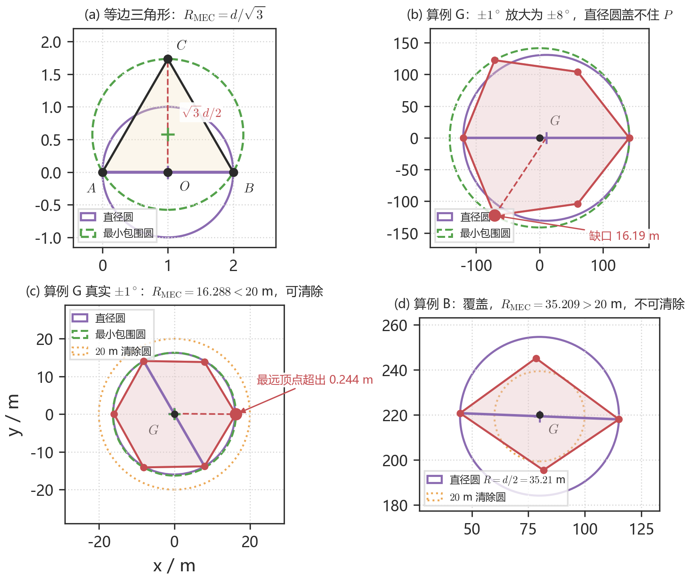

**图 3**　(a) 等边三角形（算例 E）：直径圆圆心 $(1,0)$、半径 $1$，最小包围圆即外接圆，圆心 $(1,1/\sqrt{3})$、半径 $2/\sqrt{3}$，$R_{\mathrm{MEC}}=d/\sqrt{3}$。(b) 算例 G 把 $\pm 1^\circ$ 放大为 $\pm 8^\circ$（与图 1 相同的示意惯例）：$d=261.37$ m，$R_{\mathrm{MEC}}=141.29$ m，直径圆盖不住 $P$，最远顶点缺口 $16.19$ m。(c) 算例 G 真实 $\pm 1^\circ$：$d=32.252$ m，直径圆 $R=d/2=16.126$ m，最远顶点超出 $0.244$ m，$R_{\mathrm{MEC}}=16.288<20$ m，可清除。(d) 算例 B：$d=70.419$ m，直径圆覆盖，$R_{\mathrm{MEC}}=35.209>20$ m，不可清除。

**定理 2（有界性判据）.** 每个半平面记为 $\{X:(X-o_i)\cdot\mathbf{n}_i\ge 0\}$，$\mathbf{n}_i$ 指向可行域一侧。令 $\alpha_i=\operatorname{atan2}(n_{i,y},n_{i,x})$，按角度排序列为 $\alpha_{(1)}\le\cdots\le\alpha_{(m)}$，相邻两个法向（含首尾闭合）的夹角为

$$
g_k=\alpha_{(k+1)}-\alpha_{(k)}\ \ (k<m),\qquad g_m=\alpha_{(1)}+2\pi-\alpha_{(m)},\qquad g_{\max}=\max_{k}g_k .
$$

则 $P$ 有界当且仅当 $g_{\max}<\pi$。若 $g_{\max}\ge\pi$，取最大间隙的角平分方向 $\alpha^{*}$（跨越 $0$ 时右端按 $\alpha_{(1)}+2\pi$ 计）的反向

$$
\mathbf{u}=-(\cos\alpha^{*},\ \sin\alpha^{*}),\qquad \alpha^{*}=\frac{1}{2}\bigl(\alpha_{(k^{*})}+\alpha_{(k^{*}+1)}\bigr),\qquad k^{*}=\arg\max_{k}g_k,
$$

则 $\mathbf{n}_i\cdot\mathbf{u}\ge 0$ 对所有 $i$ 成立，沿 $\mathbf{u}$ 可走到无穷。两个示向度圆周距离不超过 $2^\circ$ 时即属此情形（算例 F）。几何解释见附图 1。

### 5.2 模型求解

算法流程见附图 2：$N<2$ 或法向角间隙 $\ge 180^\circ$（定理 2）判为无界；否则边界直线两两求交得顶点，再按算法 1 求直径、直径圆覆盖与最小包围圆。无界区域讨论直径无意义，需要增加或调整检测点。

表 1 汇总七个算例。

**表 1**　问题一算例汇总（“可清除”一列按 $R_{\mathrm{MEC}}\le 20$ m 判定；直径列为题面符号 $d$）

| 算例  | 构型                       | 状态        | 顶点数     | $d$ (m) | 直径圆覆盖 | $R_{\mathrm{MEC}}$ (m) | 可清除 |
| --- | ------------------------ | --------- | ------- | ------- | ----- | ---------------------- | --- |
| A   | 单站，单个误差锥                 | UNBOUNDED | —       | —       | —     | —                      | —   |
| B   | 两站对向，交会四边形               | OK        | 4       | 70.419  | 是     | 35.209                 | 否   |
| C   | 三站切入，交会六边形               | OK        | 6       | 49.800  | 是     | 24.900                 | 否   |
| D   | 两站示向度相差 $180^\circ$，锥不相交 | EMPTY     | —       | —       | —     | —                      | —   |
| E   | 边长 $2$ 的等边三角形（几何核验）      | OK        | 3       | 2.000   | 否     | 1.155                  | —   |
| F   | 两站示向度相同                  | UNBOUNDED | 1（有限顶点） | —       | —     | —                      | —   |
| G   | 三站均匀环绕原点，$800$ m         | OK        | 6       | 32.252  | 否     | 16.288                 | 是   |

表中“覆盖”只回答第一问的第二小问：以 $d$ 为直径、以直径中点为圆心的圆能否盖住 $P$。B、C 两行说明“覆盖”并不意味着能一次清除（$R_{\mathrm{MEC}}$ 为 $35.209$、$24.900$ m，都超过 $20$ m）；G 行说明清除也不要求“覆盖”。

算例 B 四个顶点为 $(81.714,195.462)$、$(115.159,218.014)$、$(78.375,245.150)$、$(44.794,220.758)$，直径端点为第二、第四顶点，中点到各顶点均不超过 $35.209$ m，故直径圆覆盖。算例 G 的构型是：源在原点，三站为 $(800,0)$、$(-400,\pm 400\sqrt{3})$，示向度指向原点。直径圆盖不住两个顶点，见表中“否”；但 $R_{\mathrm{MEC}}=16.288<20$，圆心取 $C_{\mathrm{MEC}}$ 后 $P$ 整体落入清除圆，见图 3。表中“直径圆覆盖=否”只回答问题一的第二问，不表示该源不能清除；能否清除只看 $R_{\mathrm{MEC}}$。各算例的站址、示向度与复现入口见附录 C。

**模型检验.** ① 与暴力搜索对照：对算例 B、C、G，以 $2$ cm 步长网格枚举最小包围圆圆心、以 $1$ cm 步长采样多边形边界枚举直径，$R_{\mathrm{MEC}}$ 与 $d$ 的最大偏差分别为 $0.37$ cm 与 $0.00$ cm，属网格分辨率量级；② 退化与边界：单站（A）与同向两站（F）判为无界，相背两站（D）判为空集，单点退化的直径取 $0$，共线三点的直径等于两端距离，均与人工判断一致；③ 量纲与相似性：输入只有长度（m）与角度（度），将算例 B 整体放大 $k=0.5,2,3$ 倍后 $d$ 与 $R_{\mathrm{MEC}}$ 精确放大同一倍数（相对误差 $<10^{-12}$），算法与尺度无关。

## 六、问题二的模型建立与求解

### 6.1 第一次测向之后

第一次测向之后，方向已知、距离未知。干扰源落在 $S_1$ 示向度的楔形里，见图 4。因此第二点不可能有唯一最优坐标：它应当落在某个候选区域内，再按对未知距离的假设选出一个具体的点。

**图 4**　标出 $S_1$ 与示向度 $\theta_1$。真实张角仅 $\pm 1^\circ$，图中放大至 $\pm 8^\circ$。空心圆表示距离未知。

以 $S_1$ 为原点、测得示向度为极轴，第二点写成 $S_2=S_1+t\mathbf{e}_\theta+h\mathbf{e}_\theta^{\perp}$。$t$ 是对未知 $D=\|G-S_1\|$ 的纵向猜测，$h$ 是侧偏。沿示向度走则两次共线，交会无界，所以必须有侧偏。

### 6.2 交会角

记 $\varepsilon$ 为真实方向相对测得轴的偏角。$\varepsilon=0$ 时，$S_1,G$ 在极轴上，$S_2=(t,h)$，在 $\triangle S_1GS_2$ 中对边 $h$ 对应 $\gamma=\angle S_1GS_2$，故

$$
\sin\gamma=\frac{\lvert h\rvert}{d_2},\qquad d_2=\sqrt{(D-t)^2+h^2}.
$$

一般情形视线转过 $\varepsilon$，有 $\sin\gamma=\lvert h\cos\varepsilon-t\sin\varepsilon\rvert/d_2$。图 5 标出 $t,h,d_1,d_2,\gamma$。侧偏越大、第二点越靠近源，交会角越接近直角。

**图 5**　$\varepsilon=0$ 时的直角三角形关系。本图 $t=h=500$ m，$D=800$ m，$\gamma=59^\circ$。

### 6.3 一阶平行四边形与 $D_{\mathrm{loc}}$

设计阶段需要能直接看出 $(t,h,D)$ 如何影响直径。精确区域仍是问题一的凸多边形；这里做一次一阶展开，得到只看 $d_1,d_2,\gamma$ 的闭式用于选点，程序终判仍回到问题一的多边形算法。推导分四步。

（1）示向度的梯度。第 $i$ 站示向度 $\varphi_i=\mathrm{atan2}(y-S_{iy},x-S_{ix})$ 对源坐标的梯度是视线法向除以距离：

$$
\nabla\varphi_i=\frac{n_i}{d_i},\qquad n_i\perp(G-S_i),\ \|n_i\|=1.
$$

沿视线方向走，方位角不变；垂直于视线走，变化最快，速率是 $1/d_i$。

（2）两站合并。把两站写在一起：$\delta\varphi=J\,\delta x$，其中

$$
J=\begin{pmatrix} n_1^{\top}/d_1 \\ n_2^{\top}/d_2 \end{pmatrix},\qquad \det J=\frac{\sin\gamma}{d_1 d_2}.
$$

共线时 $\sin\gamma=0$，$J$ 不可逆，与交会无界一致；有界时 $\delta x=J^{-1}\delta\varphi$。

（3）误差盒的像。测向误差有界 $\delta\varphi_i\in[-\delta,\delta]$，故 $\delta\varphi$ 落在边长 $2\delta$ 的方块内，见附图 3(b)。线性映射把方块的四顶点 $(\pm\delta,\pm\delta)$ 送到

$$
G\pm\delta a\pm\delta b,
$$

其中 $a,b$ 是 $J^{-1}$ 的两列，见附图 3(c)。像集是以 $G$ 为中心的平行四边形，两条对角线长 $2\delta\|a\pm b\|$，直径取较长者。

（4）闭式。把 $\|a\pm b\|$ 展开（$|a|=d_2/\sin\gamma$、$|b|=d_1/\sin\gamma$，两列夹角与 $\gamma$ 互补），得

$$
D_{\mathrm{loc}}=2\delta\max\bigl(\|a+b\|,\|a-b\|\bigr)=2\delta\sqrt{\frac{d_1^2+d_2^2+2d_1 d_2\lvert\cos\gamma\rvert}{\sin^2\gamma}}.
$$

平行四边形关于 $G$ 中心对称，最小包围圆半径等于直径之半。设计阶段用 $D_{\mathrm{loc}}\le 40$ m 代替 $R_{\mathrm{MEC}}\le 20$ m；程序终判仍走问题一的多边形。

$\delta=1^\circ$ 时线性化误差很小，多边形与平行四边形几乎重合，看不出映射关系；图 6(a) 改用更极端的站址（$d_1=800$ m、$d_2=280$ m、$\gamma=38^\circ$ 一类）并把张角放大到 $5^\circ$，两者才分开。为把“几乎重合”量化，先给口径：在 $d_1\in\{300,500,800,1100,1400\}$、$d_2/d_1\in\{0.4,0.7,1.0,1.4,1.8\}$、$\gamma$ 步长 $5^\circ$ 的网格上逐点比较闭式直径与多边形直径的相对差——工作角域 $\gamma\in[30^\circ,150^\circ]$ 内共 $600$ 组，最大 $0.43\%$、平均 $0.09\%$（最坏出现在 $d_1=d_2=500$ m、$\gamma=30^\circ$）；把角域放宽到 $25^\circ$–$155^\circ$（$648$ 组）最大也只有 $0.63\%$。图 6(b) 画出相对差随 $\gamma$ 的变化。

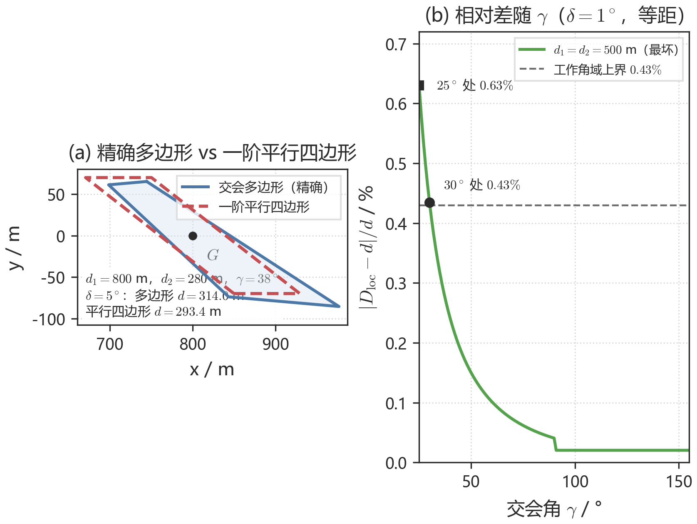

**图 6**　(a) 极端站址下两图形可分开（$\delta$ 放大到 $5^\circ$）；(b) 等距时相对差几乎不随距离变化，故只画最坏的 $d_1=d_2=500$ m。工作角域 $\gamma\ge 30^\circ$ 内最大 $0.43\%$。

### 6.4 等距切片、$800$ m 与 $\inf D_{\mathrm{loc}}=2\delta D$

闭式含三个量 $d_1,d_2,\gamma$。为单独看交会角，做一次**切片**：在分析里把真实距离 $D$ 当作参数、令 $d_1=d_2=D$。机器狗并不知道 $D$，切片只是“固定 $D$ 再看 $\gamma$”，不是假设。等距时

$$
D_{\mathrm{loc}}=2\delta D\sqrt{\frac{2(1+\lvert\cos\gamma\rvert)}{\sin^2\gamma}}.
$$

$\gamma\in(0,90^\circ]$ 时该式在 $\gamma=90^\circ$ 取最小 $2\sqrt{2}\,\delta D$。图 7 令 $D=800$ m，$S_2$ 绕 $G$ 走等距圆周：$90^\circ$ 时 $D_{\mathrm{loc}}=39.5$ m，刚进入 $40$ m 筛选线；$30^\circ$ 与 $150^\circ$ 升到 $107.9$ m。取 $800$ m 是因为等距直角交会碰到 $40$ m 门槛的距离是

$$
D_{90}=\frac{40}{2\sqrt{2}\,\delta}\approx 810\ \mathrm{m},
$$

$800$ m 正好压在这条设计门槛上。机器狗不知道 $D$，$d_1=d_2$ 只是切片，用来单独说明 $\gamma$ 的作用。

**图 7**　$d_1=d_2=800$ m。(a) $S_2$ 的等距轨迹；(b) 闭式曲线，$90^\circ$ 最低。

等距只是切片。若允许 $d_2$ 自由变化，直角交会下 $D_{\mathrm{loc}}=2\delta\sqrt{d_1^2+d_2^2}$，令 $d_2\to 0$ 得到

$$
\inf_{S_2}D_{\mathrm{loc}}=2\delta D.
$$

几何含义见附图 4(a)：第一锥在 $G$ 处的横向全宽是 $2D\tan\delta\approx 2\delta D$，第二站无论怎么摆都削不掉这一条（$\delta=1^\circ$ 时 $2D\tan\delta$ 与 $2\delta D$ 相差约 $0.01\%$，数值上可互换；下文界限一律用精确的 $\tan$ 写）。因此两步要把直径压到 $40$ m，必须

$$
2D\tan\delta\le 40\iff D\le D^*=\frac{20}{\tan 1^\circ}\approx 1146\ \mathrm{m}.
$$

更远的源两次测向不可能进入 $20$ m，必须准备第三次测量。附图 4(b) 在 $d_1=800$ m、$\gamma=90^\circ$ 上画出这条下界与等距点。

### 6.5 由 $\sin\gamma\ge 1/2$ 推出蝶形

距离未知，不能只对某一个 $D$ 去摆 $90^\circ$。先看阈值为什么取 $1/2$：等距曲线上 $\gamma=30^\circ$ 时直径已约 $108$ m，$\gamma=90^\circ$ 只有 $39.5$ m，$30^\circ$ 以下曲线更陡（图 7）；把“交会角还不太差”的门槛定在 $30^\circ$，意味着允许第二点之后的交会在 $[30^\circ,150^\circ]$ 内摆动，超出这个范围就交给第三次切割。于是写成

$$
\sin\gamma\ge s_{\min}=\frac{1}{2}\qquad(\gamma\in[30^\circ,150^\circ]).
$$

$\varepsilon=0$ 时 $\sin\gamma=\lvert h\rvert/d_2$，不等式成为 $\lvert h\rvert\ge \tfrac12\sqrt{(D-t)^2+h^2}$。两边平方、整理：

$$
h^2\ge\frac14\bigl[(D-t)^2+h^2\bigr]\iff \lvert h\rvert\ge\frac{s_{\min}}{\sqrt{1-s_{\min}^2}}\lvert D-t\rvert=\frac{1}{\sqrt{3}}\lvert D-t\rvert.
$$

固定 $D$ 时，这是 $(t,h)$ 平面上以 $(D,0)$ 为顶点、半张角 $30^\circ$ 的对顶锥的**外部**，见图 8(a)。$D$ 未知、在 $[D_{\mathrm{near}},D_{\mathrm{far}}]=[5,1500]$ 上取值，要求对每个 $D$ 都成立，就是对一族对顶锥取交集，等价于侧偏盖住最远的那条边界：

$$
\lvert h\rvert\ge\frac{s_{\min}}{\sqrt{1-s_{\min}^2}}\max\bigl(\lvert D_{\mathrm{far}}-t\rvert,\lvert t-D_{\mathrm{near}}\rvert\bigr).
$$

这就是杠杆条件，见图 8(b) 的包络构造。它在示向度两侧各给出一条斜带，两条带合起来像蝴蝶的两翼，故称蝶形候选区，见图 8(c)。再叠加上节的 $D_{\mathrm{loc}}\le 40$ m（K-条件）、接收约束和 $\|S_2\|\le 1800$，得到候选区域 $\mathcal{C}$。图 9 画在场地坐标系里。空心点是关于示向度的对称点：最优解是等价类，所以题面问的是区域而不是一个点。

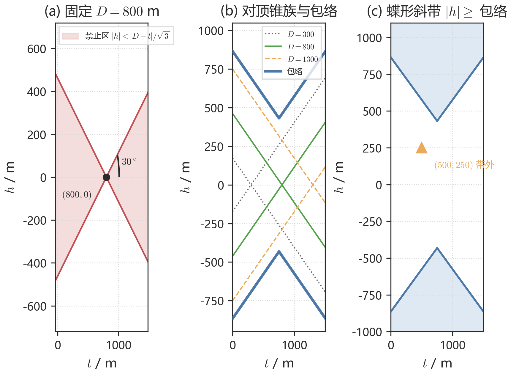

**图 8**　(a) 固定 $D=800$ m 时侧偏的禁止区（对顶锥）；(b) 一族对顶锥与包络；(c) 两条斜带=蝶形。时间点 $(500,250)$ 在杠杆带外。

**图 9**　与图 4 同一组 $S_1$、示向度。两侧翼为杠杆带；四个实心点是四种准则的采用点：$(550,450)$、$(675,500)$、$(750,450)$、$(500,250)$。

### 6.6 四种准则与网格

候选区只说明第二点可以落在哪里；落到哪一点，取决于对未知 $D$ 的假设。四种准则都在同一张网格上选 $(t,h)$：$t\in\{250,275,\ldots,1000\}$、$h\in\{150,175,\ldots,700\}$，共 $713$ 个格点；$D$ 取 $[5,1500]$ 上 $80$ 个节点；K-条件在误差端点 $e_1,e_2\in\{-\delta,0,\delta\}$ 上取最坏。四种准则各给一个采用点：

1. **minimax（硬保证）.** 准则：最大化“保证前缀”——从 $D=5$ m 起 K-条件连续成立、且用问题一的多边形核验（$9$ 个误差端点）最坏 $R_{\mathrm{MEC}}\le 20$ m 的最远 $D$。格点上最长前缀为 $724$ m（$D$ 网格分辨率约 $19$ m），在 $t\in\{525,550\}$、$h$ 较大的一带并列；取代表点 $(550,450)$：多边形核验在 $D\in[5,730]$ m（步长 $2.5$ m）上最坏 $19.94$ m，直到 $735$ m 才越界；移动 $710$ m。
2. **概率最优.** 面积先验 $f_D\propto D$（圆盘上均匀等价于半径密度正比于 $D$）。同一网格上最大化两步成功的加权测度，得 $(675,500)$，两步成功概率 $0.279$，成功区间 $[232,819]$。
3. **保守.** 限制在杠杆带内，最小化成功样本的期望时间 $E[T]$。格点最优即 $(750,450)$：$E[T]=318.7$ s，区间 $[402,857]$。
4. **时间（实战）.** 不强制杠杆，同一 $E[T]$ 网格上最小：格点最优 $(500,200)$ 为 $264.4$ s；取 $(500,250)$ 为 $267.9$ s（相差 $1.3\%$，取整到 $25$ m 网格，便于与代码一致），区间 $[81,686]$。

$E[T]$ 的评价协议（第 3、4 条共用）：$D$ 取 $[5,1500]$ 上 $40$ 个节点、权 $\propto D$；误差取 $0$；救援规则 $\rho=\max(50,0.5L)$；按问题一的算法逐 $D$ 模拟，两次不够就补第三次；仅当最终 $R_{\mathrm{MEC}}\le 20$ m 的样本计入平均。

图 10(a) 是 $31\times23$（$713$ 点）网格上的两步成功概率，杠杆边界与四个采用点一并标出；(b) 是固定 $h=250$ 与沿杠杆下界的 $E[T]$–$t$ 曲线。时间点 $267.9$ s、保守点 $318.7$ s，相对缩短 $(318.7-267.9)/318.7\approx 16\%$。四流派在该模型里最终都能压进 $20$ m（成功概率 $1$），差距来自前期少走的路，而不是两步失败的惩罚。期望测量次数 $2.7$–$2.8$。

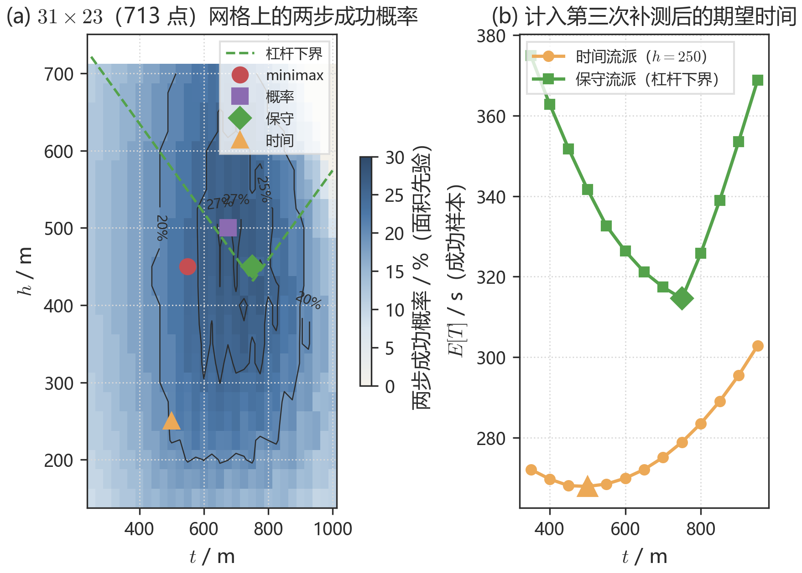

**图 10**　(a) $31\times23$ 网格（$713$ 点）上的两步成功概率热图与四个采用点；(b) 固定 $h=250$ 与杠杆下界的 $E[T]$ 随 $t$ 变化，三角形、菱形为采用点。

**表 2**　第二检测点的四种设计（区间由 K-条件/多边形核验给出；$E[T]$ 仅对成功样本）

| 流派          | 准则                 | 采用点 $(t,h)$ | 保证／成功区间     | $E[T\mid\mathrm{成功}]$ |
| ----------- | ------------------ | ----------- | ----------- | --------------------- |
| minimax 硬保证 | 保证前缀最长（K-条件+多边形核验） | $(550,450)$ | $[5,724]$   | $307$ s               |
| 概率最优        | 面积先验下两步概率最大        | $(675,500)$ | $[232,819]$ | $325$ s               |
| 保守流派        | 杠杆带内 $E[T]$ 最小     | $(750,450)$ | $[402,857]$ | $319$ s               |
| 时间流派（实战）    | 无约束 $E[T]$ 最小      | $(500,250)$ | $[81,686]$  | $268$ s               |

问题三采用时间点；需要硬保证则改 $(550,450)$。问题四因定向波束改用小侧偏，不再沿用 $(500,250)$。

### 6.7 两次不够时沿长轴再切

每个测点沿视线法向把区域压到约 $2\delta d_i$ 宽。若两次后 $R_{\mathrm{MEC}}>20$ m，新测点取当前长轴法向、朝来路一侧：

$$
S_{\mathrm{new}}=C_{\mathrm{MEC}}+\rho\,\hat n,\qquad \rho=\max(50,\ 0.5L),
$$

$L$ 为当前直径。附图 5 是 $D=1500$ m、第二点 $(700,462)$ 的全局位置：两次后直径 $164.5$ m。图 11 是局部：第三次后直径 $33.1$ m，$R_{\mathrm{MEC}}=16.5$ m，落入 $20$ m 清除圆。

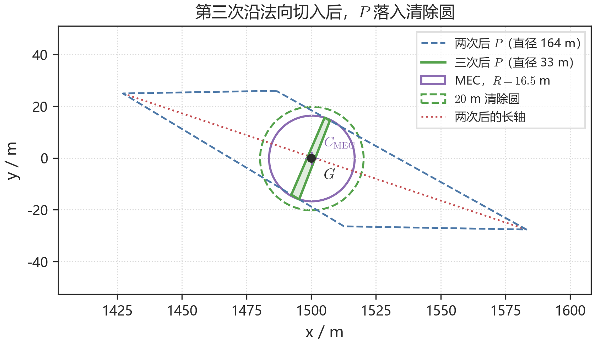

**图 11**　蓝虚线为两次后的 $P$，绿色为三次后的 $P$，虚线圆为 $20$ m 清除圆。

单目标时间 $T=\sum\|S_{k+1}-S_k\|/5+5n_{\mathrm{meas}}+5$。仅当最终半径 $\le 20$ m 时计入平均。面积先验下成功样本的 $E[T]$ 见附图 6，时间流派谷底在 $t=500$ m，用于问题三。

主要核对：设计角域内闭式最大相对误差 $0.43\%$；$D^*=1146$ m；采用点 $(550,450)$ 的核验最坏 MEC $19.94$ m；$(500,250)$ 相对 $(750,450)$ 缩短约 $16\%$。

## 七、问题三的模型建立与求解

### 7.1 模型建立

#### 7.1.1 七点覆盖网与判空

全向源无信号只有两种可能：该频道已无未清源，或检测点已超出接收半径。一组监听点若能用半径 $1000$ m 的接收圆盘盖住整个 $1800$ m 圆域，某频道在这些点全无信号即可判空。未知总数因此变成有限点上的覆盖问题。

由等圆覆盖的 Kershner 下界 [6]，$N$ 个半径 $1000$ m 的圆盘覆盖半径 $1800$ m 的目标圆至少需要 $N\ge 1.209\times(1800/1000)^2\approx 3.92$，故不少于 $4$ 点。该渐近下界在小 $N$ 下偏松：数值核验表明 $4$、$5$、$6$ 点最优构型的覆盖半径分别为 $1271.6$、$1110.6$、$1037.9$ m，均无法保证 $1000$ m 覆盖。可行方案从七点起。

监听点取原点，再加上半径 $r$ 圆周上均匀 $n$ 个点。原点管住 $\|X\|\le 1000$；外缘最差点出现在相邻环点的角平分线上，该点到最近环站的距离满足

$$
d(r)^2=1800^2+r^2-2\cdot 1800\cdot r\cdot\cos\frac{180^\circ}{n}.
$$

要求 $d(r)\le 1000$ 有解，得到 $\cos(\pi/n)\ge 0.8315$，即 $n\ge 5.33$。因此“原点+均匀环”这一族至少 $6$ 个环点，共 $7$ 点。$n=6$ 时令 $d(r)=1000$，较小正根 $r^*\approx 1123$ m；取 $r=1150$ m，径向余量约 $27$ m，最坏距离

$$
d(1150)=\sqrt{1800^2+1150^2-2\cdot 1800\cdot 1150\cdot\cos 30^\circ}\approx 988.5\text{ m}<1000\text{ m}.
$$

余量 $1000-988.5=11.5$ m。沿半径方向，边界点到正对环站只有 $1800-1150=650$ m。检测律是“距离不超过接收半径 $R$ 就能听到”，题面 $R\in[1000,1500]$ m 且接口不返回具体值。$R$ 越小越难听到，按最坏值 $1000$ m 设计的覆盖网对所有 $R\ge 1000$ m 都成立：若七点均无信号，则源到每个站都超过 $1000$ m，与“圆域内任一点到某站不超过 $988.5$ m”矛盾，故该频道无未清源。证书成立的前提是机器狗确实走遍这 $7$ 个点。

**图 12**　(a) 原点加 $1150$ m 六等分点；(b) 角平分线处最坏点的余弦三角形与 $d(r)$–$r$ 曲线：$r^*\approx 1123$ m，取 $1150$ m，最坏距离 $988.5$ m。

#### 7.1.2 频道账本与三阶段调度

每个频道独立维护状态：`unknown → heard → cleared`，或 `unknown → empty`。算法分三段。

1. **原点扫频.** 不移动，频道 $1$–$20$ 各测一次，虚拟耗时 $20\times 5+19\times 1=119$ s。听到的源满足 $\|G\|\le R\le 1500$；近距源就地清除。
2. **追击已听频道.** 从听测点走问题二的时间赌注 $(500,250)$ 再测；两锥交会后算最小包围圆，半径 $>20$ m 则沿长轴法向再下一站，$\le 20$ m 则到圆心清除。第二点若因出界或坐标取整返回无信号，把“距该点超过 $1000$ m”纳入后续选点（换侧并加大纵向赌注），不写成第二点必然有信号。
3. **环网补漏.** 从当前点最近的环站起绕一圈。每点先把剩余频道扫完再搬家；七点都无信号则标 `empty`。环上新听到的源，若专程去第二点再进圈的额外路程超过 $300$ m 则挂起，整圈走完再就近追。程序读取 `/enter` 返回的剩余现实时间，墙钟不足时停止补网。

调度上还做三件事：能交会且 $R_{\mathrm{MEC}}\le 20$ m 的源优先就近清除；移动途经某停点时，顺路复测仍只有一站、且相对第一站接近时间赌注的频道，已进 $20$ m 且顺路的源就地收割；清满 $16$ 个（题面源数上界）即停。交会调用问题一半平面算法，最小包围圆与长轴调用问题二几何模块。

停机：已清除数达到 $16$，或二十个频道都是 `cleared` 或 `empty`。

#### 7.1.3 时间目标

记第 $i$ 次测量位置为 $S_i$、测量次数为 $N_{\mathrm{meas}}$、换频次数为 $N_{\mathrm{switch}}$。总虚拟时间

$$
T=\sum_i\frac{\|S_{i+1}-S_i\|}{5}+5N_{\mathrm{meas}}+N_{\mathrm{switch}}+T_{\mathrm{clear}}.
$$

约束包括：区域约束；示向度误差不超过 $1^\circ$；清除约束 $R_k\le 20$ m 才允许清除；覆盖判空约束要求频道 $k$ 在七点骨架上均无信号方可判空。本问不另起几何模型，新工作是覆盖网与三阶段衔接。

### 7.2 模型求解

#### 7.2.1 官方模拟器演练

程序入口为 `python q3/run_q3.py`。单局案例 `WU4D-52HU-EUR9-Y4QR`：原点听测清除 $8$ 个、环网补漏清除 $6$ 个，覆盖判空 $6$ 个，清除/失败/剩余为 $14/0/0$，虚拟时间 $5189$ s、平均 $371$ s/个。该局移动 $4563$ s（$87.9\%$），检测 $470$ s，切频道 $86$ s，清除 $70$ s。多数源两次测量即可清；较远的源第三次长轴切割后最小包围圆降到 $10$ m 量级。轨迹与进度见图 13、附图 7。

覆盖网策略在同一官方模拟器上开展 $19$ 局随机案例实测，源数 $13\pm 2$（$10$–$16$），全部 19/19 全清，平均 $352\pm 31$ s/个（$290$–$402$ s），虚拟总时间 $4480\pm 426$ s，见表 3。按 $19$ 局均值拆分，移动仍占八成以上。源越多，原点扫频与环网固定开销摊得越薄，单源平均才稳定在约 $350$ s。逐局案例编码与时间见附录 D。

**图 13**　案例 `WU4D-52HU-EUR9-Y4QR`。星号为清除点，数字为频道。

压低单源时间的关键是减少空驶，而不是再减测量次数。

**表 3**　问题三官方模拟器 $19$ 局演练汇总（覆盖网策略）

| 局数 | 全清 | 源数 | 平均时间 (s/个) | 虚拟总时间 (s) |
| --- | --- | --- | --- | --- |
| $19$ | 19/19 | $13\pm 2$ | $352\pm 31$ | $4480\pm 426$ |

#### 7.2.2 本地策略对照

在同一批 $12$ 个随机世界上，把第二点赌注换成另外两个流派、并关掉顺路复测作对照，四种策略均 12/12 全清，见表 4 与附图 8。时间赌注加停点复用最低（$314$ s/个）；关掉复用后升至 $326$ s；minimax 与保守分别升至 $336$ s 与 $332$ s。因此问题三采用 $(500,250)$ 并保留停点复用，与问题二单目标仿真的排序一致。表中 minimax 点 $(550,498)$ 为该对照网格上的取值；问题二采用点为 $(550,450)$。

配对设计下，“时间+复用”对其余三组无一局反超，配对差均值约 $12$、$22$、$18$ s（相对约 $4\%$–$7\%$）。移动成本占主导，差值方向稳定。

**表 4**　问题三本地策略对照（$12$ 局同一批世界）

| 策略 | 第二点 $(t,h)$ | 停点复用 | 全清 | 平均 (s/个) |
| --- | --- | --- | --- | --- |
| 时间+复用（采用） | $(500,250)$ | 是 | 12/12 | $314$ |
| 时间、无复用 | $(500,250)$ | 否 | 12/12 | $326$ |
| minimax | $(550,498)$ | 是 | 12/12 | $336$ |
| 保守 | $(750,450)$ | 是 | 12/12 | $332$ |

#### 7.2.3 策略无关的时间下界

任何“确保全部清除”的策略至少承担三项不可压缩的代价：(i) 原点扫频 $119$ s；(ii) 每个源至少 $2$ 次检测（$10$ s）加 $1$ 次清除（$5$ s）；(iii) 从原点出发访问全部清除点的最短路径，其长度不小于含原点最小生成树（MST）的长度，除以 $5$ m/s 即移动下界。用 $19$ 局覆盖网实测日志中 `/clear` 成功指令的清除点坐标离线计算，问题三下界约为 $136$ s/个，实测均值 $352$ s/个距下界约 $+159\%$。剩余差距主要由测向定位所需的额外绕行与多次检测构成，而不是调度还能轻易压掉的空转。

## 八、问题四的模型建立与求解

### 8.1 模型建立

#### 8.1.1 环抱判据

定向源只在发射方向两侧各 $90^\circ$ 辐射，可检区域是“以 $G$ 为顶点、张角 $180^\circ$ 的闭半平面”与接收圆盘的交。“无信号”因此不再等于超距：源可能就在附近，只是波束朝另一边。问题三的圆盘覆盖直接失效。

要把任意朝向的定向源找出来，监听点不能只满足距离覆盖，还要在各个方向把候选位置围住。

**命题（环抱判据）.** 频道为空，当且仅当对目标圆域内任意 $G$ 有

$$
\max_{G\in\mathrm{disk}(1800)}\ \mathrm{maxgap}\bigl(N(G)\bigr)\le 180^\circ,
$$

其中 $N(G)$ 是与 $G$ 距离不超过 $1000$ m 的探针集合，$\mathrm{maxgap}$ 是它们绕 $G$ 的最大方位间隙。

充分性：若最大间隙不超过 $180^\circ$，则任意 $180^\circ$ 闭半平面内至少含一个探针，故无论朝向如何都能被听到；全向源是其特例。必要性：若某 $G$ 的 $\mathrm{maxgap}(G)>180^\circ$，取发射方向背对那条空隙，则全部探针都落在盲侧，该朝向可能漏检。部分公开思路要求任意 $1000$ m 邻域内存在方位互差 $120^\circ$ 的三个观测点，那是本判据的特例（三互差 $120^\circ$ 的点最大间隙为 $120^\circ$），反之不必。几何对照见附图 9。

#### 8.1.2 圆外停点是必要的

源在 $G=(1800,0)$、朝向 $(1,0)$ 时，可检半平面为 $x\ge 1800$，与圆域的交几乎只剩 $G$ 自身，圆内探针对此源的 $\mathrm{maxgap}=360^\circ$，见图 15。因此只用问题三的七点网，或把外圈停在 $1750$ m 的圆内实用网，都不能给出完整保证。题面允许检测坐标超出 $1800$ m 圆域，证书必须包含圆外停点。

#### 8.1.3 26点环抱骨架

取

$$
\mathcal{S}=\mathrm{ring}(400,6)\cup\mathrm{ring}(1300,8)\cup\mathrm{ring}(1900,12),
$$

共 $26$ 点：内环 $400$ m 六点、中环 $1300$ m 八点、外环 $1900$ m 十二点，外环在圆域之外，用来照亮圆缘外向源，见图 14。$20$–$25$ 点的穷尽搜索均出现最坏间隙大于 $180^\circ$；外环半径取 $1850$ m 时圆缘外向源即失效，故 $1900$ m$\times 12$ 是必要的。走遍这 $26$ 点的开路长度约 $18758$ m，合 $3752$ s，是判空移动的刚性下界。

在半径方向 $19$ 层、每层至多 $96$ 个方位的 $1825$ 个网格点上核验：$\mathcal{S}$ 的最坏 $\mathrm{maxgap}$ 恰为 $180.0^\circ$，全部通过；圆缘点 $(1800,0)$ 处为 $99.2^\circ$。对照见表 5。

**表 5**　网格上的最大方位间隙（$R=1000$ m）

| 探针网 | 点数 | 最坏间隙 | 未通过格点 | 圆缘间隙 |
| --- | --- | --- | --- | --- |
| 七点覆盖 | $7$ | $360^\circ$ | 1069/1825 | $360^\circ$ |
| 圆内实用环绕 | $25$ | $239.6^\circ$ | 174/1825 | $216.0^\circ$ |
| 26点环抱（采用） | $26$ | $180.0^\circ$ | 0/1825 | $99.2^\circ$ |

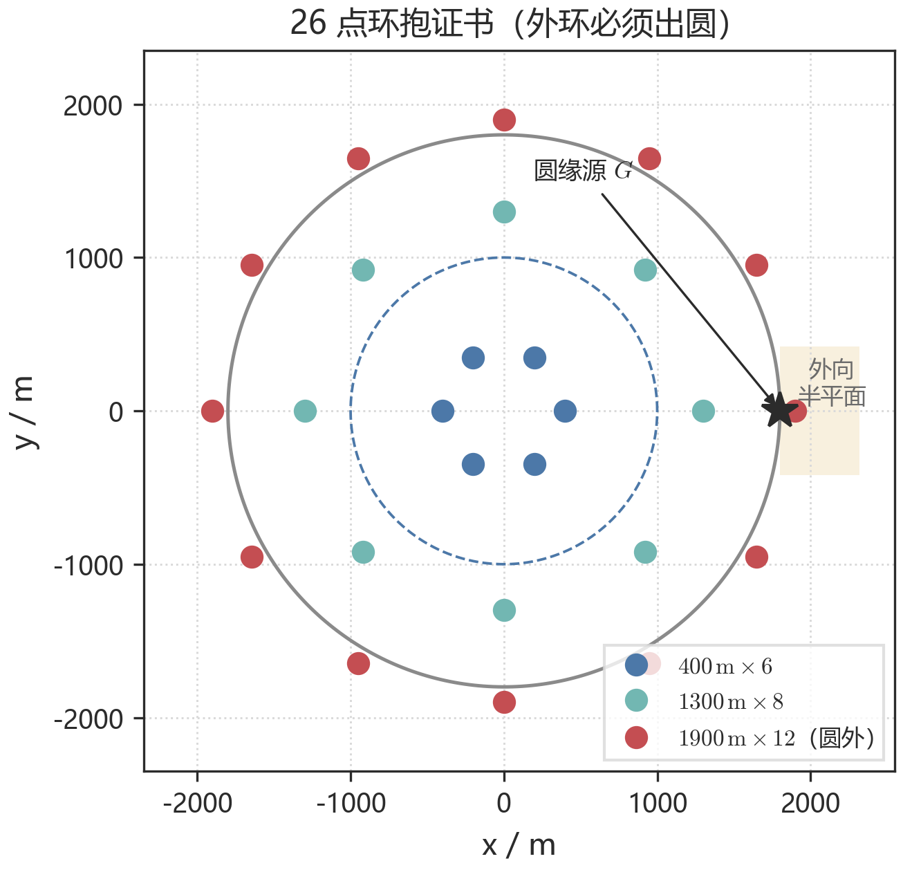

**图 14**　内环 $400$ m、中环 $1300$ m、外环 $1900$ m（出圆）。阴影为圆缘源的外向半平面。

在更密的 $60697$ 点采样上（含边界 $0.25^\circ$ 细网），一般位置上的最坏间隙为 $174.84^\circ$，距失效阈值 $180^\circ$ 尚有约 $5.2^\circ$ 的角度余量；$180.0^\circ$ 只在一类测度零的退化构型上取到——当候选源 $G$ 恰落在某对探针的连线上时，两探针绕 $G$ 严格对径，间隙正好 $180^\circ$。题面规定定向源辐射张角为两侧各 $90^\circ$（含），合计恰为 $180^\circ$ 的闭扇区，此时边界点仍可被照亮，故 $180^\circ$ 仍属通过；若实际有效扇区略窄于 $175^\circ$，一般位置将开始出现失效候选点。

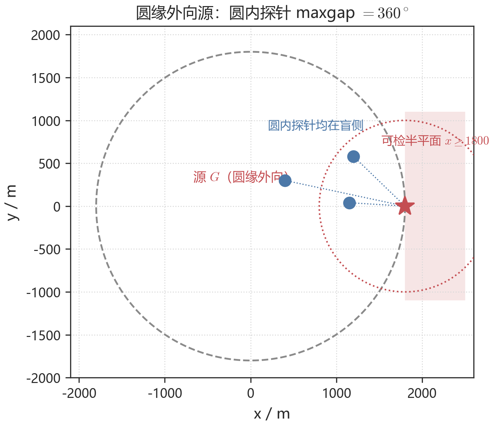

**图 15**　源在 $G=(1800,0)$、朝向 $(1,0)$ 时，可检半平面为 $x\ge 1800$，与圆域几乎只交于 $G$ 自身。

#### 8.1.4 合并巡回与定向源的第二检测点

策略分成三段，把证书扫描、定位与清除放在同一条路上，避免先走完探针再回头。

1. **原点扫频.** 频道 $1$–$20$ 各测一次，虚拟 $119$ s。
2. **合并巡回.** 节点集合 = 尚未访问的证书点 $\cup$ 已检出未清除源的最小包围圆圆心。节点集合一变，就以当前位置为起点对剩余节点做最近邻加 $2$-opt。到证书点：把该点仍未知的频道扫完，并顺路补测最不确定的已听频道；到源节点：按预测点测量、尝试清除，失败则追踪。
3. **收尾.** 对残余源做兜底巡回，追踪预算逐轮放大。理想情况下这一段为零。

第一站测到示向度 $\theta_1$ 后，第二点仍写成 $S_2=S_1+t\mathbf{e}_\theta+h\mathbf{e}_\theta^{\perp}$，但 $(t,h)$ 改用小侧偏组合 $(260,\pm 80)$、$(160,\pm 55)$、$(360,\pm 45)$ 等，优先取离机器狗更近且留在已点亮一侧的那个。沿示向度推进时步长随交会区缩小。若下一点无信号，说明走过了源或掉进背向，则在“最近一次有效测站到失联点”的线段上搜索清除。交会后最小包围圆半径 $\le 20$ m 则到圆心清除。

定向追击另有三条规则：点亮侧优先（候选点偏向已有测点所在半平面）；黑侧惩罚（无信号方位不再反复撞）；长条端采样（最小包围圆半径较大时沿主轴两端取样，避免只围中心）。工程上不强制每次走满全部 $26$ 点：优先追击已听源，证书巡回作兜底判空，同时监控 `/enter` 返回的剩余墙钟。

### 8.2 模型求解

#### 8.2.1 官方模拟器演练

早期演练采用圆内实用环绕（七点覆盖后走 $1750$ m 外圈）。确定 $26$ 点环抱证书后，环抱证书加合并巡回在同一官方模拟器上开展 $17$ 局随机案例实测，实现 17/17 全清、平均 $593\pm 95$ s/个（$411$–$740$ s），总时间 $7317\pm 644$ s，见表 6(a)。正式测试三局均值 $600.26$ s/个，与该演练一致。问题四平均时间明显高于问题三。附图 10 对照问题三 $19$ 局演练与问题四正式测试。

同一套程序在 $24$ 个确定性 mock 世界上 24/24 全清，平均 $600.1\pm 83.2$ s/个。时间账见表 6(c)：证书巡回移动约 $3752$ s 是判空地板，约占一半；测量约 $21\%$，绕行接近源约 $17\%$。把证书巡回、理想绕行与每源两次测量加起来，单源下界大约 $472$ s，实测 $600$ s 距该下界约 $27\%$。

**表 6**　问题四官方模拟器实测与策略对照

(a) 官方模拟器实测汇总（最终版策略 v3）

| 测试来源 | 局数 | 全清 | 平均时间 (s/个) | 总时间 (s) |
| --- | --- | --- | --- | --- |
| 最终版 v3 实测 | $17$ | 17/17 | $593\pm 95$（$411$–$740$） | $7317\pm 644$ |
| mock $24$ 种子 | $24$ | 24/24 | $600.1\pm 83.2$ | — |

(c) mock $24$ 种子平均时间账（合计约 $7580$ s，$T_{\mathrm{avg}}\approx 592$ s/个）

| 分项 | 时间 (s) | 占比 |
| --- | ---: | ---: |
| 原点扫频 | $119$ | $2\%$ |
| 证书巡回移动 | $\sim 3752$ | $49\%$ |
| 绕行接近源 | $\sim 1250$ | $17\%$ |
| 收尾 | $\sim 460$ | $6\%$ |
| 测量 | $\sim 1615$ | $21\%$ |
| 换频 | $\sim 300$ | $4\%$ |

(b) 本地策略对照（混合场景 / 圆缘外向应力场景）

| 策略 | 混合全清 | 混合平均 (s/个) | 外向全清 | 外向平均 (s/个) |
| --- | --- | --- | --- | --- |
| 七点覆盖 | 1/8 | $409$ | 0/6 | $455$ |
| 实用环绕+早停 | 6/8 | $648$ | 0/6 | $702$ |
| 实用环绕走满 | 6/8 | $775$ | 0/6 | $811$ |
| $26$ 点环抱（采用） | 7/8 | $681$ | 5/6 | $720$ |

由表 6(b) 与图 16，$26$ 点环抱网是唯一能在圆缘外向应力下稳定全清的策略（5/6）；七点覆盖与实用环绕均无法检出圆缘外向源。环抱网两例未全清的源都已被听到，失败发生在定向追击的末轮楔形清除而非证书漏检。

**图 16**　混合随机与圆缘外向应力下，四点策略的全清比例。只有 $26$ 点环抱在外向场景仍有清除。

#### 8.2.2 方位近共线退化与兜底

定向源漏检只有一类来源，即“方位近共线”退化几何：多次有效测站几乎共线，定位区域退化为细长条，最小包围圆半径始终降不到 $20$ m。演练日志复盘：某局频道 $18$ 的 $39$ 次检测中 $4$ 次得到示向度，全部来自 $3$ 个近乎共线的站位（读数彼此只差 $2.3^\circ$）；另一局频道 $10$ 的 $6$ 个有效站位集中在一段短弧上，示向度跨度仅 $1.6^\circ$。策略因此加入几何中心兜底：只要已积累方位、候选多边形几何中心可算，就强制到该中心尝试一次清除，把“区域有界但半径略超 $20$ m”的部分救回。机制加入后的验证演练中，此类漏检未再出现。

#### 8.2.3 时间下界

沿用问题三的策略无关下界（固定开销 $119$ s + 每源 $2$ 次检测 $10$ s + $1$ 次清除 $5$ s + 含原点 MST 移动下界），用 $17$ 局最终版实测日志的清除点坐标离线计算，问题四下界约为 $151$ s/个，实测均值 $593$ s/个距下界约 $+293\%$。与问题三（$+159\%$）相比差距更大，这是定向源的本质代价：一次阴性观测几乎不携带位置信息，每源必须付出更多测向绕行；这一额外代价在松弛下界中未被计入。证书巡回本身还有 $3752$ s 的几何地板，源数偏少时摊薄不足，单源平均会被抬高。

#### 8.2.4 正式测试

两次正式测试均使用与最终版完全相同的冻结参数。问题三 $3$ 次正式测试均 $100\%$ 清除，平均定位清除时间 $259.48$–$323.51$ s/个、均值 $285.34$ s/个，程序运行时间 $1.3$–$1.7$ s。问题四 $3$ 次正式测试均 $100\%$ 清除，平均 $518.78$–$698.52$ s/个、均值 $600.26$ s/个，程序运行时间 $3.7$–$4.6$ s。见表 7。

**表 7**　正式测试结果（官方模拟器）

(a) 问题三

| 案例编码 | 清除个数 | 平均时间 (s/个) | 程序运行时间 (ms) |
| --- | --- | --- | --- |
| `EA6G-8KH7-MD9Y-RM5C` | $11$ | $323.51$ | $1589$ |
| `G9DQ-EJCW-SJYN-FWW6` | $16$ | $259.48$ | $1743$ |
| `DNNF-446T-J6GT-8A29` | $15$ | $273.03$ | $1294$ |

(b) 问题四

| 案例编码 | 清除个数 | 平均时间 (s/个) | 程序运行时间 (ms) |
| --- | --- | --- | --- |
| `2CS6-PYGG-YEXJ-CNMX` | $12$ | $583.47$ | $3910$ |
| `HDGN-FSKE-BGQ4-HXMH` | $13$ | $518.78$ | $3750$ |
| `GGJ8-K8GP-DBCX-QET9` | $10$ | $698.52$ | $4619$ |

## 九、模型评价

### 9.1 模型的优点

四问共用有界误差下的半平面交会：问题一在顶点集上取直径 $d$、用中点检验覆盖，清除看 $R_{\mathrm{MEC}}\le 20$ m；问题二先给出蝶形候选区，再按假设选点；问题三用七点覆盖网把未知源数变成有限监听；问题四把覆盖改成环抱，$26$ 点骨架含圆外停点。

判定都落在可核验的量上。等边三角形说明直径圆覆盖不能省；算例 G 说明直径圆盖不住仍可能 $R_{\mathrm{MEC}}\le 20$ m。问题二四个采用点由同一张网格给出；闭式直径在工作角域内相对误差不超过 $0.43\%$。覆盖网最坏间隙 $988.5$ m，环抱证书粗网格最坏恰为 $180.0^\circ$。正式测试问题三、四均 $100\%$ 清除，平均 $285.34$ s/个与 $600.26$ s/个。

### 9.2 模型的缺点与改进

表 8 列出主要缺点、已采取的应对与可执行的改进。表中每一条都能在正文或代码里找到对应边界。

**表 8**　模型缺点、边界与改进

| 缺点 | 定量边界 | 已采取的应对 | 改进 |
| --- | --- | --- | --- |
| 时间赌注 $(500,250)$ 不满足杠杆条件 | $D>D^*\approx 1146$ m 时两次不能压进 $20$ m | 第三次长轴补测；面积先验下约 $79\%$ 的源走第三次 | 对 $D>D^*$ 强制第二次后立即补测 |
| 覆盖网、环抱证书依赖走遍停点 | 七点或 $26$ 点未走满则不能判空 | 未走遍的频道不标 `empty`；墙钟不足时停网 | 把“走遍证书点”写成显式调度约束 |
| 定向追击的方位近共线 | 示向度跨度可小至 $1.6^\circ$ | 几何中心兜底清除 | 沿失联线段折线加密 |
| 环抱证书余量薄 | 粗网格最坏恰 $180^\circ$，一般位置约 $5.2^\circ$ | $60697$ 点加密采样仍通过 | 按扇区张角 $2\theta$ 重构造骨架 |
| $E[T]$ 是成功样本上的条件期望 | 只计入 $R_{\mathrm{MEC}}\le 20$ m 的样本 | 正文写明口径 | 报告失败样本的时间分布 |
| minimax 保证前缀只到 $724$ m | 更远的源依赖第三次切割 | 救援规则 $\rho=\max(50,0.5L)$ | 联合优化两步区间与路程 |

关掉覆盖网补漏后，问题三清除率由 $100\%$ 跌至 $56.3\%$；把问题四证书换成七点网或圆内环绕，清除率分别降至 $94.1\%$ 与 $96.0\%$，见表 9。几何中心兜底在 $24$ 个离线世界上关闭与否都是 $100\%$ 全清，该批未触发它所针对的退化几何，其作用在官方演练中体现。

### 9.3 适用边界

集合定位适用于误差有界、分布未知的测向问题。目标区域远大于 $1800$ m 而接收半径仍为 $1000$ m 时，证书点数随面积增长，巡回可能超过时间预算。定向源张角明显窄于 $180^\circ$ 时，$26$ 点骨架的零余量保证失效，须按扇区张角重造。机器狗不允许驶出目标区域时，圆缘外向源在几何上无法判空。

消融实验见表 9。

**表 9**　消融实验（本地数值仿真，同批随机世界）

| 问 | 配置 | 清除率 | 全清局 | 平均时间 (s/个) |
| --- | --- | --- | --- | --- |
| 三 | 完整方法 | $100\%$ | 30/30 | $317.9\pm 38.0$ |
| 三 | 关覆盖网补漏 | $56.3\%$ | 0/30 | $232.8$ |
| 三 | 关长轴补测 | $100\%$ | 30/30 | $327.7$ |
| 四 | 完整方法 | $100\%$ | 24/24 | $601.2\pm 86.9$ |
| 四 | 证书换成七点网 | $94.1\%$ | 10/24 | $695.1$ |
| 四 | 证书换成圆内环绕 | $96.0\%$ | 13/24 | $1217.9$ |
| 四 | 关几何中心兜底 | $100\%$ | 24/24 | $600.1\pm 83.2$ |

## 参考文献

[1] WANG S, et al. Optimal geometry and motion coordination for multisensor target tracking with bearings-only measurements[J]. Sensors, 2023, 23(13): 4347.

[2] BISHOP A N, FIDAN B, ANDERSON B D O, et al. Optimality analysis of sensor-target localization geometries[J]. Automatica, 2010, 46(6): 1169-1177.

[3] OSHMAN Y, DAVIDSON P. Optimization of observer trajectories for bearings-only target localization[J]. IEEE Transactions on Aerospace and Electronic Systems, 1999, 35(3): 892-902.

[4] BERTSIMAS D J, VAN RYZIN G. A stochastic and dynamic vehicle routing problem in the Euclidean plane[J]. Operations Research, 1991, 39(4): 601-615.

[5] JUNG H. Über die kleinste Kugel, die eine räumliche Figur einschließt[J]. Journal für die reine und angewandte Mathematik, 1901, 123: 241-257.

[6] KERSHNER R. The number of circles covering a set[J]. American Journal of Mathematics, 1939, 61(3): 665-671.

[7] WANG Y, CAO G. On full-view coverage in camera sensor networks[C]//Proceedings of IEEE INFOCOM. 2011.

## 附录

正文与文献的对应：问题二对照 [1][2] 关于交会角 $90^\circ$ 最优、测点宜近的几何结论；候选区域形态对照 [1] 的几何不变性。问题三的追击顺序属于最小延迟路由的一类在线贪心，见 [4]；第三次测量沿长轴切入与 [3] 一致。七点覆盖网点数下界对照 [6]。问题四环抱判据与全视场覆盖同构，见 [7]。Jung 界与最小包围圆结构直接引用 [5]。Fisher 信息只作平行对照。

**附录 A　问题二公式速查**

| 用途         | 公式                                                                                                                             |
| ---------- | ------------------------------------------------------------------------------------------------------------------------------ |
| 交会角正弦      | $\sin\gamma=\lvert h\cos\varepsilon-t\sin\varepsilon\rvert/d_2$                                                                |
| 定位直径       | $D_{\mathrm{loc}}=2\delta\sqrt{(d_1^2+d_2^2+2d_1 d_2\lvert\cos\gamma\rvert)/\sin^2\gamma}$                                     |
| 两步成功（设计）   | 上式根号内 $\le K\approx 1146$ m                                                                                                    |
| minimax 核验 | 采用点 $(550,450)$：$D\in[5,730]$ m 上多边形 $R_{\mathrm{MEC}}\le 19.94$ m                                                             |
| 杠杆条件       | $\lvert h\rvert\ge\dfrac{s_{\min}}{\sqrt{1-s_{\min}^2}}\max(\lvert D_{\mathrm{far}}-t\rvert,\lvert t-D_{\mathrm{near}}\rvert)$ |
| 必要距离界      | $D\le D^*=20/\tan 1^\circ\approx 1146$ m                                                                                       |
| 全局变换       | $S_2=(x_1+t\cos\theta_1-h\sin\theta_1,\ y_1+t\sin\theta_1+h\cos\theta_1)$                                                      |
| 环抱判空       | $\max_G\mathrm{maxgap}(N(G))\le 180^\circ$，$N(G)=\{p:\|p-G\|\le 1000\}$                                                       |
| $26$ 点骨架    | $\mathrm{ring}(400,6)\cup\mathrm{ring}(1300,8)\cup\mathrm{ring}(1900,12)$                                                     |

**附录 B　复现入口**

| 文件                   | 内容                             |
| -------------------- | ------------------------------ |
| `q1/solver.py`       | 问题一半平面交会、直径、圆覆盖与最小包围圆          |
| `q2/geometry.py`     | 问题二楔形、直径、最小包围圆、K-闭式与单目标仿真      |
| `q2/derive_check.py` | 闭式误差对照、$D^*$、四准则网格与 minimax 核验 |
| `q3/run_q3.py`       | 问题三机器狗：原点扫频、追击、环网补漏            |
| `q4/run_q4.py`       | 问题四机器狗：环抱证书与定向追击               |
| `q4/ledger.py`       | 问题四探针集合与环抱判空                     |
| `q4/policy.py`       | 问题四 Policy3：扫频、合并巡回、收尾           |
| `q4/score.py`        | 问题四 $24$ 种子 mock 基准                  |
| `q4/skeleton_final.json` | $26$ 点证书坐标                       |
| `robot.py`           | 问题四模拟器接口                           |

**附录 C　问题一算例构型**

坐标用于核验算法，不是题面数据；示向度均指向示意源，$\delta=1^\circ$。

| 算例  | 源 $G$      | 检测点 $S_i$                                                        | 备注            |
| --- | ---------- | ---------------------------------------------------------------- | ------------- |
| A   | $(80,220)$ | $S_1=(-920,-480)$                                                | 单站，公共区域无界     |
| B   | $(80,220)$ | $S_1=(-920,-480)$、$S_2=(980,-420)$                               | 图 1(b)、图 2(a) |
| C   | $(80,220)$ | 再加 $S_3=(-40,1180)$                                              | 三站切入，六边形      |
| D   | —          | $S_1=(0,0)$、$S_2=(200,0)$，示向度 $90^\circ$ 与 $270^\circ$           | 相背，交会为空       |
| E   | —          | 等边三角形 $(0,0)$、$(2,0)$、$(1,\sqrt{3})$                             | 几何核验          |
| F   | —          | $S_1=(0,0)$、$S_2=(200,0)$，示向度同为 $90^\circ$                       | 同向，无界         |
| G   | $(0,0)$    | $S_1=(800,0)$、$S_2=(-400,400\sqrt{3})$、$S_3=(-400,-400\sqrt{3})$ | 图 3           |

**附录 D　问题三官方 $19$ 局逐局结果**

口径：平均时间 = 虚拟时间 $\div$ 清除数；全清 = 清除数与真值源数一致且失败列表为空。数据见 `paper/官方演练_Q3Q4_最新.md`。

| 局 | 案例 | 源数 | 清除 | 判空 | 虚拟时间 (s) | 平均 (s/个) |
| --- | --- | --- | --- | --- | --- | --- |
| 1 | `KN4P-5R5W-BQXQ-TCN7` | $12$ | $12$ | $8$ | $3927$ | $327$ |
| 2 | `PMBJ-SQ7V-HTJG-B6A2` | $10$ | $10$ | $10$ | $3798$ | $380$ |
| 3 | `FTMA-VUGS-K8DX-Z3R7` | $14$ | $14$ | $6$ | $4604$ | $329$ |
| 4 | `BC9E-SSG6-9JSQ-W92H` | $13$ | $13$ | $7$ | $4409$ | $339$ |
| 5 | `F5TU-3NH5-SHDQ-AFGR` | $15$ | $15$ | $5$ | $5328$ | $355$ |
| 6 | `VEEJ-W4CJ-F8SZ-H5FE` | $16$ | $16$ | $4$ | $4633$ | $290$ |
| 7 | `VAFN-E33C-43CS-D983` | $12$ | $12$ | $8$ | $4418$ | $368$ |
| 8 | `SK2Q-225V-FGR8-52QT` | $12$ | $12$ | $8$ | $4826$ | $402$ |
| 9 | `QXAX-DMBS-CJS8-PCED` | $15$ | $15$ | $5$ | $4783$ | $319$ |
| 10 | `A3Y2-PHNC-T322-DMGY` | $16$ | $16$ | $4$ | $5255$ | $328$ |
| 11 | `AUBF-WSH8-EFPP-HPJS` | $11$ | $11$ | $9$ | $4369$ | $397$ |
| 12 | `CTNN-9W9K-CKB7-ATWA` | $10$ | $10$ | $10$ | $3658$ | $366$ |
| 13 | `25HG-MHCG-H3PT-6478` | $12$ | $12$ | $8$ | $4610$ | $384$ |
| 14 | `47DE-MRWU-YAAX-7TE6` | $12$ | $12$ | $8$ | $4578$ | $382$ |
| 15 | `7KGY-T7RF-4GZK-SSVG` | $13$ | $13$ | $7$ | $4424$ | $340$ |
| 16 | `QAPC-YE2V-PN6H-563V` | $11$ | $11$ | $9$ | $4239$ | $385$ |
| 17 | `VS3W-HZBE-RSXK-GQMP` | $13$ | $13$ | $7$ | $3974$ | $306$ |
| 18 | `3XER-PVDM-2RB8-CXAK` | $13$ | $13$ | $7$ | $4565$ | $351$ |
| 19 | `NYPY-CNZ7-4E9G-2BRM` | $14$ | $14$ | $6$ | $4713$ | $337$ |

合计：19/19 全清，平均 $352\pm 31$ s/个。

**附录 E　问题四正式测试逐局**

三次正式测试均 `outer_verified`。清除失败次数（$4/6/1$）为同一源螺旋逼近的重复尝试，最终均清除，零漏检。

| 局 | 案例 | 清除个数 | 虚拟总时间 (s) | 平均 (s/个) | 程序 (ms) |
| --- | --- | --- | --- | --- | --- |
| 1 | `2CS6-PYGG-YEXJ-CNMX` | $12$ | $7002$ | $583.47$ | $3910$ |
| 2 | `HDGN-FSKE-BGQ4-HXMH` | $13$ | $6744$ | $518.78$ | $3750$ |
| 3 | `GGJ8-K8GP-DBCX-QET9` | $10$ | $6985$ | $698.52$ | $4619$ |

合计：3/3 全清，平均 $600.26$ s/个。

**附录 F　正文未展开的附图**

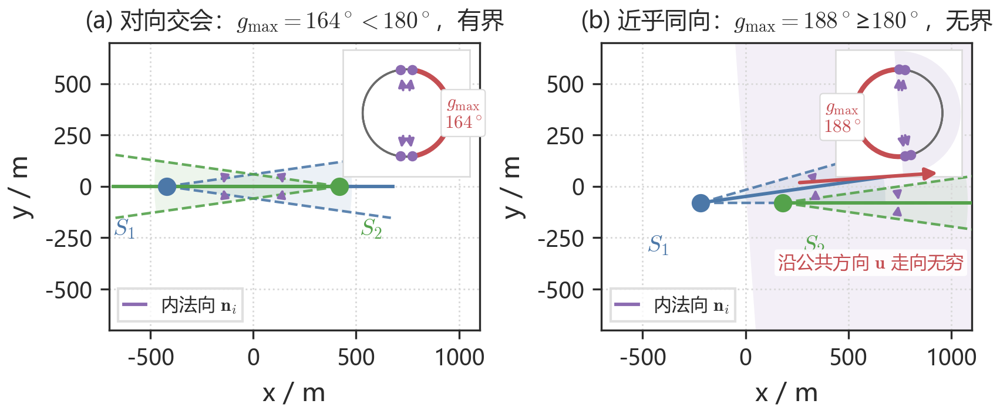

**附图 1**　主图只画两锥与检测点；右上角单位圆给出全部内法向 $\mathbf{n}_i$ 与相邻夹角，红色弧为 $g_{\max}$。无界时浅紫填充为法向所在的闭半平面，红箭头为公共方向 $\mathbf{u}=-(\cos\alpha^{*},\sin\alpha^{*})$。(a) 对向交会：$g_{\max}=164^\circ<180^\circ$，有界；(b) 近乎同向：$g_{\max}=188^\circ\ge 180^\circ$，沿 $\mathbf{u}$ 走向无穷，直径无定义。对本题误差锥，无界等价于各 $2^\circ$ 示向度弧存在公共方向。

**附图 2**　先求顶点，再取最长连线为直径，圆心取中点后逐点检验；有界时同时按算法 1 计算最小包围圆，供后续清除判据使用。

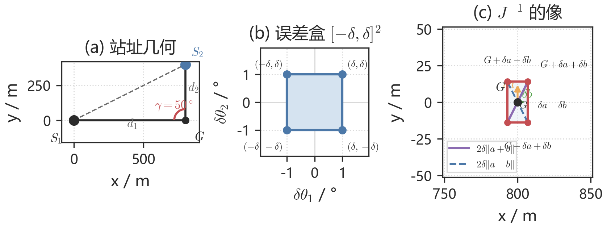

**附图 3**　推导三件套：(a) 站址几何：$S_1$、$S_2$ 与交会角 $\gamma$；(b) 误差盒 $[-\delta,\delta]^2$，四角为 $(\pm\delta,\pm\delta)$；(c) $J^{-1}$ 的像：四角 $G\pm\delta a\pm\delta b$、两支列向量 $\delta a,\delta b$ 与两条对角线。

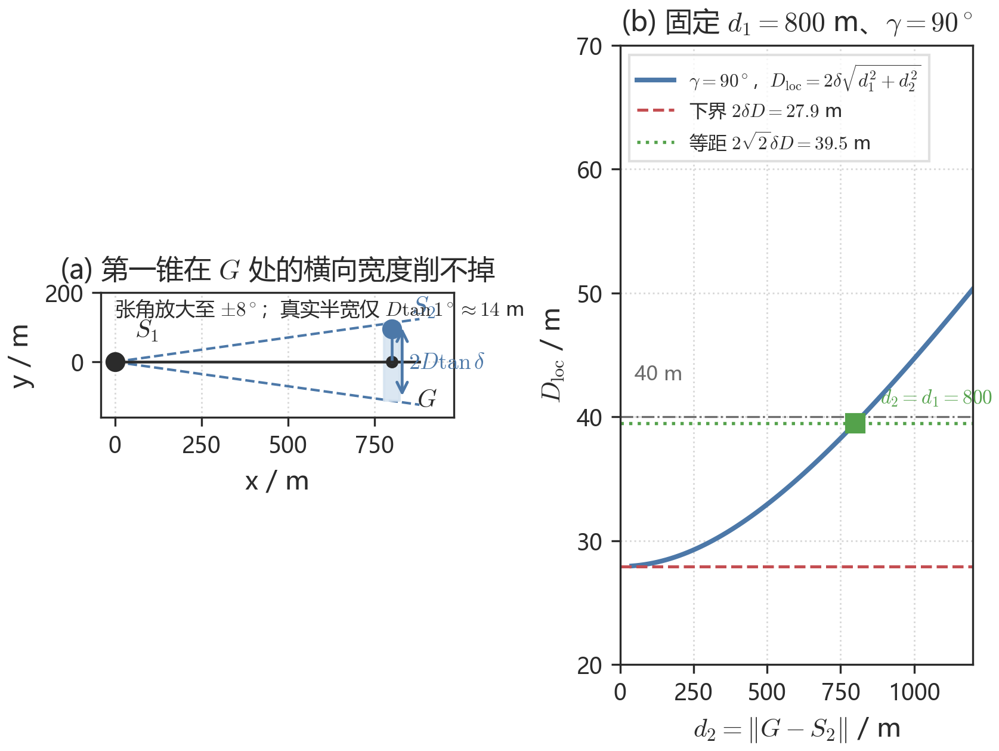

**附图 4**　(a) 第一锥横向宽度（张角放大）；(b) $D_{\mathrm{loc}}$ 随 $d_2$ 下降到 $2\delta D$，等距 $800$ m 对应 $39.5$ m。

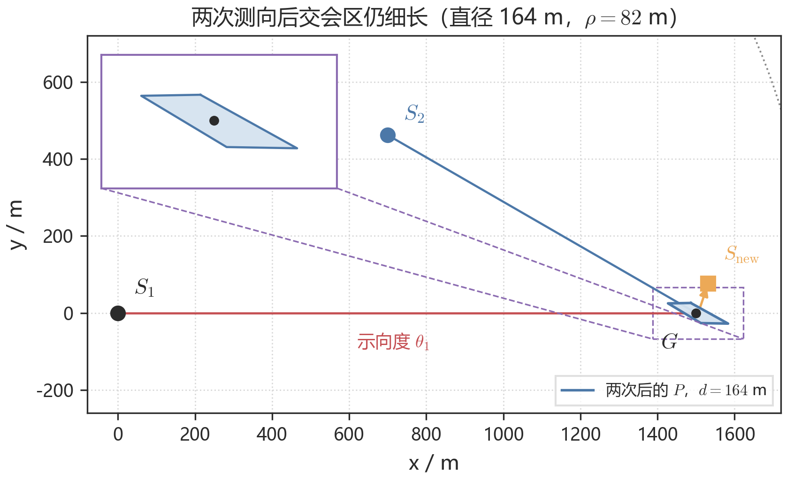

**附图 5**　$D=1500$ m。$S_{\mathrm{new}}$ 在长轴法向，$\rho=82$ m。

**附图 6**　面积先验 $f_D\propto D$。时间流派谷底在 $t=500$ m，用于问题三。

**附图 7**　该局虚拟时间 $5189$ s。移动占 $87.9\%$。竖线为原点扫频结束（$119$ s）。

**附图 8**　同一批 $12$ 个世界上四种第二点策略的平均定位清除时间。

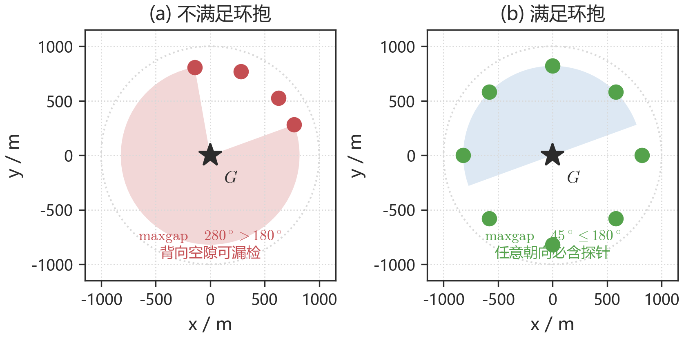

**附图 9**　(a) $\mathrm{maxgap}=280^\circ$，存在朝向使全部探针落在盲侧；(b) $\mathrm{maxgap}=45^\circ$，任意朝向必被检出。

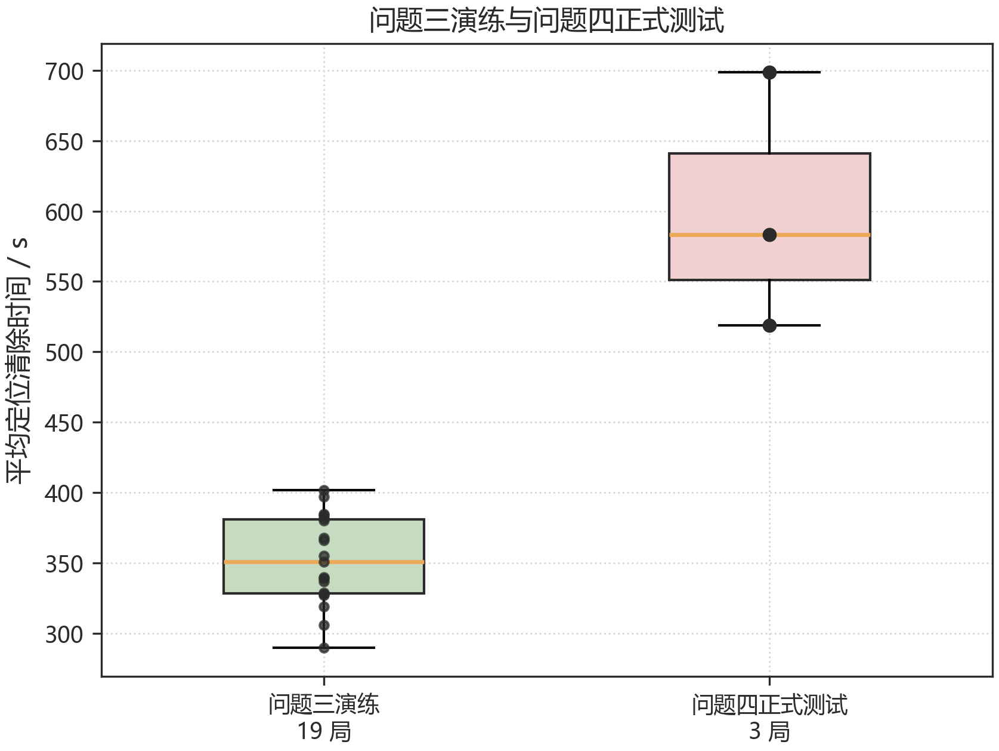

**附图 10**　左：问题三官方 $19$ 局演练（均值 $352$ s/个）；右：问题四正式测试三局（均值 $600.26$ s/个）。

**附录 G　支撑材料文件列表**

电子版支撑材料为 `支撑材料.zip`（与论文一并提交，大小不超过 20 MB）。论文附录给出重点源程序；完整可运行代码以压缩包为准。压缩包内不得含承诺书、编号页及队名、校名。

| 路径 | 说明 |
| --- | --- |
| `q1/solver.py` | 问题一半平面交会、直径、覆盖与最小包围圆 |
| `q2/geometry.py` | 问题二几何与 $D_{\mathrm{loc}}$ 闭式 |
| `q3/run_q3.py` | 问题三主程序：扫频、追击、环网补漏 |
| `q4/ledger.py` | 问题四探针账本与环抱判空 |
| `q4/scheduler.py` | 问题四证书巡回 |
| `q4/policy.py` | 问题四合并巡回与定向追击 |
| `q4/run_q4.py` | 问题四入口 |
| `robot.py` | 模拟器通信接口 |
| `q2/derive_check.py` | 闭式误差、四准则网格与 minimax 核验 |
| `q4/skeleton_final.json` | $26$ 点证书坐标 |
| `q4/score.py` | 问题四 mock 基准 |
| `q1/figs/`、`q2/figs/`、`q3/figs/`、`q4/figs/` | 论文插图源文件 |

**附录 H　重点源程序**

下列程序与提交的 `支撑材料.zip` 一致。问题三入口 `python q3/run_q3.py`（默认关闭 `--adaptive-step`）；问题四入口 `python q4/run_q4.py`。

<!-- include-code: q1/solver.py -->

<!-- include-code: q2/geometry.py -->

<!-- include-code: q3/run_q3.py -->

<!-- include-code: q4/ledger.py -->

<!-- include-code: q4/scheduler.py -->

<!-- include-code: q4/policy.py -->

<!-- include-code: q4/run_q4.py -->

<!-- include-code: robot.py -->
