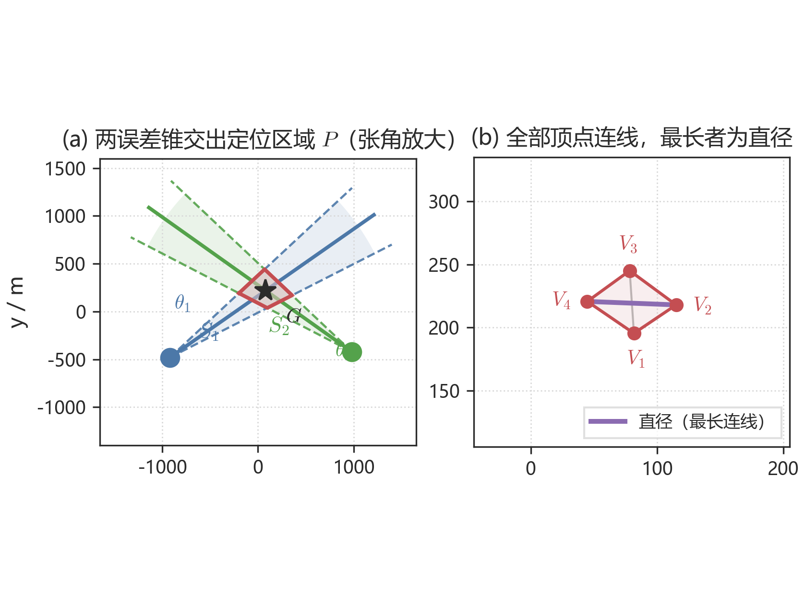
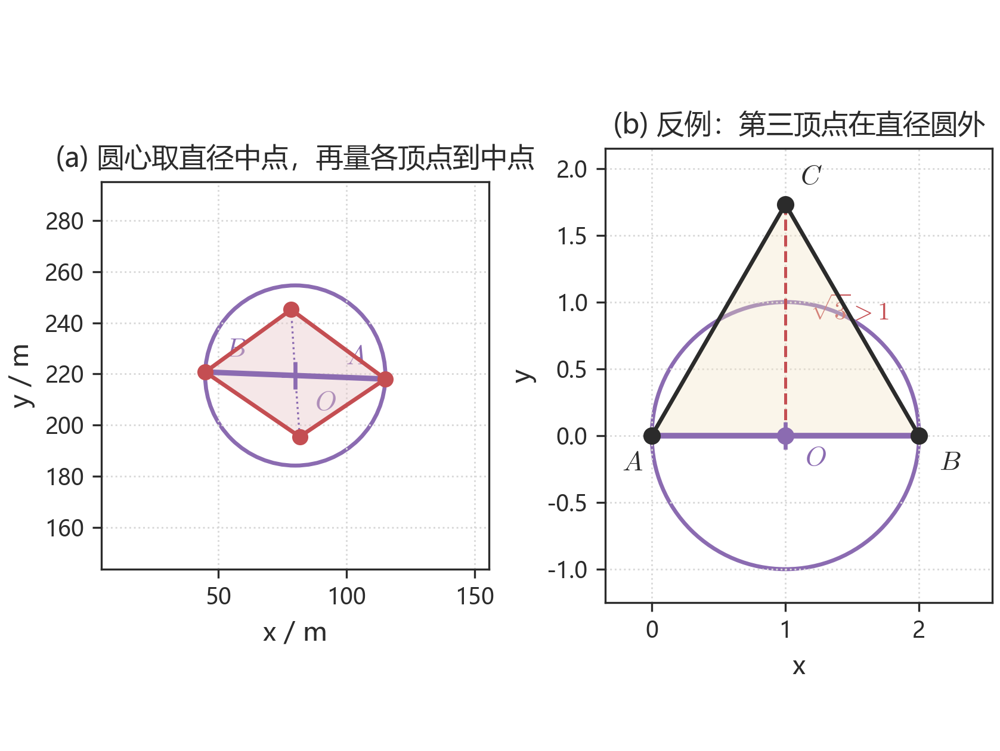
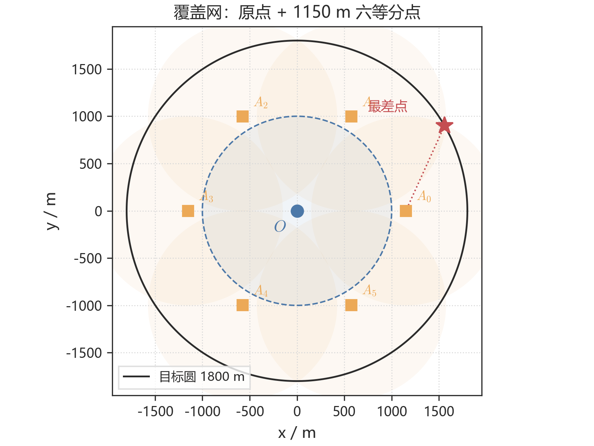
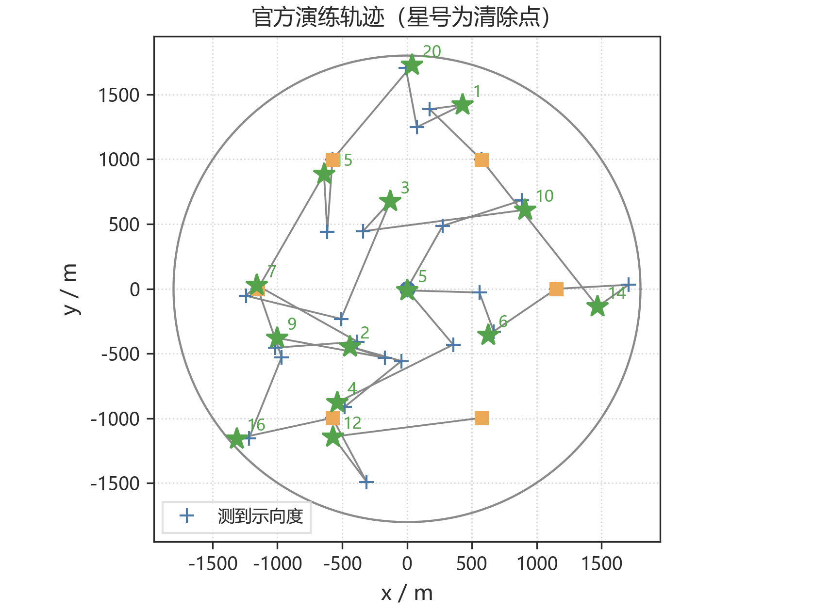
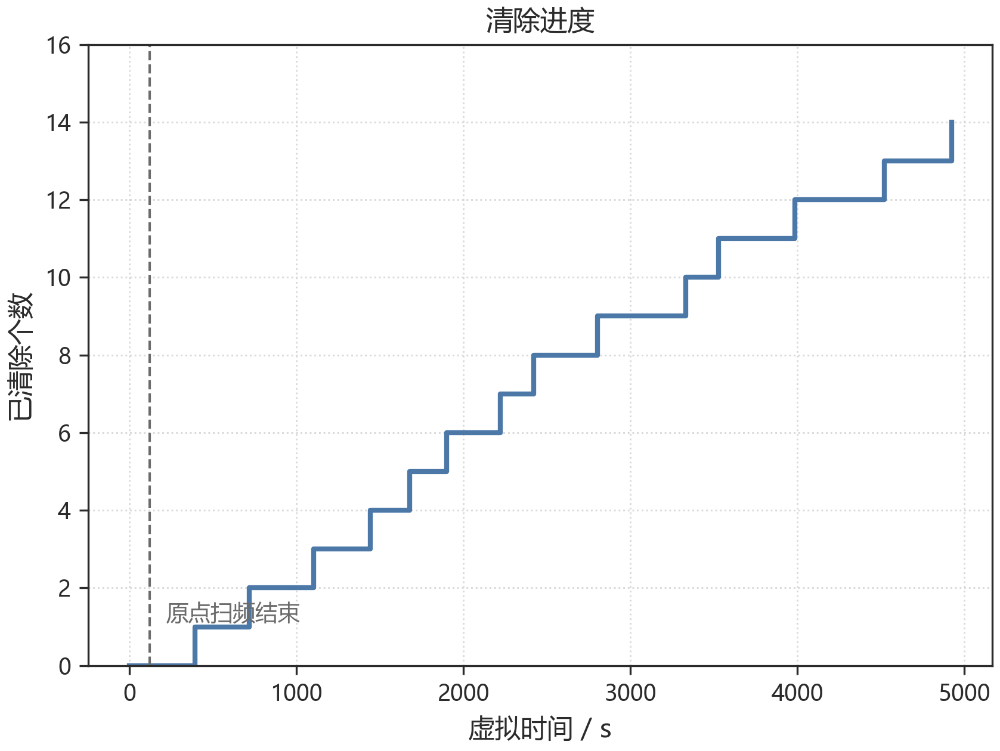
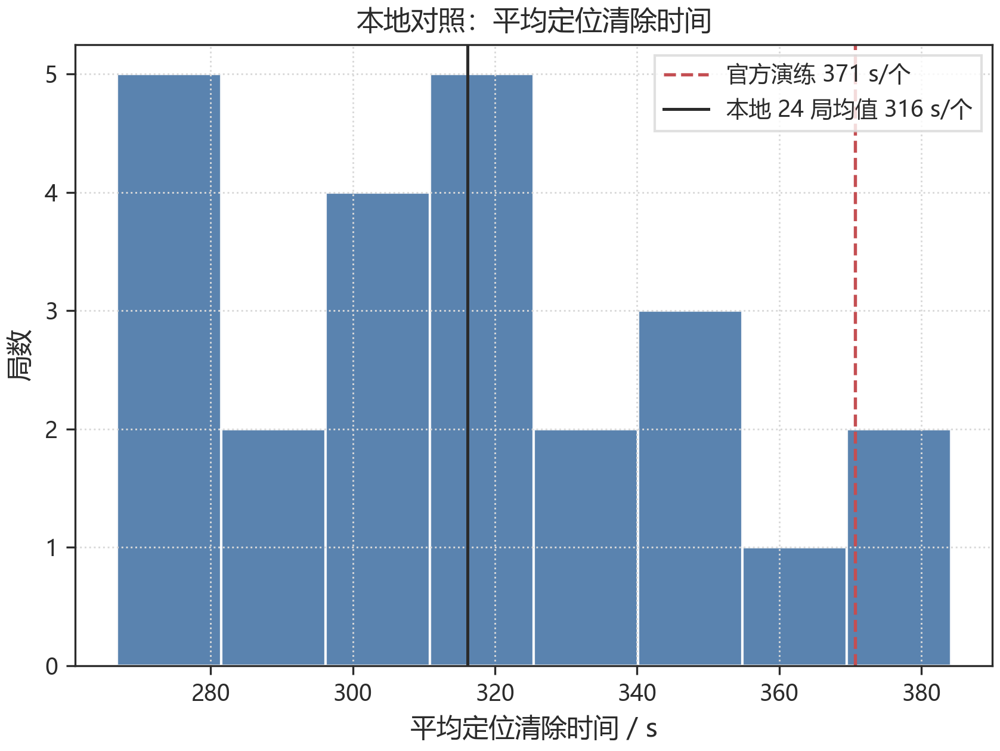
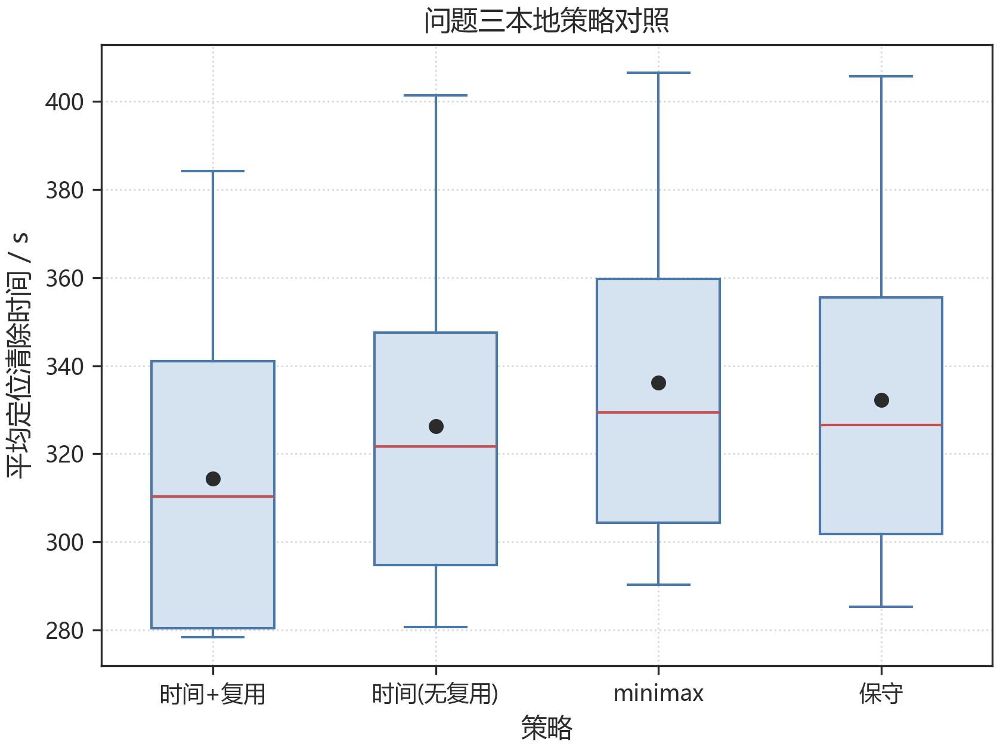

# 无线电干扰源的快速自动定位与清除

## 摘要

针对目标圆域内无线电干扰源的快速定位与清除，本文将测向误差写成有界集合，而不是随机噪声。各检测点对应一个张角 $2^\circ$ 的误差锥，定位区域就是这些锥的公共交集。四问共用同一套几何对象：问题一给出交会多边形的直径与覆盖判定，问题二在此之上选择第二检测点，问题三用覆盖网搜索全向源，问题四把覆盖改成环抱证书以检出定向源。程序可在官方模拟器上直接运行。

问题一把定位区域看成凸多边形。直径就是全部顶点连线（边和对角线都算）里最长的一条；若要用直径为 $D$ 的圆去覆盖，圆心只能取这条线段的中点，再看各顶点到中点是否都不超过半径。等边三角形说明这一步不能省。两站交会算例直径 $D=70.419$ m，直径圆可以覆盖；三站环绕时直径圆盖不住，但最小包围圆半径只有 $16.288$ m，仍小于 $20$ m 的清除半径。

问题二的关键是：干扰源到 $S_1$ 的距离未知，第二点只能落在某个候选区域里，再按假设从中选出一个点。候选区由交会角约束给出，分居示向度两侧，呈蝶形。四种假设对应四个点；仿真后时间流派 $(500,250)$ 期望约 $270$ s，用于问题三。问题四因定向波束改用小侧偏。两次仍压不进 $20$ m 时，沿当前长轴的法向再切一刀，远目标直径可由 $164.5$ m 压到 $33.1$ m。计入平均时间的，只包括最小包围圆半径已经不超过 $20$ m 的成功样本。

问题三用原点加半径 $1150$ m 的六个等分点组成监听网。按最坏接收半径 $1000$ m 计算，网外最坏间隙约 $988.5$ m，因此某频道在七点都无信号即可判空。机器狗先在原点扫完频道 $1$–$20$，再按问题二追击已经听到的源，最后走环网补漏。官方模拟器多局演练中，清除数在 $11$–$16$，失败为 $0$，平均约 $317$–$431$ s/个。自建随机环境 $24$ 局均值为 $316$ s；同一批世界上比较四种追击策略，时间赌注加停点复用最低。本地结果只用来观察策略是否稳定，不能当作官方成功率。

问题四引入定向源后，无信号增加了“波束背向”这一解释，七点覆盖不再构成判空证书。保证任意朝向都能检出，等价于探针绕候选点的最大方位间隙不超过 $180^\circ$。圆缘外向源的可检半平面几乎落在圆外，故证书必须包含圆外停点。本文取 $26$ 点骨架（$400$ m×$6$、$1300$ m×$8$、$1900$ m×$12$），在 $1825$ 个网格点上最坏间隙恰为 $180^\circ$。官方八局实用环绕网全部清完，但本地圆缘外向场景上该网 $0/6$ 全清；环抱网为 $5/6$，两例失败均发生在已检出之后的追击，而不是漏检。程序默认改为环抱证书。

**关键词：** 交会定位；误差锥；最小包围圆；第二检测点；覆盖网；环抱证书；定向干扰源

## 一、问题重述

目标区域是半径 $1800$ m 的圆盘。无人机器狗可在圆内直线移动，速度 $5$ m/s；停下后对指定频道测向，单次 $5$ s。测向误差有界：真实方位角与示向度之差不超过 $\delta=1^\circ$。有效接收半径 $R\in[1000,1500]$ m。机器狗走到距源不超过 $20$ m 处，即可光学定位并激光清除；不超过 $5$ m 时信号过强，无法测向，但可直接清除。

问题一给出若干检测点及其示向度，要求计算交会得到的多边形定位区域的直径，并判断以该直径为直径的圆能否覆盖该区域。这里的定位区域只由示向度误差锥交会得到，不叠加目标圆域或接收半径圆盘。

问题二已知某全向干扰源已在第一检测点测得示向度，要求给出第二个检测点的选择策略及其候选区域。所谓较好的定位，是指两次（必要时三次）测向后，定位区域的最小包围圆半径不超过 $20$ m，从而一次进圈即可清除，同时尽量缩短移动与测量时间。

问题三的圆内有 $10$–$16$ 个全向干扰源，分别占用频道 $1$–$20$ 中的若干个，每频道至多一个源。机器狗从原点、频道 $1$ 出发，要在虚拟时间与约 $20$ 分钟现实时限内，尽量提高清除比例、缩短平均定位清除时间。

问题四在问题三基础上引入定向干扰源。定向源的个数与朝向均未知，只在定向方向两侧各 $90^\circ$ 的闭半平面内辐射。硬约束是清除比例 $100\%$，并在此前提下缩短平均定位清除时间。

## 二、问题分析

### 2.1 问题一

问题一要求根据若干检测点及其示向度，确定交会得到的多边形定位区域 $P$，计算直径 $D(P)$，并判断以该直径为直径的圆能否覆盖 $P$。示向度存在有界误差 $\pm 1^\circ$，单次测向只能将干扰源限制在以检测点为顶点、张角为 $2^\circ$ 的误差锥内。各锥取公共交集，即得到 $P$。当各锥对向交会时，$P$ 为凸多边形。

凸集的直径在极点处取得，因而 $D(P)$ 等于全部顶点两两距离的最大值。题面进一步要求判断以该直径为直径的圆能否覆盖 $P$。圆盘内最远点对只能是对径点，故若这样的覆盖圆存在，圆心唯一确定为直径端点的中点；再检验各顶点是否落入该圆即可。一般凸多边形并不保证落进直径圆，等边三角形给出反例，因此覆盖判定必须逐点进行。半平面交会用于求出顶点；单站或示向度近乎同向时公共区域无界，直径没有有限值。

### 2.2 问题二

第一次测向之后，干扰源的方位已知而距离未知，可行域收缩为以 $S_1$ 为顶点的细长楔形。因此第二检测点不存在唯一最优坐标，而应落在由交会角约束确定的候选区域内；再根据对未知距离的假设，从该区域内选出具体测点。交会角 $\gamma$ 决定定位区域的形状；一阶平行四边形近似给出直径关于 $\gamma$ 的闭式，从而说明 $\gamma=90^\circ$ 时定位效果最好。距离未知时，为使各种可能距离仍保持可用交会角，第二点必须离开示向度射线足够远，候选区因此分居两侧，呈蝶形。仿真后问题三采用时间赌注 $(500,250)$；问题四因定向波束改用小侧偏。两次不够，就沿长轴法向再测。

### 2.3 问题三

全向条件下，无信号只有两种解释：这个频道没有尚未清除的源，或者检测点已经超出该源的接收半径。于是，只要一组监听点能用半径 $1000$ m（接收半径的下界）盖住整个 $1800$ m 圆盘，某频道在这些点上都无信号，就可以判定该频道为空。未知总数因此变成一个覆盖问题。一旦听到示向度，后面的定位和清除与问题一、二相同。本问在几何上并不另起模型，新的工作是覆盖网、扫频与追击的衔接，以及频道账本。

### 2.4 问题四

定向源使无信号增加了第三种解释：检测点虽在接收半径内，却落在波束背向的阴影半平面。问题三的圆盘覆盖因此不再构成判空证书。为保证任意朝向都能检出，对圆域内任意点 $G$，落在 $B(G,1000)$ 内的探针绕 $G$ 的最大方位间隙不得超过 $180^\circ$。源贴在圆缘且指向圆外时，可检半平面与圆域几乎不相交，因而证书必须包含圆外停点。检出之后的交会仍用问题一；第二点改为沿示向度小步、小侧偏，以免走出定向波束。

## 三、模型假设

| 编号 | 假设 | 依据 |
|---|---|---|
| H1 | 示向度误差有界 $[-\delta,\delta]$，$\delta=1^\circ$；同一地点重复测量误差不变 | 题面附录 |
| H2 | 测向机与干扰源视为同一平面；问题一至三中干扰源全向，接收只取决于距离 | 题面 |
| H3 | 示向度是检测点指向干扰源的方位角，可行域只取检测点前方的误差锥 | 题面定义 |
| H4 | 问题一的定位区域只由误差锥交会得到，不叠加目标圆域与有效接收半径圆盘 | 与附录多边形交会区一致 |
| H5 | 直线移动，速度 $5$ m/s；单次测量 $5$ s；距源 $\le 20$ m 时清除必成功 | 题面附录 |
| H6 | $R\in[1000,1500]$ m，未知但对该源固定；覆盖判空用最坏接收半径 $1000$ m | 问题二、三 |
| H7 | 问题二仅在涉及概率时假定 $G$ 在圆域与楔形内按面积均匀；无先验的硬结论不依赖该假设 | 题目未给先验 |
| H8 | 两步成功：交会区域最小包围圆半径 $\le 20$ m；问题三第二点默认采用时间赌注 $(500,250)$ | 与光学清除作用域衔接 |
| H9 | 定向源可检区域为张角 $180^\circ$ 的闭半平面与接收圆盘的交；朝向固定但未知 | 问题四 |
| H10 | 检测点允许在圆域外；环抱证书外环取 $1900$ m | 问题四，题面坐标范围 |

## 四、符号说明

| 符号 | 含义 | 单位 |
|---|---|---|
| $S_i=(x_i,y_i)$ | 第 $i$ 个检测点 | m |
| $N$ | 检测点个数 | — |
| $\theta_i$ | 在 $S_i$ 处测得的示向度 | 度 |
| $\delta=1^\circ$ | 测向误差限 | 度 |
| $G$ | 干扰源位置 | m |
| $C_i$ | 第 $i$ 个检测点的误差锥 | — |
| $P=\bigcap_i C_i$ | 交会定位区域 | — |
| $V(P)$ | $P$ 的顶点集，边数至多 $2N$ | — |
| $D(P)$ | $P$ 的直径，即区域内任意两点距离的最大值 | m |
| $R_{\mathrm{MEC}}$ | $P$ 的最小包围圆半径 | m |
| $D=\|G-S_1\|$ | 干扰源到第一检测点的距离 | m |
| $d_i=\|G-S_i\|$ | 第 $i$ 个检测点到源的距离 | m |
| $\gamma$ | 交会角 $\angle S_1 G S_2$ | 度 |
| $t,h$ | 第二点局部坐标：沿示向度的赌注与侧偏 | m |
| $K$ | 两步成功常数，$K=40/(2\tan 1^\circ)\approx 1146$ | m |
| $\kappa$ | 最小包围圆半径与直径之半的比 | — |
| $W$ | 第一次测向后干扰源的候选集 | — |
| $\mathcal{C}$ | 第二检测点的候选区域 | — |
| $\rho$ | 救援测点相对当前最小包围圆圆心的偏移 | m |
| $E[T]$ | 单目标定位清除总时间的期望 | s |
| $R$ | 有效接收半径，$R\in[1000,1500]$ | m |
| $r$ | 问题三环网监听半径 | m |
| $\mathrm{maxgap}(G)$ | 探针绕候选点 $G$ 的最大方位间隙 | 度 |
| $\mathcal{S}$ | 问题四 $26$ 点环抱骨架 | — |

## 五、问题一的模型建立与求解

### 5.1 模型建立

本问要把有界误差下的交会区域写成可以计算的几何对象。误差锥的公共交集 $P$ 在对向交会时是凸多边形；直径在顶点对上取到，覆盖圆若存在则圆心只能是直径中点。半平面交会用于求出顶点。

对检测点 $S_i$，误差锥两条边界过 $S_i$，方向为 $\theta_i\pm\delta$。点落在左边界的逆时针侧、同时落在右边界的顺时针侧，就在该锥内。定位区域 $P$ 是这些锥的公共交集，因而凸。当 $N\ge 2$ 且各锥能够对向交会时，$P$ 成为边数不超过 $2N$ 的凸多边形。两个示向度的圆周距离若不超过 $2^\circ$，公共区域无界，直径没有定义。

图 1(a) 画出两锥如何交出 $P$。为看清交会，图中把 $\pm 1^\circ$ 放大为 $\pm 8^\circ$；图 1(b) 与后文算例改回真实 $\pm 1^\circ$。

凸多边形上最远点对一定落在顶点，因此

$$
D(P)=\max_{u,v\in V(P)}\|u-v\|.
$$

把全部顶点两两连起来——边和对角线都算——最长的一条就是直径，见图 1(b)。实现时不必预先判断最长的是边还是对角线。

**图 1**　(a) $S_1,S_2$ 的误差锥交出 $P$（张角放大）；(b) 真实 $\pm 1^\circ$ 下的凸四边形，粗线为全部顶点连线中的最长者，即直径。

设 $A,B$ 达到直径，$\|A-B\|=d$。若存在直径也等于 $d$ 的覆盖圆，它必须盖住 $A$ 和 $B$；圆内最远的两点只能是对径点，故圆心只能取

$$
O=\frac{A+B}{2},\qquad R=\frac{d}{2}.
$$

再检查各顶点到 $O$ 是否都不超过 $R$：圆盘是凸集，顶点都在圆内则整个多边形在圆内。图 2(a) 画出这一检验。这一步不能省：等边三角形以底边为直径作圆，第三顶点到圆心的距离为 $\sqrt{3}\,D/2>D/2$，见图 2(b)。平行四边形时检验一定通过，但本题交会四边形一般不是平行四边形，仍按顶点检验。

**图 2**　(a) 圆心取直径中点 $O$，虚线为各顶点到 $O$ 的距离；(b) 等边三角形反例：第三顶点在直径圆外。

直径圆盖不住，只说明“直径为 $d$ 的圆”不够大。最小包围圆半径满足 $D/2\le R_{\mathrm{MEC}}\le D/\sqrt{3}$。后续以 $R_{\mathrm{MEC}}\le 20$ m 作为可清除判据。

### 5.2 模型求解

算法与图 3 一致：$N<2$ 或法向角间隙达到 $180^\circ$ 则无界；否则直线两两求交得顶点，枚举顶点对取直径，圆心取中点后逐点检验，并枚举最小包围圆。无界区域可能留下有限顶点，不能据此输出虚假直径。

**图 3**　先求顶点，再取最长连线为直径，圆心取中点后逐点检验。

坐标用于核验，不是题面数据。示意源 $G=(80,220)$，检测点 $S_1=(-920,-480)$、$S_2=(980,-420)$、$S_3=(-40,1180)$。图 1(b)、图 2(a) 即算例 B。

**表 1**　问题一算例汇总

| 算例 | 构型 | 状态 | 顶点数 | $D$ (m) | 直径圆覆盖 | $R_{\mathrm{MEC}}$ (m) |
|---|---|---|---|---|---|---|
| A | 单站 | UNBOUNDED | — | — | — | — |
| B | 两站交会四边形 | OK | 4 | 70.419 | 是 | 35.209 |
| C | 三站切入六边形 | OK | 6 | 49.800 | 是 | 24.900 |
| D | 相背两站 | EMPTY | — | — | — | — |
| E | 等边三角形边长 2 | 几何核验 | 3 | 2.000 | 否 | 1.155 |
| F | 同向两站 | UNBOUNDED | 1（有限顶点） | — | — | — |
| G | 三站环绕六边形 | OK | 6 | 32.252 | 否 | 16.288 |

算例 B 四个顶点到中点均不超过 $R=35.209$ m，故覆盖。算例 G 是交会区上的不覆盖例子：$D=32.252$ m，直径圆半径 $16.126$ m，最小包围圆 $16.288$ m 仍小于 $20$ m，不影响后续清除。

## 六、问题二的模型建立与求解

### 6.1 模型建立

第一次测向之后，方向已知、距离未知。干扰源落在 $S_1$ 示向度的楔形里，见图 4。因此第二点不可能有唯一最优坐标：它应当落在某个候选区域内，再按对未知距离的假设选出一个具体的点。

**图 4**　标出 $S_1$ 与示向度 $\theta_1$。真实张角仅 $\pm 1^\circ$，图中放大至 $\pm 7^\circ$。空心圆表示距离未知。

以 $S_1$ 为原点、测得示向度为极轴，第二点写成 $S_2=S_1+t\mathbf{e}_\theta+h\mathbf{e}_\theta^{\perp}$。$t$ 是对 $D$ 的纵向猜测，$h$ 是侧偏。沿示向度走则两次共线，交会无界，所以必须有侧偏。

图 5(a) 给出交会角：$\varepsilon=0$ 时 $\sin\gamma=\lvert h\rvert/d_2$。精确区域仍用问题一的多边形。把误差方块 $[-\delta,\delta]^2$ 经雅可比的逆映成平行四边形，见图 5(b)，直径取较长对角线，得到闭式

$$
D_{\mathrm{loc}}=2\delta\sqrt{\frac{d_1^2+d_2^2+2d_1 d_2\lvert\cos\gamma\rvert}{\sin^2\gamma}}.
$$

分子在 $\gamma=90^\circ$ 时最小，分母 $\sin\gamma$ 在此时最大，故直角交会最好；共线则发散。闭式相对多边形直径误差不超过 $0.43\%$。对本问平行四边形，最小包围圆半径等于直径之半，设计阶段可用直径 $\le 40$ m 代替半径 $\le 20$ m。

**图 5**　(a) $S_1,S_2,G$ 与 $t,h,\gamma$；(b) 平行四边形（虚线）几乎重合于交会多边形（实线），闭式由此写出。

图 6 把闭式画成几何：左边 $S_1$ 固定、$S_2$ 绕 $G$ 改变 $\gamma$，右边是同一过程的直径曲线。$90^\circ$ 时直径 $39.6$ m，刚进入 $40$ m 筛选线；$30^\circ$ 与 $150^\circ$ 约 $108$ m。固定 $D$ 时 $\inf D_{\mathrm{loc}}=2\delta D$，故两步成功必须 $D\le D^*=20/\tan 1^\circ\approx 1146$ m，更远的源要准备第三次测量。

**图 6**　$d_1=d_2=800$ m。(a) 标出 $S_1$、$G$ 及 $S_2$ 在 $30^\circ$、$90^\circ$、$150^\circ$ 的位置；(b) 对应的直径曲线，$90^\circ$ 最低。

距离未知，不能只对某一个 $D$ 去摆 $90^\circ$。要求全体候选 $D$ 上 $\sin\gamma\ge 1/2$，得到杠杆条件：侧偏必须与距离失配同量级。它在示向度两侧各给出一条斜带，这就是蝶形候选区，见图 7。图中 $S_1$ 与示向度与图 4 相同，否则看不出蝶形落在楔形哪一侧。空心点是对称点：最优解是等价类，所以题面问的是区域。

**图 7**　与图 4 同一组 $S_1$、示向度。两侧翼为杠杆带；四个实心点是四种策略，空心点为对称点。时间流派 $(500,250)$ 在探距带外。

候选区只说明第二点可以落在哪里。落到哪一点取决于假设，见表 2。minimax 点 $(550,498)$ 对 $D\le 734$ m 有硬保证；时间点 $(500,250)$ 路更短，远端依赖补测。仿真后时间流派最低，问题三采用该点；问题四因定向波束改用小侧偏。

若两次后最小包围圆仍大于 $20$ m，新测点取当前长轴的法向：$S_{\mathrm{new}}=C+\rho\hat n$，$\rho=\max(50,0.5L)$。图 8(a) 能看见 $S_1$、$S_2$、示向度与交会区；(b) 是紫框放大：两次后直径 $164.5$ m，再测一次后 $33.1$ m、半径 $16.5$ m，落入清除圆。

**图 8**　$D=1500$ m。(a) 全局标出 $S_1$、$S_2$、示向度 $\theta_1$ 与 $S_{\mathrm{new}}$；(b) 蓝虚线为两次后的细长区域，第三次后落入 $20$ m 清除圆。

### 6.2 模型求解

**表 2**　第二检测点的四种设计（$E[T]$ 仅对成功样本）

| 流派 | 准则 | 最优赌注 $(t,h)$ | 两步成功区间 | $E[T\mid\mathrm{成功}]$ |
|---|---|---|---|---|
| minimax 硬保证 | 无先验最坏情形 | $(550,498)$ | $[5,732]$ | $320\pm 1$ s |
| 概率最优 | 面积先验下成功概率最大 | $(675,476)$ | $[244,815]$ | $320\pm 1$ s |
| 保守流派 | 杠杆与硬接收下期望时间最小 | $(750,450)$ | $[389,867]$ | $319\pm 1$ s |
| 时间流派（实战） | 无约束期望时间最小 | $(500,250)$ | $[78,680]$ | $270\pm 3$ s |

四流派最终都能压进 $20$ m，成功概率为 $1$。图 9 中时间流派谷底在 $t=500$ m，比杠杆加硬接收大约快 $16\%$，差距主要来自前期少走的路。问题三单目标子程序即取该点；需要硬保证则改 $(550,498)$。问题四不再沿用该侧偏。

**图 9**　面积先验 $f_D\propto D$，仅当最小包围圆半径不超过 $20$ m 才计时。时间流派谷底在 $t=500$ m，用于问题三。

主要核对：闭式相对误差 $\le 0.43\%$；$D^*$ 在 $1146$ m；$(550,498)$ 最坏半径 $19.93$ m；误差蒙特卡洛下排序不变。

## 七、问题三的模型建立与求解

### 7.1 模型建立

#### 7.1.1 覆盖网

监听点取原点，再加上半径 $r=1150$ m 圆周上均匀分布的 $6$ 个点（相邻夹角 $60^\circ$），见图 10。要用半径 $1000$ m 的接收圆盘盖住半径 $1800$ m 的目标圆：原点管住 $\|X\|\le 1000$；环上最难盖的点出现在外缘的角平分线上。该点到最近环站的距离由余弦定理给出

$$
d(r)^2=1800^2+r^2-2\cdot 1800\cdot r\cdot\cos 30^\circ.
$$

令 $d(r)=1000$，较小的正根 $r^*\approx 1123$ m；再缩小环半径，外缘就会突破 $1000$ m。实际取 $r=1150$ m，留出大约 $27$ m 余量，此时 $d(1150)\approx 988.5$ m。沿半径方向，边界点到正对环站只有 $1800-1150=650$ m。因此，某频道只要在这 $7$ 个点都返回无信号，就可以判定该频道没有尚未清除的全向源。

#### 7.1.2 频道账本与三阶段策略

每个频道单独记账：未知变为已听再变为已清除，或者未知直接变为空。清满 $16$ 个（题面源数上界）以后，剩下的频道按上界判空。

策略分三段。第一段在原点扫频：人不移动，频道 $1$ 到 $20$ 各测一次，虚拟耗时 $119$ s。第二段追击已经听到的频道：从听测点走时间赌注 $(500,250)$；若第二点无信号，就换侧并加大纵向赌注，相当于把“距该点超过 $1000$ m”用进下一步，并不假设第二点必然有信号。两锥交会后，最小包围圆大于 $20$ m 就沿长轴再切一刀，不超过就到圆心清除。第三段走环网补漏：无信号按监听点编号记账，七点都无信号则判空。程序读取接口返回的剩余现实时间，墙钟不够就停止补网。

定位清除不重写：交会调用问题一半平面算法，最小包围圆与长轴调用问题二几何模块。

### 7.2 模型求解

#### 7.2.1 官方模拟器演练

程序入口为 `python q3/run_q3.py`。图 10—图 12 分别给出覆盖网、一局官方轨迹与清除进度。该局移动占虚拟时间 $87.9\%$。

**图 10**　原点加 $1150$ m 六等分点。$1000$ m 接收圆盘盖住 $1800$ m 目标圆域，外缘最差点到最近环站 $988.5$ m。

**图 11**　案例 `WU4D-52HU-EUR9-Y4QR`。星号为清除点，数字为频道。

**图 12**　该局虚拟时间 $5189$ s。移动 $4563$ s（$87.9\%$），检测 $470$ s，切频道 $86$ s，清除 $70$ s。竖线为原点扫频结束（$119$ s）。

在官方模拟器上连续演练，连接被重置的一局不计。其余各局清除失败数均为 $0$，占用频道与空频道合计 $20$，账本闭合。源个数落在题面 $10$–$16$ 的范围内。多数源两次测量即可清；较远的源第三次长轴切割后最小包围圆降到 $10$ m 量级。清满 $16$ 个后提前结束环网，剩余频道由题面源数上界判空。

**表 3**　问题三官方模拟器演练

| 局次 | 清除数 | 判空数 | 失败 | 剩余 | 虚拟时间 (s) | 平均 (s/个) |
|---|---|---|---|---|---|---|
| 1 | 14 | 6 | 0 | 0 | 5189 | 371 |
| 2 | 13 | 7 | 0 | 0 | 5139 | 395 |
| 3 | 12 | 8 | 0 | 0 | 5167 | 431 |
| 4 | 16 | 4 | 0 | 0 | 5073 | 317 |
| 5 | 11 | 9 | 0 | 0 | 4341 | 395 |
| 6 | 16 | 4 | 0 | 0 | 5874 | 367 |

局 1 对应案例 `WU4D-52HU-EUR9-Y4QR`：原点听到并清除 $8$ 个，环网再清 $6$ 个，覆盖后判空 $6$ 个。时间构成中移动 $4563$ s（$87.9\%$），检测 $470$ s，切频道 $86$ s，清除 $70$ s，程序墙钟约 $3$ s。演练中模拟器在两局之间偶发连接重置，重试 `/enter` 后即可继续，与搜索逻辑无关。

#### 7.2.2 本地对照与策略比较

同一套程序在**自建随机环境**中跑了 $24$ 局，见图 13。这 $24/24$ 全清只说明所设随机场景下策略稳定，**不是**官方成功率。官方以模拟器演练为准（表 3）；本地均值 $316$ s，与官方各局 $317$–$431$ s/个同量级。

**图 13**　自建随机环境对照直方图，不能当作官方成功率。虚线为官方局 1 的 $371$ s/个，实线为本地 $24$ 局均值 $316$ s/个。

在同一批 $12$ 个随机世界上，把第二点换成问题二的另外两个流派，并关掉停点复用作为对照，见图 14、表 4。四种策略均全清。时间赌注加停点复用最低（$314$ s/个）；关掉复用后升至 $326$ s；minimax 与保守分别升至 $336$ s 与 $332$ s。排序与问题二单目标仿真一致，说明多源场景下差距仍然主要来自前期少走的路。问题三因此采用 $(500,250)$ 并保留顺路复测。

**图 14**　同一批 $12$ 局上四种追击策略的平均时间。

**表 4**　问题三本地策略对照（$12$ 局同一批世界）

| 策略 | 第二点 $(t,h)$ | 停点复用 | 全清 | 平均 (s/个) | 局均虚拟时间 (s) |
|---|---|---|---|---|---|
| 时间+复用（采用） | $(500,250)$ | 是 | $12/12$ | $314$ | $3955$ |
| 时间、无复用 | $(500,250)$ | 否 | $12/12$ | $326$ | $4122$ |
| minimax | $(550,498)$ | 是 | $12/12$ | $336$ | $4226$ |
| 保守 | $(750,450)$ | 是 | $12/12$ | $332$ | $4178$ |

## 八、问题四的模型建立与求解

### 8.1 模型建立

#### 8.1.1 从圆盘覆盖到环抱证书

定向源只在张角 $180^\circ$ 的闭半平面内可检。无信号因此有三种解释：频道为空、距离超出接收半径、检测点落在背向阴影。问题三的七点覆盖只排除前两种，不能再作为判空证书。

保证任意朝向都能检出，等价于：对圆域内任意点 $G$，落在 $B(G,1000)$ 内的探针绕 $G$ 的最大方位间隙

$$
\mathrm{maxgap}(G)\le 180^\circ.
$$

此时任意闭半平面与探针集的交非空。全向源是其特例。若某 $G$ 的最大间隙大于 $180^\circ$，取定向方向背对那条空隙，则可能漏检。

源在圆缘且指向圆外时，可检半平面与目标圆域几乎不相交。任何纯圆内探针集合对此类源的 $\mathrm{maxgap}=360^\circ$。题面允许检测坐标超出 $1800$ m 圆域，证书因此必须包含圆外停点。

#### 8.1.2 $26$ 点骨架

取

$$
\mathcal{S}=\mathrm{ring}(400,6)\cup\mathrm{ring}(1300,8)\cup\mathrm{ring}(1900,12),
$$

共 $26$ 点，见图 15。外环 $1900$ m 用来照亮圆缘外向源。在 $1825$ 个网格点上核验，$\mathcal{S}$ 的最坏 $\mathrm{maxgap}$ 恰为 $180.0^\circ$，全部通过；圆缘点 $(1800,0)$ 处为 $99.2^\circ$。问题三七点网与圆内 $25$ 点实用网在圆缘分别为 $360^\circ$ 与 $216^\circ$，见表 5。后者可以缩短巡线，但不是处处可证的包围证书。

**表 5**　网格上的最大方位间隙（$R=1000$ m）

| 探针网 | 点数 | 最坏 $\mathrm{maxgap}$ | 圆缘 $(1800,0)$ | 未通过格点 |
|---|---|---|---|---|
| 七点覆盖 | $7$ | $360^\circ$ | $360^\circ$ | $1069/1825$ |
| 圆内实用环绕 | $25$ | $239.6^\circ$ | $216.0^\circ$ | $174/1825$ |
| $26$ 点环抱证书 | $26$ | $180.0^\circ$ | $99.2^\circ$ | $0/1825$ |

**图 15**　内环 $400$ m、中环 $1300$ m、外环 $1900$ m。阴影为圆缘源的外向半平面。

#### 8.1.3 搜索与追击

程序先在原点扫频道 $1$–$20$，再按最近邻巡回证书点。每点先扫剩余频道，再就近追击刚听到的源。若某频道在 $26$ 个证书点上都无信号，即可判空。清满 $16$ 个按题面上界停网。

第二点不再用 $(500,250)$，改为 $(260,\pm 80)$ 一类小侧偏，优先留在已点亮的一侧。沿示向度的步长随交会区缩小；若走进背向无信号，在最近一次有效测站与失联点之间搜索清除，不对远处的无信号一律 `/clear`。交会仍调用问题一半平面算法，最小包围圆半径 $\le 20$ m 则进圈。网走完仍未清且已有示向度时，沿示向度折线 `/clear`。

### 8.2 模型求解

#### 8.2.1 官方模拟器演练

早期演练采用圆内实用环绕（七点覆盖后再走 $1750$ m 外圈，连续空转则早停），见图 16、图 17。官方 $8$ 局清除数与模拟器回写的源数一致，失败为 $0$，见表 6。局 1 清满 $16$ 个后提前停网，平均 $541$ s/个；源较少的局空频道扫频把平均时间抬到 $1000$ s 量级。这些案例没有暴露圆缘外向源，不能外推成任意朝向都保证发现。

**图 16**　$850$ m 六角格加 $1750$ m 外圈。外圈仍在圆内。

**图 17**　官方局 1，星号为清除点。

**表 6**　问题四官方模拟器演练（实用环绕网）

| 局次 | 案例 | 源数（全向/定向） | 清除 | 失败 | 剩余频道 | 虚拟时间 (s) | 平均 (s/个) |
|---|---|---|---|---|---|---|---|
| 1 | `BQVK-CMS4-C6AB-STKE` | $16$（$10/6$） | $16$ | $0$ | $0$ | $8661$ | $541$ |
| 2 | `HNMA-FQRN-CS87-DMKW` | $10$（$8/2$） | $10$ | $0$ | $10$ | $12994$ | $1299$ |
| 3 | `K2KV-ZS6Y-3W9T-9J65` | $11$（$10/1$） | $11$ | $0$ | $9$ | $8161$ | $742$ |
| 4 | `HGRX-X5P5-GBFD-Q6ET` | $12$（$8/4$） | $12$ | $0$ | $8$ | $8653$ | $721$ |
| 5 | `K8BU-RQEJ-GRVG-FYRH` | $11$（$10/1$） | $11$ | $0$ | $9$ | $8058$ | $733$ |
| 6 | `FEMW-7NES-HNHA-C4FV` | $11$（$10/1$） | $11$ | $0$ | $9$ | $7242$ | $658$ |
| 7 | `SDVM-J45S-3892-ZCUT` | $12$（$8/4$） | $12$ | $0$ | $8$ | $8324$ | $694$ |
| 8 | `2PKZ-WTFE-WPX8-KJB5` | $11$（$6/5$） | $11$ | $0$ | $9$ | $11517$ | $1047$ |

#### 8.2.2 本地策略对照

自建混合环境（定向占比约一半，$8$ 局）与圆缘外向应力场景（强制 $2$ 个源在 $r=1760$ m、朝向径向朝外，$6$ 局）上比较四种搜索网，见图 18、表 7。本地结果不是官方成功率。

七点覆盖对定向源不充分。实用环绕在混合世界上 $6/8$ 全清，圆缘外向 $0/6$。$26$ 点环抱在混合世界上 $7/8$ 全清，圆缘外向 $5/6$。两例未全清的源都已经被听到，失败发生在定向追击的末轮楔形清除，而不是证书漏检。在“确保全部清除”的硬约束下，程序默认改为环抱证书。

**图 18**　混合随机 $8$ 局、圆缘外向 $6$ 局。环抱网是唯一能在外向应力下稳定全清的策略。

**表 7**　问题四本地策略对照

| 策略 | 混合全清 | 混合平均 (s/个) | 外向全清 | 外向平均 (s/个) |
|---|---|---|---|---|
| 七点覆盖 | $1/8$ | $409$ | $0/6$ | $455$ |
| 实用环绕+早停 | $6/8$ | $648$ | $0/6$ | $702$ |
| 实用环绕走满 | $6/8$ | $775$ | $0/6$ | $811$ |
| $26$ 点环抱（采用） | $7/8$ | $681$ | $5/6$ | $720$ |

## 九、模型评价

四问共用有界误差下的集合交会。问题一在顶点集上取直径、用中点检验覆盖；问题二先给出蝶形候选区，再按假设选点，两次不够就沿长轴再切；问题三用覆盖网把未知源数变成有限监听；问题四把覆盖改成环抱，外环放到圆外，以检出任意朝向的定向源。接口清楚，程序可以在官方模拟器上直接跑。

这样写的好处主要有三条。第一，问题一直径与覆盖的判定都落在顶点上，等边三角形说明中点检验不能省，交会区上的反例说明直径圆不必覆盖。第二，问题二的图与推导都围着“候选区是蝶形、再从中选点”：闭式用来说明 $90^\circ$ 最好，终判据回到多边形；时间赌注用于问题三，硬保证赌注另行给出。第三，问题三用余弦定理写出环半径的下界，判空有覆盖论证；问题四用最大方位间隙写出环抱判据，并在网格上核验 $26$ 点骨架。本地对照表明：全向多源下时间赌注仍最短；定向圆缘外向时，圆内实用网不能代替环抱证书。

局限同样清楚。时间赌注 $(500,250)$ 不满足杠杆条件，对远端源交会角偏小，安全性靠自适应救援；给出的平均时间是角度交会模型下、成功样本上的条件期望。本地全清只说明自建随机场景稳定，不是官方成功率。覆盖网按最坏接收半径 $1000$ m 来铺，偏保守。环抱证书保证检出，个别定向源仍可能在末轮楔形清除中失败。官方八局使用的是实用环绕网，没有覆盖圆缘外向的最不利情形。

## 参考文献

[1] WANG S, et al. Optimal geometry and motion coordination for multisensor target tracking with bearings-only measurements[J]. Sensors, 2023, 23(13): 4347.

[2] BISHOP A N, FIDAN B, ANDERSON B D O, et al. Optimality analysis of sensor-target localization geometries[J]. Automatica, 2010, 46(6): 1169-1177.

正文引用：问题二对照文献 [1][2] 关于交会角 $90^\circ$ 最优、测点宜近的几何结论；候选区域形态对照 [1] 的几何不变性。选题依据仍是多边形直径与最小包围圆，Fisher 信息只作平行对照。

## 附录

**附录 A　问题二公式速查**

| 用途 | 公式 |
|---|---|
| 交会角正弦 | $\sin\gamma=\lvert h\cos\varepsilon-t\sin\varepsilon\rvert/d_2$ |
| 定位直径 | $D_{\mathrm{loc}}=2\delta\sqrt{(d_1^2+d_2^2+2d_1 d_2\lvert\cos\gamma\rvert)/\sin^2\gamma}$ |
| 两步成功（设计） | 上式根号内 $\le K\approx 1146$ m |
| 杠杆条件 | $\lvert h\rvert\ge\dfrac{s_{\min}}{\sqrt{1-s_{\min}^2}}\max(\lvert D_{\mathrm{far}}-t\rvert,\lvert t-D_{\mathrm{near}}\rvert)$ |
| 必要距离界 | $D\le D^*=20/\tan 1^\circ\approx 1146$ m |
| 全局变换 | $S_2=(x_1+t\cos\theta_1-h\sin\theta_1,\ y_1+t\sin\theta_1+h\cos\theta_1)$ |

**附录 B　复现入口**

| 文件 | 内容 |
|---|---|
| `q1/solver.py` | 问题一半平面交会、直径、圆覆盖与最小包围圆 |
| `q2/geometry.py` | 问题二楔形、直径、最小包围圆、K-闭式与单目标仿真 |
| `q3/run_q3.py` | 问题三机器狗：原点扫频、追击、环网补漏 |
| `q3/compare_strats.py` | 问题三本地四种追击策略 |
| `q4/run_q4.py` | 问题四机器狗：环抱证书与定向追击 |
| `q4/cert_check.py` | 问题四网格最大间隙核验 |
