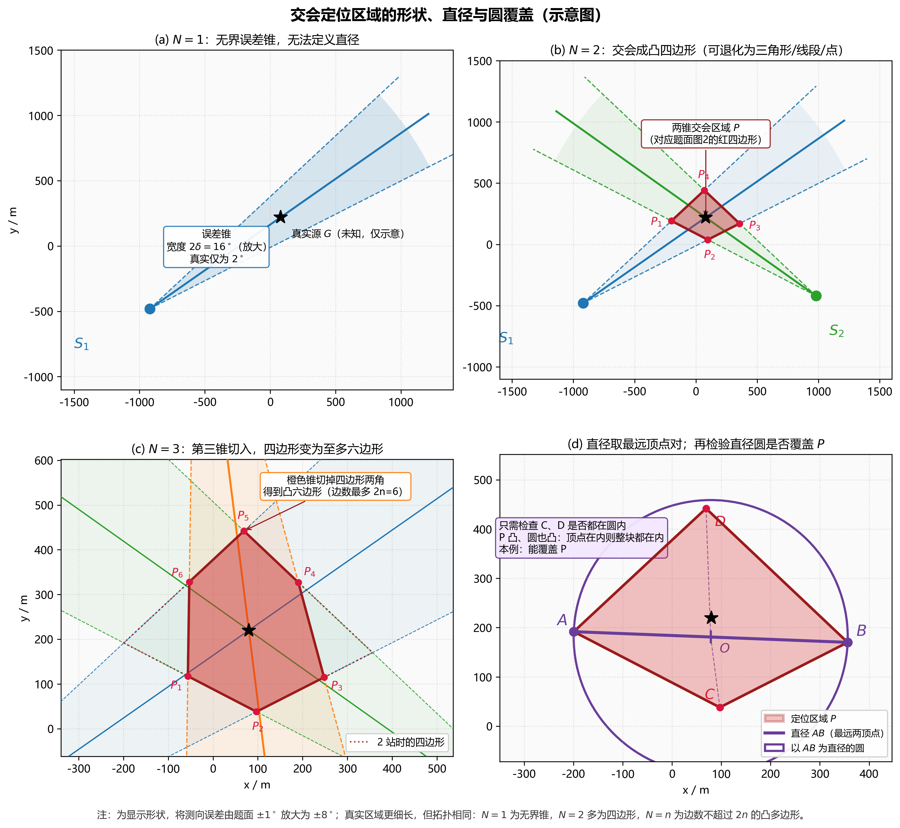
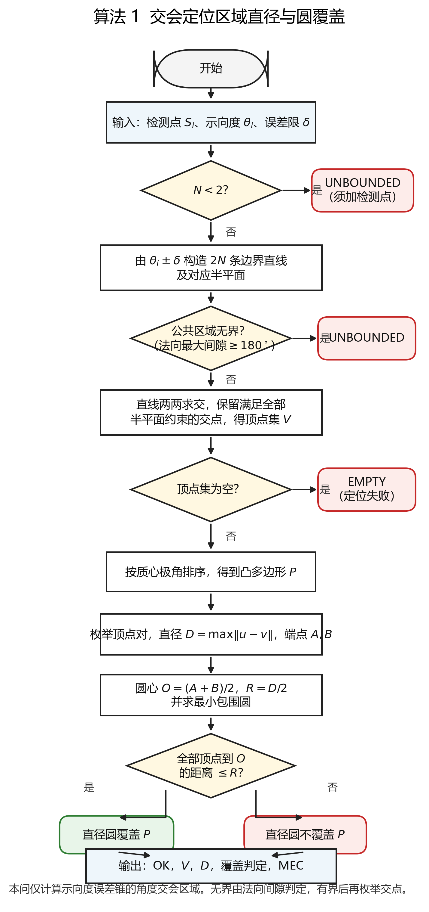

# 第一问　交会定位区域的直径算法与圆覆盖判断

> 本文是 2026 年高教社杯 B 题《无线电干扰源的快速自动定位与清除》问题 1 的完整建模稿。几何示意图见 `figs/fig_geometry.png`，算法流程见 `figs/fig_algorithm_flow.png`，数值复现：`python q1/solver.py`。

---

## 1　问题重述

已知若干检测点坐标 $S_i=(x_i,y_i)$（$i=1,\ldots,N$），以及某干扰源 $G$ 关于这些检测点的示向度 $\theta_i$（单位：度，正东为 $0^\circ$，逆时针为正）。测向存在有界误差：真实方位角 $\varphi_i$ 满足

$$
\varphi_i\in[\theta_i-\delta,\ \theta_i+\delta],\qquad \delta=1^\circ.
$$

交会定位法将各检测点的可行方向取公共交集，得到平面上的多边形定位区域 $P$。本问的 $P$ 只由示向度误差锥交会得到，不叠加目标圆域或有效接收半径圆盘。要求：

1. 给出计算 $P$ 的直径 $D(P)$ 的算法，直径定义为区域内任意两点距离的最大值；
2. 判断以该直径为直径的圆能否覆盖 $P$。

---

## 2　问题分析

单次测向不能给出点位置，只能给出方向。因为误差有界而非随机，不确定性的正确载体是**集合**：每个检测点对应一个张角为 $2\delta=2^\circ$ 的误差锥。$N$ 个误差锥的公共交集就是定位区域 $P$。

需要分清两个几何对象：

- **射线意义下的误差锥**：干扰源在检测点前方，可行域以 $S_i$ 为顶点、沿 $\theta_i$ 方向张开 $2^\circ$，向一端无限延伸。单个锥无界，直径无定义。
- **直线意义下的半平面**：算法上，锥的两条边所在直线把平面分成半平面，误差锥等于其中两个半平面的交集。当 $N\ge 2$ 且示向度方向对向交会时，公共交集由有限界成，成为凸多边形。

因此：$N=1$ 只能得到无界锥；$N=2$ 典型地得到题面图 2 的红色四边形；$N$ 再增大，新的锥继续切入，边数至多 $2N$，区域只缩小、保持凸。题面中的“多边形定位区域”与附录图 2，对应的就是这一角度交会区。测得示向度虽蕴含距离不超过有效接收半径（$\le 1500$ m），本问不把该圆盘及目标圆域切进 $P$——切进去后边界带弧，不再保证是纯多边形。圆域约束留到后续搜索使用。

直径是集合上的最远点对。凸集上最远点对一定落在极点（顶点）上，故只需枚举顶点。若再用“直径为 $d$ 的圆”去覆盖 $P$，则圆心不能任意选：圆盘内最远点对必是对径点，因而圆心只能是直径端点的中点。一般凸多边形仍**不能**保证这个圆盖住 $P$（锐角三角形即反例），判定一律用顶点检验。直径圆盖不住时，真正盖住 $P$ 的最小圆是最小包围圆，其半径介于 $D/2$ 与 Jung 界 $D/\sqrt{3}$ 之间；后续清除看的是该半径是否 $\le 20$ m。

---

## 3　模型假设

| 编号 | 假设 | 依据 |
|---|---|---|
| H1 | 示向度误差有界 $[-\delta,\delta]$，$\delta=1^\circ$；同一地点重复测量误差不变 | 题面附录 2 |
| H2 | 测向机与干扰源视为同一平面 | 题面附录 2 |
| H3 | 示向度是检测点指向干扰源的方位角，可行域只取检测点前方的误差锥，不含反向 | 题面定义 |
| H4 | 不同检测点的边界直线交会后，关心的是有界公共交集；若交集无界或为空，则本次交会不能给出有限直径 | 几何事实 + 工程可操作性 |
| H5 | 数值上两条直线夹角过小视为平行，交点用容差剔除重复 | 实现约定 |
| H6 | 定位区域定义为各检测点示向度误差锥的公共交集，不叠加目标圆域与有效接收半径圆盘 | 与附录图 2 的多边形交会区一致；圆盘约束留给后续搜索。属合理简化 |

---

## 4　符号说明

| 符号 | 含义 | 单位 |
|---|---|---|
| $S_i=(x_i,y_i)$ | 第 $i$ 个检测点 | m |
| $N$ | 检测点个数 | — |
| $\theta_i$ | 在 $S_i$ 处测得的示向度 | 度 |
| $\delta=1^\circ$ | 测向误差限 | 度 |
| $\ell_i^{\pm}$ | $\theta_i\pm\delta$ 对应的边界射线所在直线 | — |
| $H_i^{\pm}$ | $\ell_i^{\pm}$ 所界定、包含示向度方向的半平面 | — |
| $C_i=H_i^-\cap H_i^+$ | 第 $i$ 个检测点的误差锥 | — |
| $P=\bigcap_i C_i$ | 定位区域 | — |
| $V(P)=\{V_1,\ldots,V_m\}$ | $P$ 的顶点集，$m\le 2N$ | — |
| $D(P)$ | $P$ 的直径 | m |
| $A,B$ | 取得直径的两个顶点 | — |
| $O,R$ | 以 $AB$ 为直径的圆心与半径 | m |
| $R_{\mathrm{MEC}}$ | $P$ 的最小包围圆半径 | m |

---

## 5　模型建立

### 5.1　误差锥的半平面表示

对检测点 $S_i$，记

$$
\mathbf{u}_i^{\pm}=\bigl(\cos(\theta_i\pm\delta),\ \sin(\theta_i\pm\delta)\bigr).
$$

$\mathbf{u}_i^{-}$、$\mathbf{u}_i^{+}$ 分别是误差锥顺时针、逆时针边界的方向。边界射线所在直线过 $S_i$、方向为 $\mathbf{u}_i^{\pm}$。将方向逆时针旋转 $90^\circ$ 得 $(-u_y,u_x)$，顺时针旋转 $90^\circ$ 得 $(u_y,-u_x)$，于是可行域为

$$
\begin{aligned}
H_i^{-}
&=\{X:(X-S_i)\cdot(-u_{i,y}^{-},\,u_{i,x}^{-})\ge 0\},\\
H_i^{+}
&=\{X:(X-S_i)\cdot(u_{i,y}^{+},\,-u_{i,x}^{+})\ge 0\}.
\end{aligned}
$$

即：$X$ 落在 $\ell_i^{-}$ 的逆时针侧，且落在 $\ell_i^{+}$ 的顺时针侧。当 $\theta_i\pm\delta$ 为 $90^\circ$ 或 $270^\circ$ 时，对应直线为竖直线 $x=x_i$，半平面写法不变。

单个误差锥

$$
C_i=H_i^{-}\cap H_i^{+}
$$

是张角 $2\delta$ 的无界楔形（射线意义）。它由直线的半平面写出，但物理上只保留前方，反向 $2^\circ$ 楔形被两个半平面同时排除。

### 5.2　定位区域是凸多边形

$$
P=\bigcap_{i=1}^{N} C_i=\bigcap_{i=1}^{N}(H_i^{-}\cap H_i^{+}).
$$

半平面是凸集，凸集的任意交仍是凸集，故 $P$ 凸。当 $N\ge 2$ 且各锥方向能够交会时，$P$ 由有限条线段围成且有界，因而是凸多边形，边数不超过 $2N$（每个检测点至多贡献两条边）。

**两点有界判据.** 单个误差锥的回收锥就是那条张角 $2\delta=2^\circ$ 的方向弧。两个锥的公共区域有界，当且仅当这两段弧在圆周上不相交，即示向度的圆周距离

$$
\Delta(\theta_1,\theta_2)=\min\bigl(|\theta_1-\theta_2|\bmod 360^\circ,\ 360^\circ-(|\theta_1-\theta_2|\bmod 360^\circ)\bigr)
$$

满足 $\Delta(\theta_1,\theta_2)>2\delta=2^\circ$。$\Delta\le 2^\circ$ 时两条误差弧仍有公共方向，区域沿该方向拖到无穷，直径无定义——这就是必须把第二检测点**侧向拉开**、而不能沿示向度直线走的几何原因。$N\ge 3$ 时改为：全部 $2^\circ$ 弧没有公共方向；算法 1 用内法向最大角间隙 $\ge 180^\circ$ 判定，与此等价。

形状随 $N$ 变化，见图 1（为看清形状，图中将 $\pm 1^\circ$ 放大为 $\pm 8^\circ$；真实区域更细长，拓扑相同）：

- $N=1$：$P$ 为无界误差锥，直径无定义；
- $N=2$：$P$ 多为凸四边形（题面图 2 的红四边形），也可退化为三角形、线段或点；
- $N=3$：第三锥切入后边数至多 $6$；**本示例中**切成六边形，并非凡三站必为六边形；
- 一般 $N$：凸 $m$ 边形，$m\le 2N$。

**图 1**　(a) 单站无界锥；(b) 两站交会四边形；(c) 本示例中三站切入后为六边形；(d) 直径取最远顶点对，再检验直径圆。注：测向误差由 $\pm 1^\circ$ 放大为 $\pm 8^\circ$；图中只画角度交会区域。

---

## 6　直径算法

### 6.1　顶点极值定理

**定理.** 设 $P$ 是有界凸多边形，顶点集为 $V(P)$。则

$$
D(P)=\max_{u,v\in P}\|u-v\|=\max_{u,v\in V(P)}\|u-v\|.
$$

**证明（要点）.** 对固定的 $u\in P$，函数 $v\mapsto\|u-v\|$ 是凸函数，在凸集上的最大值在极点取得。再对 $u$ 用一次同样的论证，最大值在顶点对上取得。这是计算几何中的标准结论。

**推论.**

- 若 $P$ 是三角形，则 $D(P)$ 是三边中的最长边；
- 若 $P$ 是四边形，则 $D(P)$ 是四边与两对角线中的最长者；
- 实现时不必预先判断“最长的是边还是对角线”，枚举全部顶点对即可。

### 6.2　顶点集的计算

本题 $N$ 为个位数。采用暴力枚举，不依赖需要预设包围盒的多边形裁剪（如 Sutherland–Hodgman）：

1. $N$ 个检测点给出 $2N$ 条边界直线；
2. 两两求交，平行则跳过，至多 $\binom{2N}{2}=O(N^2)$ 个候选交点；
3. 保留同时落在全部 $2N$ 个半平面内的交点，去重后即 $V(P)$。

有界凸多边形的每个顶点都是某两条边界直线的交点，且满足其余半平面约束，故该枚举不多不少。无界区域可能没有任何有限顶点，也可能留下若干有限顶点（顶点在无穷远的方向上“缺边”），因此不能把“$V=\varnothing$”直接当成空集，也不能看见有限顶点就当有界。

本问不把目标圆域或有效接收半径圆盘加入上述半平面。若加入，有界性会改变，$P$ 也不再必是纯多边形。

### 6.3　算法 1（与程序一致）

**输入：** $S_i$、$\theta_i$（$i=1,\ldots,N$），$\delta=1^\circ$。

**输出：** $\mathrm{status}\in\{\mathrm{OK},\mathrm{UNBOUNDED},\mathrm{EMPTY}\}$；若为 $\mathrm{OK}$，同时给出 $V$、$D$、$A,B$、直径圆是否覆盖 $P$，以及最小包围圆。

1. 若 $N<2$，返回 `UNBOUNDED`（单个误差锥无界，直径无定义，须增加检测点）。
2. 对每个 $i$，由 $\theta_i\pm\delta$ 构造 $\ell_i^{\pm}$ 及 $H_i^{\pm}$，共 $2N$ 个半平面。
3. 先判断是否无界：若 $2N$ 个半平面的内法向最大角间隙 $\ge 180^\circ$，返回 `UNBOUNDED`。对本题误差锥，无界等价于各 $2^\circ$ 示向度弧有公共方向；沿该方向走到无穷必进入所有锥，故无界蕴含非空，不必另作可行性探测。
4. 将 $2N$ 条直线两两求交，平行则跳过，得候选集 $C$。
5. $V=\{p\in C:p\text{ 满足全部 }2N\text{ 个半平面约束}\}$，去掉数值重复点。有界情形下 $V=\varnothing$ 当且仅当交集为空，返回 `EMPTY`。
6. 退化分支：$|V|=1$ 则 $D=0$；$|V|=2$ 或顶点共线，则直径为两端点距离。其余将 $V$ 绕质心按极角排序，得到凸多边形 $P$ 的有序顶点。
7. 枚举顶点对，取欧氏距离最大者作为 $D$，端点记为 $A,B$。
8. 圆心只能取 $O=(A+B)/2$（直径为 $d$ 的覆盖圆若存在则唯一），半径 $R=D/2$。若每个顶点到 $O$ 的距离均 $\le R$，则该圆覆盖 $P$；否则不覆盖。单点时 $R=0$，该点被覆盖。
9. 用覆盖全部顶点的两点圆、三点外接圆枚举最小包围圆，半径记为 $R_{\mathrm{MEC}}$。直径圆覆盖时必有 $R_{\mathrm{MEC}}=D/2$。
10. 返回 `OK` 及 $(V,D,A,B,\text{覆盖判定},R_{\mathrm{MEC}})$。

流程见图 2。

**图 2**　交会定位区域直径与圆覆盖判定流程。先由法向角间隙判定无界，有界后再枚举交点；交点空则为空集。本问只计算角度交会区域。`UNBOUNDED` / `EMPTY` 表示本次不能给出有限直径。

### 6.4　复杂度

步骤 4–5：对 $O(N^2)$ 个交点逐一检验 $O(N)$ 个半平面，时间为 $O(N^3)$。步骤 7：顶点数 $m\le 2N$，枚举顶点对 $O(N^2)$。步骤 9 的最小包围圆对 $O(m^3)$ 个两点/三点圆检验覆盖，亦为 $O(N^3)$。整体 $O(N^3)$。

半平面交的排序增量法可达 $O(N\log N)$，实现更重。本题 $N$ 为个位数，$O(N^3)$ 足够，本文采用枚举法。

---

## 7　圆覆盖判断

记 $d=D(P)$，并设 $A,B\in P$ 达到直径，即 $\|A-B\|=d$。

题面问的是：是否存在一个**直径也等于 $d$** 的圆覆盖 $P$。不必在平面上搜索圆心。理由如下。

若这样的圆存在，它必须盖住 $A$ 和 $B$。圆盘内任意两点距离的最大值等于直径 $d$，且只有对径点（直径的两端）才能达到 $d$。因此 $A,B$ 必须是该圆的一对对径点，圆心被唯一确定为

$$
O=\frac{A+B}{2},
$$

半径 $R=d/2$。换句话说：要么是以 $AB$ 为直径的这一个圆覆盖 $P$，要么任何直径为 $d$ 的圆都覆盖不了。

于是判定化为

$$
\max_{X\in P}\|X-O\|\le \frac{d}{2}.
$$

**只需检查顶点.** $P$ 是凸多边形，圆盘是凸集。若全部顶点在圆内（或圆上），则顶点的凸组合仍在圆内，故 $P$ 被该圆覆盖；若某个顶点在圆外，则该圆不能覆盖 $P$。

### 7.1　一般凸多边形不一定能覆盖

**反例（等边三角形）.** 边长为 $D$ 的等边三角形，直径就是 $D$。以任一边为直径作圆，半径为 $D/2$。等边三角形外接圆半径为

$$
R_{\mathrm{circ}}=\frac{D}{\sqrt{3}}\approx 0.577D>\frac{D}{2},
$$

第三顶点在直径圆之外。

Jung 定理给出更强的全局对照：平面上直径为 $D$ 的任意集合，都能被半径 $D/\sqrt{3}$ 的圆盖住，且等边三角形取到等号。直径圆的半径只有 $D/2$，比这个紧上界小约 $13.4\%$，所以“以直径为直径的圆一定覆盖 $P$”在几何上本来就不成立；等边三角形正是达到 Jung 界的极端情形。

由泰勒斯定理：圆周角为直角当且仅当所对弦为直径。等边三角形内角为 $60^\circ$（锐角），故第三顶点必在直径圆外。任意锐角三角形同理。因此不能先验断言“以直径为直径的圆一定覆盖定位区域”。

等价的顶点判据：直径端点为 $A,B$ 时，$P$ 被直径圆覆盖当且仅当每个顶点 $X$ 都满足 $(X-A)\cdot(X-B)\le 0$（在 $AB$ 上的张角不小于 $90^\circ$）。这与“全部顶点到中点的距离 $\le D/2$”是同一件事。

数值核对：边长 $2$ 的等边三角形，第三顶点到该圆心距离为 $\sqrt{3}\approx 1.732>1$，判定为不覆盖。

### 7.2　平行四边形：直径圆必定覆盖

**命题.** 若 $P$ 是平行四边形，最长对角线为 $AC$，则以 $AC$ 为直径的圆覆盖 $P$。

**证明.** 平行四边形对角线互相平分，故另一对角线 $BD$ 的中点与 $AC$ 的中点重合，记为 $O$。圆半径 $R=|AC|/2$。$B,D$ 到 $O$ 的距离均为 $|BD|/2$。由直径定义 $|AC|\ge|BD|$，故 $|BD|/2\le R$，即 $B,D$ 在圆内或圆上；$A,C$ 在圆周上。因此该圆覆盖整个平行四边形。

亦可用恒等式 $|AC|^2+|BD|^2=2(|AB|^2+|AD|^2)$：较长对角线对应较短的另一对角线，从而另一对顶点到圆心的距离不超过半径。

### 7.3　本题交会区

两站交会四边形的两组对边分别交于 $S_1,S_2$，**不是**平行四边形。$\delta=1^\circ$ 时张角很小，区域看起来细长，直观上接近 7.2 的情形，但覆盖与否仍以顶点检验为准，不把平行四边形结论直接套用。对一般 $N$（含第三站切入后的多边形）同样如此。

**结论.** 一般凸多边形必须用顶点到圆心的距离判断；平行四边形是可以证明覆盖的对照情形；本题交会区一律执行算法 1 第 8 步的顶点检验。

### 7.4　最小包围圆（与后续清除的衔接）

第一问只要求判断直径为 $D$ 的圆能否覆盖 $P$。不能覆盖时，$P$ 仍可被某个略大的圆盖住。最小包围圆（MEC）是半径最小的覆盖圆。任何覆盖圆的半径至少为 $D/2$（须盖住直径两端）；Jung 定理给出不超过 $D/\sqrt{3}$。因此

$$
\frac{D}{2}\le R_{\mathrm{MEC}}\le \frac{D}{\sqrt{3}}.
$$

左端等号当且仅当直径圆已经覆盖 $P$，此时直径圆就是 MEC；右端等号由等边三角形取到。

后续问题中光学清除半径为 $20$ m：只要 $R_{\mathrm{MEC}}\le 20$，在最小包围圆圆心处执行清除，即可保证干扰源落在作用范围内。直径圆盖不住，并不等于无法清除。算法 1 在覆盖判定之后求出 $R_{\mathrm{MEC}}$，供问题 2、3 直接调用。

---

## 8　边界情形

| 情形 | 算法返回 | 含义 |
|---|---|---|
| $N=1$ | `UNBOUNDED` | 无界误差锥，直径无定义，须加检测点 |
| $N\ge 2$ 但示向度近乎同向、未能对向交会 | `UNBOUNDED` | 公共区域仍无界；两点时即 $\Delta(\theta_1,\theta_2)\le 2^\circ$。无界时仍可能留下有限顶点，不能据此算直径 |
| 示向度矛盾，半平面无公共点 | `EMPTY` | 定位失败，须换点或加站 |
| $V$ 只剩 1 个点 | `OK`，$D=0$ | 退化为点 |
| $V$ 只剩 2 个点 | `OK`，$D$ 为线段长 | 退化为线段；以该线段为直径的圆盘显然覆盖它 |

不能在失败时输出一个虚假的有限直径。

---

## 9　数值算例

算例坐标用于验证算法，**不是题面给定数据**。示意源 $G=(80,220)$，三个检测点

$$
S_1=(-920,-480),\quad S_2=(980,-420),\quad S_3=(-40,1180),
$$

示向度取 $S_i$ 指向 $G$ 的方位角，$\delta=1^\circ$。复现：`python q1/solver.py`。

### 9.1　$N=1$

返回 `UNBOUNDED`。与 5.2、第 8 节一致。

### 9.2　$N=2$（题面真实误差）

有界凸四边形，顶点为

| 顶点 | 坐标 (m) |
|---|---|
| $V_1$ | $(81.714,\ 195.462)$ |
| $V_2$ | $(115.159,\ 218.014)$ |
| $V_3$ | $(78.375,\ 245.150)$ |
| $V_4$ | $(44.794,\ 220.758)$ |

直径 $D=70.419$ m，端点 $V_2$ 与 $V_4$，圆心 $O=(79.976,\ 219.386)$，$R=35.209$ m。四个顶点到 $O$ 的距离均 $\le R$，**直径圆覆盖 $P$**，最小包围圆与之重合，$R_{\mathrm{MEC}}=35.209$ m。区域尺度约 $70$ m，与 $\delta=1^\circ$、站间距离约 $2$ km 量级相符：横向半宽约为距离乘以 $\tan 1^\circ$。

### 9.3　$N=3$

有界凸六边形，直径降为 $D=49.800$ m，直径圆仍覆盖，因而 $R_{\mathrm{MEC}}=D/2=24.900$ m。本示例中第三站把区域切小，边数由 4 增至 6，与图 1(c) 一致；三站交会一般至多六边形，不必总是六边形。

### 9.4　相背两站

$S_1=(0,0)$，$\theta_1=90^\circ$；$S_2=(200,0)$，$\theta_2=270^\circ$。返回 `EMPTY`。

### 9.5　等边三角形（圆覆盖反例）

边长 $2$，第三顶点到直径圆心距离 $\sqrt{3}>1$，不覆盖。最小包围圆即外接圆，$R_{\mathrm{MEC}}=2/\sqrt{3}\approx 1.155$，达到 Jung 界。与 7.1、7.4 一致。

### 9.6　两站同向（无界区域）

$S_1=(0,0)$，$\theta_1=90^\circ$；$S_2=(200,0)$，$\theta_2=90^\circ$。两锥同向，公共区域无界。本例仍留下一个有限顶点，算法返回 `UNBOUNDED`，而不是把它当成单点或空集。

### 9.7　三站环绕（交会区上的覆盖反例）

取源在原点，三站均匀环绕、距离均为 $800$ m：

$$
S_1=(800,0),\quad
S_2=(-400,\ 400\sqrt{3}),\quad
S_3=(-400,\ -400\sqrt{3}),
$$

示向度指向原点，$\delta=1^\circ$。交会区为凸六边形，$D=32.252$ m，直径圆半径 $16.126$ m，有顶点落在该圆之外，**直径圆不能覆盖 $P$**。最小包围圆半径 $R_{\mathrm{MEC}}=16.288$ m，圆心在原点，满足

$$
\frac{D}{2}=16.126 < R_{\mathrm{MEC}}=16.288 < \frac{D}{\sqrt{3}}\approx 18.62.
$$

这是由真实 $\pm 1^\circ$ 误差锥交出来的不覆盖例子，说明“不能覆盖”不只出现在抽象的等边三角形上。对后续清除而言，$R_{\mathrm{MEC}}=16.3$ m 已小于 $20$ m，在最小包围圆圆心处清除仍有保证——直径圆盖不住，并不等于区域不可清除。

---

## 10　小结

1. 每个检测点给出张角 $2^\circ$ 的误差锥；定位区域是各锥的公共交集，在交会成功时为边数不超过 $2N$ 的凸多边形。本问不把目标圆域或接收半径圆盘叠入该交集。
2. 直径等于顶点对的最大欧氏距离。直径为 $d$ 的覆盖圆若存在，圆心只能是直径端点的中点；再检查全部顶点是否落在该圆内。
3. 算法先由法向角间隙判定无界，有界后再枚举交点，整体 $O(N^3)$。
4. 一般凸多边形的直径圆不必覆盖该多边形（Jung 界 $D/\sqrt{3}$ 说明 $D/2$ 偏小；等边三角形取到等号）。平行四边形必定覆盖，但本题交会区不直接套用，一律顶点检验。三站环绕的六边形给出交会区上的不覆盖实例。
5. 直径圆盖不住时，$D/2<R_{\mathrm{MEC}}\le D/\sqrt{3}$。后续问题以 $R_{\mathrm{MEC}}\le 20$ m 作为可清除判据（问题 2、问题 3）。

---

## 附录　程序与图

| 文件 | 作用 |
|---|---|
| `q1/solver.py` | 算法 1 实现与第 9 节算例 |
| `q1/figure_shape.py` | 图 1 |
| `q1/figure_flowchart.py` | 图 2 |
| `q1/figs/fig_geometry.png` | 几何示意图（论文用） |
| `q1/figs/fig_algorithm_flow.png` | 算法流程图（论文用） |
