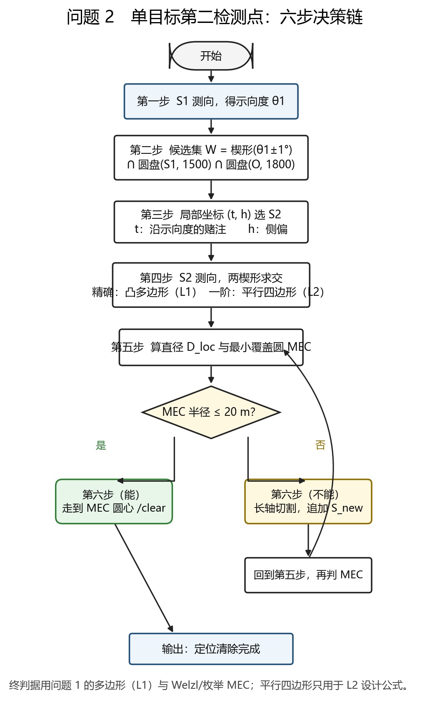
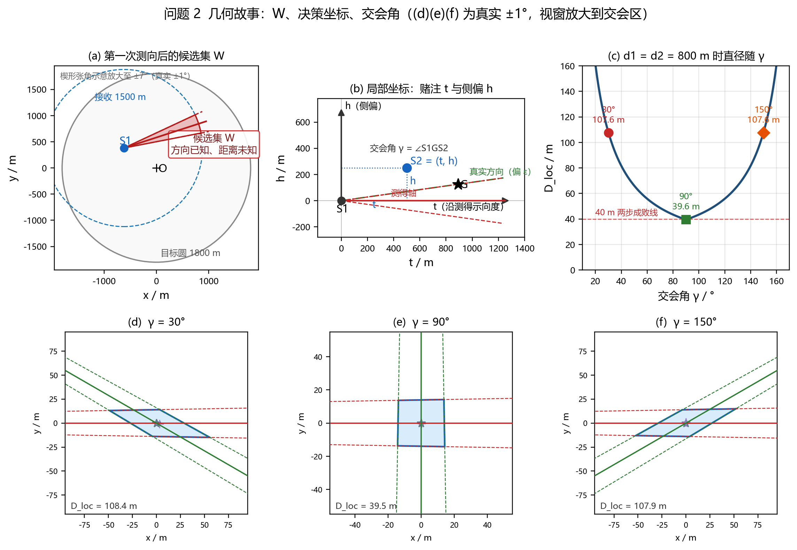
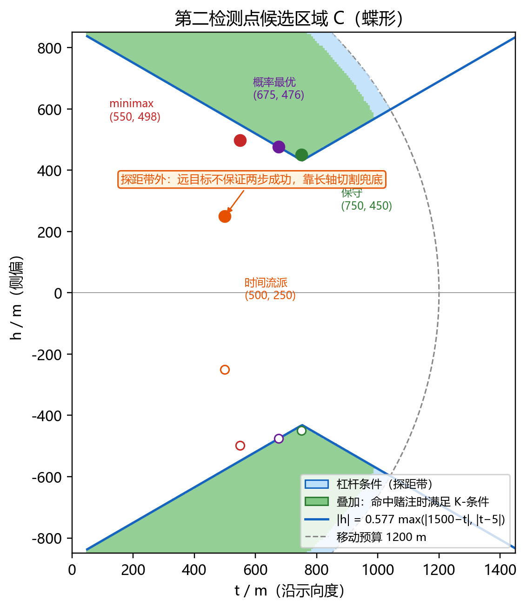
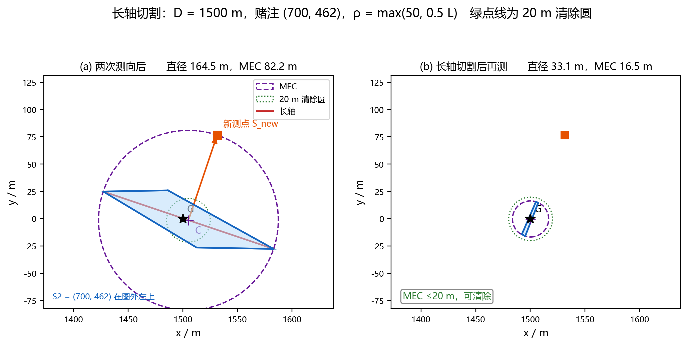

# 第二问　单点示向度下第二个检测点的选择策略与候选区域

> 本文是 2026 年高教社杯 B 题《无线电干扰源的快速自动定位与清除》问题 2 的建模稿。图 1–5 见 `figs/`，数值复现见附录 C。文献 [1][2] 提供交叉验证，不作为选题依据。

---

## 1　问题重述

已知某**全向**干扰源已在检测点 $S_1$ 测得示向度 $\theta_1$，测向误差有界 $[-1^\circ,1^\circ]$。要求：

1. 给出**第二个检测点**的选择策略，使对该源有较好的定位效果；
2. 给出第二个检测点的**候选区域**。

题面约束中与本问直接相关的有：有效接收半径 $R\in[1000,1500]$ m（案例给定但接口不可读）；测向须停下进行，单次 $5$ s，同点重复测量误差不变；机器人直线移动，速度 $5$ m/s；距源不超过 $20$ m 可光学定位（$3$ s）并激光清除（$2$ s）；不超过 $5$ m 时信号过强无法测向，但可直接清除；目标区域为半径 $1800$ m 的圆盘。

较好的定位效果，最终落实为：两次（必要时三次）测向后，定位区域的最小覆盖圆（MEC）半径不超过 $20$ m，从而一次进圈即可清除；并在此前提下缩短移动与测量时间。

---

## 2　问题分析

### 2.1　一次示向度给了什么、缺什么

由“在 $S_1$ 处获得示向度”（而非无信号或距离过近）可作硬推断：干扰源 $G$ 落在

$$
W=\underbrace{\{\theta_1-\delta\le\arg(G-S_1)\le\theta_1+\delta\}}_{2^\circ\text{楔形}}\ \cap\ \underbrace{\{5<\|G-S_1\|\}}_{\text{否则返回过近}}\ \cap\ \underbrace{\{\|G-S_1\|\le1500\}}_{R\le1500}\ \cap\ \underbrace{\{\|G\|\le1800\}}_{\text{目标圆域}},
$$

其中 $\delta=1^\circ$。这是一条细长的方向条：方向已知，距离未知。唯一实质未知量是标量

$$
D=\|G-S_1\|\in(D_{\mathrm{near}},D_{\mathrm{far}}],
$$

$D_{\mathrm{near}}=5$ m，$D_{\mathrm{far}}=\min\bigl(1500,\ \text{楔形两边缘出圆距离的最大值}\bigr)$。楔形在 $1500$ m 处的真实半宽仅约 $26$ m，形态见图 2(a)。

### 2.2　本题与教科书布站的三点不同

1. **误差有界、无分布。** $[-1^\circ,1^\circ]$ 有界，同点重复测量不变。不确定性的载体是集合（与问题 1 的多边形语言一致），不是概率椭圆。
2. **最优第二点依赖未知的 $D$。** $G$ 只知道在楔形内，必须对最坏 $D$ 或对先验期望做稳健设计。
3. **时间是硬约束。** 移动耗时为路程除以 $5$，每次测量 $5$ s。“较好”要落到定位清除总时间，而不是只最小化几何直径。

### 2.3　文献角色

Wang 等 [1] 与 Bishop 等 [2] 给出纯测向定位的几何结论：交会角 $90^\circ$ 最优、测点应尽量靠近源。这与下文 L2' 闭式的推论一致。文献使用高斯噪声与 Fisher 信息，并通常假定目标位置已知或有先验；本题三个特性需单独处理。下文以多边形直径与 MEC 为选题依据，FIM 与 D-最优只作平行对照。

### 2.4　求解主线

决策链只有六步，见图 1。



**图 1**　$S_1$ 测向后构造候选集 $W$，在局部坐标 $(t,h)$ 上选 $S_2$，两楔形求交，用直径与 MEC 判定能否两步清除；不能则沿长轴法向追加测点。精确交会区域是问题 1 的凸多边形（L1）；平行四边形只是一阶近似（L2），用于写出闭式。

后文按这条链展开：5.1–5.3 说明坐标、信息与测量返回；5.4 给出直径闭式；5.5–5.7 给出选点准则与候选区域；5.8–5.9 给出救援规则与时间模型。

---

## 3　模型假设

| 编号 | 假设 | 依据 |
|---|---|---|
| H1 | 示向度误差有界 $[-\delta,\delta]$，$\delta=1^\circ$；同点重复测量不变；不同地点误差近似独立 | 题面附录 2 |
| H2 | $R\in[1000,1500]$ m，未知但对该源固定 | 题面附录 2 |
| H3 | 干扰源全向，接收只取决于距离 | 问题 2 设定 |
| H4 | 直线移动、$5$ m/s；单次测量 $5$ s；距源 $\le 20$ m 时清除必成功 | 题面附录 2 |
| H5 | 一阶（雅可比）近似适用于测点距离 $d\gtrsim 20$ m | 近场 $d\lesssim 20$ m 时一阶偏差可达 $44\%$，但已进入清除作用域，操作上直接清除 |
| H6 | 仅先验版采用：$G$ 在圆域 $\cap$ 楔形内按面积均匀，$f_D(d)\propto d$ | 题目未给先验；涉及概率的结论必须声明该假设，并做谱分析（7.1 节） |
| H7 | 代价只计移动、测量与一次清除；救援测点按 5.8 节长轴切割生成 | 建模设定；已做误差蒙特卡洛 |
| H8 | 两步成功：交会区域 MEC 半径 $\le 20$ m | 与光学清除作用域衔接；直径 $\le 40$ m 的关系见 5.4 节 |

---

## 4　符号说明

| 符号 | 含义 |
|---|---|
| $S_1,\ S_2$ | 第一、第二检测点；$S_2$ 为决策变量 |
| $\theta_1,\ \theta_2$ | 两测点测得的示向度（含误差） |
| $G,\ D$ | 干扰源位置；$D=\|G-S_1\|$ |
| $d_i=\|G-S_i\|$ | 测点到源的距离（$d_1=D$） |
| $\gamma$ | 交会角 $\angle S_1GS_2$ |
| $\delta=1^\circ$ | 误差半宽（弧度 $0.017453$） |
| $t,\ h$ | 第二点的局部坐标：沿示向度的赌注 $t$，侧偏 $h$ |
| $J$ | 两次测向对 $G$ 的雅可比，$2\times 2$，第 $i$ 行为 $u_i^\perp/d_i$ |
| $D_{\mathrm{loc}}$ | 定位区域直径（区域内两点距离的最大值） |
| $K$ | 两步成功常数，$K=40/(2\tan 1^\circ)\approx 1146$ m |
| $\kappa$ | MEC 半径与直径之半的比 |
| $W,\ \mathcal{C}$ | 干扰源候选集；第二检测点候选区域 |
| $\rho$ | 救援测点相对当前 MEC 中心的偏移 |
| $E[T]$ | 单目标定位清除总时间的期望 |

---

## 5　模型建立

### 5.1　坐标系与决策变量

以 $S_1$ 为原点、**测得的**示向度方向 $\vec e_\theta=(\cos\theta_1,\sin\theta_1)$ 为极轴，法向 $\vec e_\theta^\perp=(-\sin\theta_1,\cos\theta_1)$。第二检测点写为

$$
S_2=S_1+t\,\vec e_\theta+h\,\vec e_\theta^\perp.
$$

全局坐标

$$
S_2=\bigl(x_1+t\cos\theta_1-h\sin\theta_1,\ \ y_1+t\sin\theta_1+h\cos\theta_1\bigr).
$$

$t$ 是对未知距离 $D$ 的纵向猜测，称为赌注；$h$ 是垂直于示向度的侧偏。$\theta_1$ 本身含误差，局部轴相对真实方向还差 $\varepsilon\in[-\delta,\delta]$，在 5.5 节处理。几何关系见图 2(b)。

### 5.2　单点测向：信息秩 1

第 $i$ 次测向 $\theta_i=\arctan\dfrac{y-y_i}{x-x_i}+e_i$ 的雅可比为 $\nabla\theta_i=u_i^\perp/d_i$，其中 $u_i^\perp=(-\sin\theta_i,\cos\theta_i)$ 垂直于视线。单次测量的信息矩阵秩为 $1$，零空间恰为射线方向。因此纯沿示向度前进（$h=0$）不增加新信息，第二点必须带非零侧偏。这与文献 [1] 的 FIM 结构一致；本题误差有界，下文用集合直径度量，不再把 FIM 当作设计准则。

### 5.3　三种测量返回都收缩候选集

由 H1，候选集用集合维护。在 $S_2$ 测量有三种返回，都是对 $W$ 的收缩（边界取硬保证）：

| 返回 | 候选集更新 | 依据 |
|---|---|---|
| 有信号（示向度 $\theta_2$） | $W\leftarrow W\cap\mathrm{wedge}(S_2,\theta_2)\cap\{\|G-S_2\|\le 1500\}$ | $R\le 1500$ |
| 无信号 | $W\leftarrow W\cap\{\|G-S_2\|>1000\}$ | $R\ge 1000$，只能推下界 |
| 距离过近 | 直接定位并清除，本问结束 | 距离 $\le 5$ m |

因此第二点的设计目标是“每种回答都有信息”，而不是“一次必须交会成功”。无信号不是失败，接收约束可以取软版（5.7 节）。

### 5.4　定位直径：精确多边形与一阶闭式

精确的定位区域是问题 1 的对象：两条 $\pm\delta$ 角度带的交集，为凸多边形，直径取顶点对最大值。记这一层为 **L1**，用作最终评价与算法判据。

设计阶段需要可对 $(t,h,D)$ 求导的公式。记 $J$ 为两次测向的雅可比（第 $i$ 行 $=u_i^\perp/d_i$），$a=J^{-1}e_1$、$b=J^{-1}e_2$。小角度误差 $e=(e_1,e_2)$ 映射为 $\Delta G=J^{-1}e$，误差方块 $[-\delta,\delta]^2$ 的像是以 $\pm\delta a\pm\delta b$ 为顶点的平行四边形。记这一层为 **L2**。四层公式如下。

| 层 | 公式 | 角色 | 与 L1 的关系 |
|---|---|---|---|
| L1 | 多边形顶点两两距离的最大值 | 精确值，终判据 | 定义 |
| L2 | $D^{(1)}=2\delta\max_{s\in\{\pm 1\}^2}\|J^{-1}s\|$ | 顶点公式，设计用 | 相对误差 $\le 0.5\%$ |
| L2' | $D^{(1)}=2\delta\sqrt{\dfrac{d_1^2+d_2^2+2d_1d_2\lvert\cos\gamma\rvert}{\sin^2\gamma}}$ | L2 的解析形态 | 同 L2 |
| L3 | $\dfrac{2\sqrt{2}\,\delta}{\sigma_{\min}(J)}$ | E-最优上界 | 保守，不超过 $\sqrt{2}$ 倍 |

**L2' 的推导。** 平行四边形两对角线长为 $2\delta\|a\pm b\|$，直径取较长者：

$$
D^{(1)}=2\delta\max\bigl(\|a+b\|,\|a-b\|\bigr)=2\delta\sqrt{a^\top a+b^\top b+2\lvert a^\top b\rvert}.
$$

由 $\lvert\det J\rvert=\lvert\sin\gamma\rvert/(d_1 d_2)$ 以及 $Ja=e_1$、$Jb=e_2$，得到

$$
a^\top a=\frac{d_1^2}{\sin^2\gamma},\qquad b^\top b=\frac{d_2^2}{\sin^2\gamma},\qquad a^\top b=-\frac{d_1 d_2\cos\gamma}{\sin^2\gamma}.
$$

代入即得 L2'。小角度下 $\delta$ 与 $\tan\delta$ 可换；下文 $K$ 按 $\tan 1^\circ$ 取值，与 $20$ m 清除圆一致。L2 相对 L1 的直径误差在 5 个算例中不超过 $0.43\%$。**算法终判据一律回到 L1 的顶点直径与 MEC**，平行四边形只用于写出闭式。

图 2 给出几何直观。等距 $d_1=d_2=800$ m 时，$90^\circ$ 交会区近乎方形，直径 $39.5$ m，恰在 $40$ m 成败线内；$30^\circ$ 与 $150^\circ$ 被拉成长条，直径约 $108$ m。



**图 2**　(a) 第一次测向后的候选集 $W$：楔形与接收圆、目标圆的交；为看清形状，张角由 $\pm 1^\circ$ 放大至 $\pm 7^\circ$，真实半宽在 $1500$ m 处仅约 $26$ m。(b) 局部坐标：赌注 $t$、侧偏 $h$，以及真实方向相对测得轴的偏角 $\varepsilon$。(c) $d_1=d_2=800$ m 时直径随交会角 $\gamma$ 变化，$90^\circ$ 最低。(d)(e)(f) 真实 $\pm 1^\circ$ 下 $\gamma=30^\circ,90^\circ,150^\circ$ 的交会区（视窗放大到交会区）。

由 L2' 直接得到三条几何结论。

1. **$90^\circ$ 最优，共线发散，测点宜近。** 分子在 $\gamma=90^\circ$ 时最小，分母 $\sin\gamma$ 在此时最大；$\gamma\to 0^\circ$ 或 $180^\circ$ 时区域无界。直径还与 $d_i$ 成正比，故两测点都应尽量靠近源。文献 [1][2] 由 D-最优、A-最优独立得到同一几何；其数值表中 $30^\circ$ 交会的直径约为 $90^\circ$ 的 $2.6$ 倍，与 $1/\sin\gamma$ 一致。
2. **应以直径为纲，不以 D-最优为纲。** $\gamma=90^\circ$ 时 $D_{\mathrm{loc}}=2\tan\delta\sqrt{d_1^2+d_2^2}$，与 A-最优（GDOP）同构。D-最优优化 $\det J$，其 $d_1 d_2$ 乘积会偏好“一站极近、一站极远”。反例：$d_1=50$ m、$d_2=1500$ m、$\gamma=90^\circ$ 时，$\det J$ 优于对称方案 $7.5$ 倍，直径却是 $52.4$ m 对 $37.0$ m，跨越 $40$ m 成败线。
3. **对本问的平行四边形，MEC 半径等于直径之半。** 平行四边形对角线互相平分于中点 $M$。设长对角线为 $AC$，则 $\lvert BD\rvert\le\lvert AC\rvert$，故 $B$、$D$ 到 $M$ 的距离不超过 $\lvert AC\rvert/2$。以 $AC$ 为直径的圆覆盖四个顶点，且不能再小，因此 MEC 半径等于直径之半，圆心为 $M$。一般凸集并非如此：等边三角形的 MEC 取 Jung 界，半径为直径除以 $\sqrt{3}$。本题 L1 四边形近中心对称，在 $2760$ 个数值样本上 $\kappa=\mathrm{MEC}/(\text{直径}/2)\equiv 1.0000$，直径 $\le 40$ m 的 $569$ 例中没有 MEC $>20$ m 的情形。设计阶段可用直径 $\le 40$ m 代替 MEC $\le 20$ m；算法仍逐例计算 MEC。

### 5.5　选点准则：杠杆条件与 K-条件

#### （一）探距层：杠杆条件

真实 $G$ 相对测得轴有偏角 $\varepsilon\in[-\delta,\delta]$。取 $S_1=0$、$S_2=(t,h)$、$G=D(\cos\varepsilon,\sin\varepsilon)$。二维叉积

$$
\overrightarrow{S_1G}\times\overrightarrow{S_2G}=D(t\sin\varepsilon-h\cos\varepsilon),
$$

于是

$$
\sin\gamma=\frac{\lvert\overrightarrow{S_1G}\times\overrightarrow{S_2G}\rvert}{d_1 d_2}=\frac{\lvert h\cos\varepsilon-t\sin\varepsilon\rvert}{d_2}.
$$

$\varepsilon=0$ 时 $\sin\gamma=\lvert h\rvert/\sqrt{(D-t)^2+h^2}$。要求 $\sin\gamma\ge s_{\min}$，整理得

$$
\lvert h\rvert\ge\frac{s_{\min}}{\sqrt{1-s_{\min}^2}}\lvert D-t\rvert.
$$

再对全体候选 $D\in[D_{\mathrm{near}},D_{\mathrm{far}}]$ 取最坏，得到**杠杆条件**

$$
\lvert h\rvert\ \ge\ \frac{s_{\min}}{\sqrt{1-s_{\min}^2}}\ \max\bigl(\lvert D_{\mathrm{far}}-t\rvert,\ \lvert t-D_{\mathrm{near}}\rvert\bigr).
$$

几何含义：侧偏必须与距离失配同量级——这是对“距离未知”的定量回答。取 $s_{\min}=0.5$（即 $\gamma\in[30^\circ,150^\circ]$，误差放大不超过 $2$ 倍）、$D_{\mathrm{far}}=1500$ m 时，$h\ge 432$ m 且 $t\in[634,871]$ m。

示向度误差把有效侧偏缩短为 $h_{\mathrm{eff}}=h\cos\delta-t\sin\delta$，量级 $13$–$26$ m；对默认点使 $\min\sin\gamma$ 从 $0.5001$ 降至 $0.4923$（约 $1.6\%$），纳入 $h_{\mathrm{eff}}$ 即可。若第三次测量后 $D$ 已经变窄，交会角容差可收到文献 [1] 建议的 $60^\circ$–$120^\circ$（损失不超过 $25\%$）。两个知识状态对应两档角度要求。

$D_{\mathrm{far}}$ 必须取楔形**两边缘**出圆距离的最大值。掠射时中心射线与边缘可相差约 $100$ m：例如 $S_1=(1790,0)$、$\theta_1=95^\circ$ 时，三条方向出圆距离为 $351.8$、$401.4$、$453.4$ m。用中心射线会低估杠杆下界。

#### （二）核心层：K-条件

两次交会后走到 MEC 中心一次清除成功，等价于 MEC $\le 20$ m。由 κ 恒等式，设计阶段用直径 $\le 40$ m。把 L2' 代入，得到一阶充分条件

$$
\frac{d_1^2+d_2^2+2d_1 d_2\lvert\cos\gamma\rvert}{\sin^2\gamma}\ \le\ K^2,\qquad K=\frac{40}{2\tan 1^\circ}\approx 1146\ \text{m}.
$$

$\gamma=90^\circ$ 时退化为 $d_1^2+d_2^2\le K^2$。杠杆条件是 K-条件在纯角度上的投影，必要但不充分。二者在 $D\gtrsim 1000$ m 处发生冲突：满足杠杆的赌注，其成功区间并集只到约 $D=997$ m。这是远目标必须第三次测量的几何原因。

实现上，$\sin\gamma<10^{-4}$ 时直接判该点不可用（共线是公式奇异方向）。

### 5.6　两步成功的三条结构结论

**定理 1（必要距离界）**　对固定的 $D$，无论怎样放置 $S_2$，都有 $\inf D_{\mathrm{loc}}=2\delta D$（小角度下即 $2D\tan\delta$）。因此两步成功的必要条件是

$$
D\le D^*=\frac{20}{\tan 1^\circ}\approx 1146\ \text{m}.
$$

**证明**　由 L2'，固定 $d_1=D$。当 $\gamma=90^\circ$ 时 $\cos\gamma=0$，根号内为 $D^2+d_2^2\ge D^2$，故 $D_{\mathrm{loc}}\ge 2\delta D$，等号在 $d_2\to 0$ 时达到。这对应 $S_2$ 横向逼近 $G$：第二测点把沿射线的未知切掉，留下的恰是第一楔形在该距离上的横向宽度。若 $D>D^*$，则即使取到这个下确界，直径仍大于 $40$ m，MEC 大于 $20$ m。证毕。

数值核对：$D=1100$ m 时最优可达直径 $38.4$ m，可以两步成功；$D=1200$ m 时为 $41.9$ m，不能。边界落在 $1146$ m。

**定理 2（先验谱）**　若 $D$ 在 $(5,1500]$ 上具有密度 $f_D\propto d^\alpha$，则两步成功概率的设计上界 $\sup_{(t,h)}P$ 随 $\alpha$ 单调下降：$\alpha=-1$ 时 $90.3\%$，$\alpha=0$ 时 $49.2\%$，$\alpha=1$（面积均匀）时 $27.7\%$，$\alpha=2$ 时 $18.8\%$；相应最优赌注 $t^*$ 从 $550$ m 移到 $850$ m。

因此，在题目未给先验、面积均匀又最自然的默认下，两步成功不是大概率事件。第二检测点的探距职能是几何必然，不是设计偏好。涉及概率的数字必须写明先验；无先验的硬结论只用定理 1 和定理 3。

**定理 3（minimax 保证）**　不依赖先验的最优保证赌注为 $(t,h)=(550,498)$：对任意 $D\in[5,734]$（全范围的 $49\%$）以及任意 $e_1,e_2\in[-\delta,\delta]$，MEC 半径 $\le 20$ m。全组合数值核验的最坏值为 $19.93$ m，出现在 $D=730$ m、$e_1=e_2=+1^\circ$。$D>734$ m 时该赌注两步必败，转入三步。边缘余量仅 $0.07$ m，实战可截断到 $D\le 700$ m，或在算法内直接判 MEC。

### 5.7　第二检测点的候选区域

候选区域是各约束的交集：

$$
\mathcal{C}=\bigl\{(t,h):\ \text{K-条件}\ \wedge\ \text{杠杆条件}\ \wedge\ \text{接收约束}\ \wedge\ \|S_2-O\|\le 1800\ \wedge\ \sqrt{t^2+h^2}\le v\Delta T_{\max}\bigr\}.
$$

其形态见图 3：杠杆条件给出分居示向度两侧的两条斜带（蝶形）；在命中赌注 $D=t$ 时再叠加 K-条件，得到图中的绿色核心。四个设计点标在图上。时间流派 $(500,250)$ 落在探距带外，对远目标不保证两步成功，依赖 5.8 节的长轴切割。



**图 3**　$(t,h)$ 平面上的候选区域。蓝色为杠杆条件（探距带），绿色为再叠加“命中赌注时满足 K-条件”的核心；虚线圆为移动预算 $1200$ m 的示意。示向度下方的空心点是各点关于 $t$ 轴的对称点，最优解是一个等价类。时间流派 $(500,250)$ 在探距带外。

接收约束分两版。软版要求 $\max_{G\in W}\|S_2-G\|\le 1500$（默认：无信号也是信息，见 5.3 节）；硬版要求 $\le 1000$（保证必有信号）。硬版非空：$W$ 长约 $1495$ m、宽约 $52$ m，赌注 $(700,462)$ 对全楔形最远仅 $937$ m。硬版与杠杆条件合在一起，可把纵向可行域压到 $t\in[650,850]$ m（$t=900$ m 时对近端候选达 $1034$ m，违反硬版）。默认用软版；当 $D_{\mathrm{far}}-D_{\mathrm{near}}\lesssim 300$ m，或时间充裕时，改用硬版。

由文献 [1] 的几何不变性（传感器换位、绕源旋转、关于源翻转下最优几何不变），最优解天然是等价类而不是孤立点。这解释了题面为何问的是“候选区域”。

题面要求的影响因素可按此分解：$\delta$ 只线性缩放区域尺寸，不改变杠杆条件（角度条件不含 $\delta$）；$R$ 的未知性决定 $500$ m 接收模糊带与无信号语义；$\sin\gamma$ 决定误差放大；$D$ 的未知范围决定杠杆下界的高度和斜带宽度。

### 5.8　两步不够时的长轴切割

每个测点沿视线法向 $u_i^\perp$ 把区域压到约 $2\delta d_i$ 宽。两个不平行的切割即可定位。若两次交会后 MEC 仍大于 $20$ m，新测点取当前区域长轴的法向、朝机器人来路一侧，把剩余长条拦腰切断：

$$
S_{\mathrm{new}}=C+\rho\,\hat n,\qquad \hat n\perp\text{长轴，朝来路一侧}.
$$

$C$ 为当前 MEC 中心。偏移取

$$
\rho=\max(50,\ 0.5\,L),
$$

$L$ 为当前长轴长度。$\rho$ 不必大：切割宽度为 $2\delta\rho$，$\rho=100$ m 时仅约 $3.5$ m，早已够用，而移动成本与 $\rho$ 成正比。下限 $50$ m 是为了避免落入区域内部和近场失效区。

图 4 是 $D=1500$ m、赌注 $(700,462)$ 的一次切割。第二次测向后直径 $164.5$ m、MEC $82.2$ m，紫虚线（MEC）明显大于绿点线（$20$ m 清除圆）。按自适应 $\rho\approx 82$ m 再测一次后，直径 $33.1$ m、MEC $16.5$ m，落入清除圆。若改用固定 $\rho=300$ m，第三次后为 $36.3$ m / $18.1$ m，同样成功。一次切割把约 $164$ m 压到 $33$–$36$ m。



**图 4**　$D=1500$ m，赌注 $(700,462)$，两图坐标范围相同。(a) 两次测向后的细长交会区、长轴、MEC 圆心 $C$ 以及新测点；(b) 沿长轴法向再测一次后，区域落入 $20$ m 清除圆。$S_2$ 在图外左上。

### 5.9　序贯策略与代价

策略分三段：

1. **稳健首测。** 在候选区域内取定赌注（见表 1）。赌注宁欠勿过：交会角略小于 $90^\circ$ 对直径几乎无损，却省路费、降低近端源的接收风险。
2. **距离坍缩。** 两次交会把 $D$ 钉到区域尺度。若 MEC $\le 20$ m，直接进圈；否则按长轴切割追加测点，通常一次即够。
3. **清除。** 走到 MEC 中心，光学定位加激光，共 $5$ s。

单目标、同频道的时间（H7）为

$$
T=\sum_k\frac{\|S_{k+1}-S_k\|}{5}+5\,n_{\mathrm{meas}}+5
$$

（移动 $+$ 测量 $+$ 清除）。问题 3 再加入切频道 $1$ s/次，并考虑多目标分摊测量。

---

## 6　模型求解与主要结果

### 6.1　设计选择表

不同准则给出不同最优赌注，**不存在唯一推荐点**。四个流派见表 1。

**表 1**　第二检测点的四种设计

| 流派 | 准则 | 最优赌注 $(t,h)$ | 极坐标 $(d,\alpha)$ | 两步成功区间 | $E[T]$ |
|---|---|---|---|---|---|
| minimax 硬保证 | 无先验最坏情形 | $(550,498)$ | $(742\,\mathrm{m},\ 42.2^\circ)$ | $[5,732]$ | $320\pm 1$ s |
| 概率最优 | 面积先验下 $P$ 最大 | $(675,476)$ | $(826\,\mathrm{m},\ 35.2^\circ)$ | $[244,815]$ | $320\pm 1$ s |
| 保守流派 | 杠杆 $+$ 硬接收下 $E[T]$ 最小 | $(750,450)$ | $(875\,\mathrm{m},\ 31.0^\circ)$ | $[389,867]$ | $319\pm 1$ s |
| **时间流派（实战推荐）** | 无约束 $E[T]$ 最小 | **$(500,250)$** | **$(559\,\mathrm{m},\ 26.6^\circ)$** | $[78,680]$ | **$270\pm 3$ s** |

其中 $d=\sqrt{t^2+h^2}$，$\alpha=\arctan(\lvert h\rvert/t)$ 是相对首次示向度的偏角。候选区域在极坐标下是示向度两侧的两片扇带；不同准则只是把最优点沿扇带滑动。

两条稳健性结论：

- **P-免费。** 成功概率意义下，加上杠杆约束几乎不损失（约 $28\%$ 对 $28\%$）。
- **时间保费约 $16\%$。** 期望时间意义下，杠杆加硬接收的代价约为 $319$ s 对 $270$ s。该差距经 $30$ 组 $e_i\sim U[-1^\circ,1^\circ]$ 检验，各流派 $E[T]$ 变化不超过 $1.5\%$，排序不变。

$E[T]$ 由前期移动主导，而不是由两步失败的惩罚主导：小赌注省下的路费，超过坏交会角带来的一次救援。各设计的期望测量次数都在 $2.7$–$2.9$，对次数不敏感。

### 6.2　设计图

图 5 是问题 3 选第二点时的操作说明书。

![图5　$(t,D)$ 直径热力图与 $E[T]$–赌注曲线](figs/design_chart.png)

**图 5**　(a) 侧偏取杠杆下界、$\varepsilon$ 取最坏时，定位直径在赌注–真值平面 $(t,D)$ 上的分布；红线为 $40$ m 两步成功等值线，竖色彩条为四个流派各自能覆盖的 $D$ 区间。(b) 面积先验 $f_D\propto D$、自适应 $\rho=0.5L$ 下的期望时间：时间流派谷底在 $t=500$ m（约 $266$ s），保守流派谷底在 $t=750$ m（约 $313$ s）。

### 6.3　数值核验

复现脚本见附录 C。主要核对如下。

| 实验 | 核对对象 | 结果 |
|---|---|---|
| K-闭式精度 | L2' 对 L1 多边形 | 5 例相对误差 $\le 0.43\%$ |
| $D^*$ | 最优可达直径随 $D$ | $1000/1100/1200/1500$ m $\to$ $34.9/38.4/41.9/51.2$ m，边界在 $1146$ m |
| 先验谱 | $\sup P$ 对 $\alpha$ | $90.3\%\to 18.8\%$ 单调降，$\alpha=1$ 时 $27.7\%$ |
| minimax | $(550,498)$ 全误差组合 | 最坏 MEC $19.93$ m $\le 20$ m |
| κ | MEC /（直径 $/2$） | $2760$ 样本全部为 $1.0000$ |
| $E[T]$ 蒙特卡洛 | 误差对四流派 | 变化 $\le 1.5\%$，时间流派优势维持 |
| $\rho$ | 固定 $300$ 对自适应 | 自适应再省约 $12\%$ |
| $D_{\mathrm{far}}$ | 掠射三方向 | $351.8/401.4/453.4$ m |
| 硬接收 | 全楔形最远距离 | $(700,462)\to 937$ m 可行；$(900,517)\to 1034$ m 不可行 |
| 交会角 | 直径对 $\gamma$ | $90^\circ$ 最小 $37.0$ m；$30^\circ/150^\circ$ 放大约 $2$ 倍；$5^\circ$ 放大 $11.5$ 倍 |
| 文献 [1] | $\gamma=90^\circ$ 的 $2\tan 1^\circ\sqrt{r_1^2+r_2^2}$ | 独立验证误差 $<0.5\%$，与 L2' 一致 |

---

## 7　灵敏度与稳健性

### 7.1　先验

定理 2 已给出：两步成功上界随 $\alpha$ 在 $18.8\%$–$90.3\%$ 之间变化，最优赌注在 $550$–$850$ m 之间移动。凡涉及概率的表述均冠以先验，例如“面积均匀先验下约 $28\%$”。

### 7.2　测量误差

$e_i\neq 0$ 的蒙特卡洛中，各流派 $E[T]$ 变化不超过 $3$ s。定理 3 本身按最坏误差组合核验。

### 7.3　几何参数

掠射造成的 $D_{\mathrm{far}}$ 差异已用边缘最大值消除。$R$ 的 $500$ m 未知带只影响无信号语义（下界取 $1000$ m）和接收约束的软硬选择。$\rho$ 的比例系数在 $[0.3,0.5]$ 内变动时，$E[T]$ 变化小于 $5\%$。

---

## 8　可执行规程与问题接口

**算法 1**（第二检测点，可直接作为问题 3 的单目标子程序）

```
输入：S1, θ1
1. D_far ← min(1500, 楔形两边缘出圆距离的最大值)
2. 取赌注 (t,h)：时间优先则 (500,250)；需要硬保证则 (550,498)
3. 由 5.1 节变换得 S2；若 ||S2||>1800，沿射线收缩 t 至入圆
4. 移动至 S2 并测量：
   有示向度 → 按问题 1 计算 L1 多边形；MEC≤20 则走到圆心 /clear
                 否则按 ρ=max(50, 0.5L) 长轴切割，回到本步
   无信号   → W ← W ∩ {||G−S2||>1000}，在剩余候选上重新选探距点
   过近     → 直接 /clear
```

与其他问题的接口：

- **问题 1。** L1 即其交付物：楔形化为过测点的半平面，求交得凸多边形，枚举顶点对得直径，再求 MEC。一般凸集上“以直径为直径的圆”不必覆盖区域（等边三角形取 Jung 界）；本题交会四边形经验上 $\kappa\equiv 1$，仍须逐例判定。
- **问题 3。** 本问是单目标子程序。全局用覆盖网判空：原点加半径约 $1150$ m 的六等分点，以 $1000$ m 盖住 $1800$ m 圆盘，某频道在全部监听点无信号则该频道为空。原点先扫 $1$–$20$ 频道（不移动，$20\times 5+19\times 1=119$ s），再按示向度追击已听频道，最后走环网补漏。虚拟世界上限 $100$ 小时，本问单目标约 $270$–$430$ s；现实程序约 $20$ 分钟，检测 $5$ s 不在现实中等待。
- **问题 4。** 定向源的无信号变为 $W\cap\bigl(\{\|G-S_2\|>1000\}\cup\{\text{覆盖角外}\}\bigr)$。清除只需要位置，优先选两个都在波束内的测点交会。频道互异，频道即身份。

---

## 9　模型评价

模型与题设一致：有界误差用集合描述，与问题 1 的多边形同构；先验版显式声明并做了谱分析。主线是楔形候选集、$(t,h)$ 选点、L1 交会与 L2 闭式、MEC 判定、进圈或长轴切割。表 1 与图 5 可直接供问题 3 调用。误差蒙特卡洛、先验谱、掠射几何和 $\rho$ 平台均已检验。

局限如下。κ 对 L1 多边形是 $2760$ 样本上的经验规律，L2 平行四边形已有短证明。代价模型是单目标的，多目标分摊测量后的最优赌注尚未建模。时间流派 $(500,250)$ 不满足杠杆条件，对远端源交会角仅约 $13^\circ$，安全性依赖自适应救援；若问题 3 中来不及救援，应退回 $(550,498)$。

---

## 10　参考文献

[1] WANG S, et al. Optimal geometry and motion coordination for multisensor target tracking with bearings-only measurements[J]. Sensors, 2023, 23(13): 4347. DOI:10.3390/s23134347.

[2] BISHOP A N, FIDAN B, ANDERSON B D O, et al. Optimality analysis of sensor-target localization geometries[J]. Automatica, 2010, 46(6): 1169-1177. DOI:10.1016/j.automatica.2009.12.003.

正文引用：5.2 节与 5.4 节对照 [1][2] 的几何结论；5.7 节候选区域形态对照 [1] 的几何不变性。

---

## 附录 A　公式速查

| 用途 | 公式 |
|---|---|
| 交会角正弦 | $\sin\gamma=\lvert h\cos\varepsilon-t\sin\varepsilon\rvert/d_2$ |
| 定位直径（L2'） | $D_{\mathrm{loc}}=2\delta\sqrt{(d_1^2+d_2^2+2d_1d_2\lvert\cos\gamma\rvert)/\sin^2\gamma}$ |
| 两步成功（设计） | 上式根号内 $\le K\approx 1146$ m（直径 $\le 40$ m，对本问平行四边形即 MEC $\le 20$ m） |
| 杠杆条件 | $\lvert h\rvert\ge\dfrac{s_{\min}}{\sqrt{1-s_{\min}^2}}\max(\lvert D_{\mathrm{far}}-t\rvert,\lvert t-D_{\mathrm{near}}\rvert)$ |
| 必要距离界 | $D\le D^*=20/\tan 1^\circ\approx 1146$ m |
| 切割宽度 | $2\delta\rho$（$\rho=100$ m 时约 $3.5$ m） |
| 全局变换 | $S_2=(x_1+t\cos\theta_1-h\sin\theta_1,\ y_1+t\sin\theta_1+h\cos\theta_1)$ |

## 附录 B　默认参数

| 参数 | 取值 | 出处 |
|---|---|---|
| $\delta$ | $1^\circ$（$0.017453$ rad） | 题面 |
| $K$ | $1146$ m | $40/(2\tan 1^\circ)$ |
| $s_{\min}$ | $0.5$（$30^\circ$–$150^\circ$） | 误差放大 $\le 2$ 倍 |
| $D$ 已知后的交会角 | $60^\circ$–$120^\circ$ | 文献 [1]，损失 $\le 25\%$ |
| $\rho$ | $\max(50,0.5L)$ | 实验 3 |
| 先验（默认） | $f_D\propto d$ | H6，须声明 |
| 实战赌注 | $(500,250)$；硬保证 $(550,498)$ | 表 1 |

## 附录 C　复现脚本与图

| 文件 | 内容 |
|---|---|
| `q2/geometry.py` | 楔形半平面、多边形裁剪、直径、MEC、K-闭式、单目标仿真 |
| `q2/exp_v32.py` | κ、minimax、$E[T]$、$\rho$、$D_{\mathrm{far}}$ |
| `q2/design_chart.py` | 图 5 |
| `q2/figure_story.py` | 图 1–4 |
| `q2/figs/fig_q2_flow.png` | 图 1　决策链 |
| `q2/figs/fig_q2_geometry.png` | 图 2　楔形、坐标、交会角 |
| `q2/figs/fig_q2_candidate.png` | 图 3　候选蝶形 |
| `q2/figs/fig_q2_rescue.png` | 图 4　长轴切割 |
| `q2/figs/design_chart.png` | 图 5　热力图与 $E[T]$ |

文献存档：`文献/B题问题2/`（Wang 2023 全文与提炼稿）。
