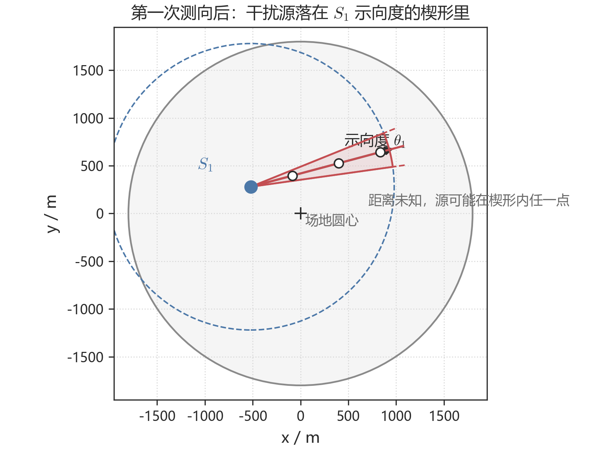
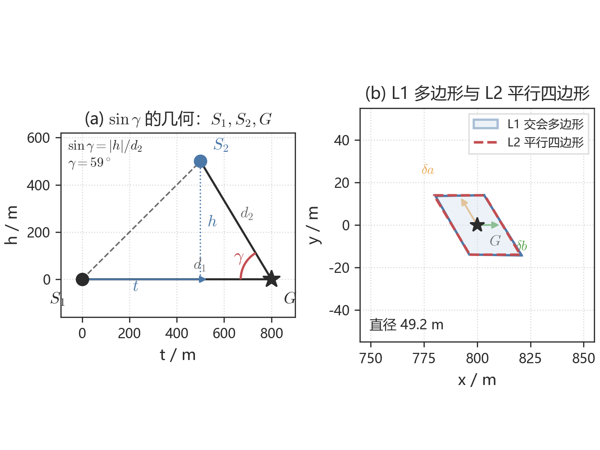
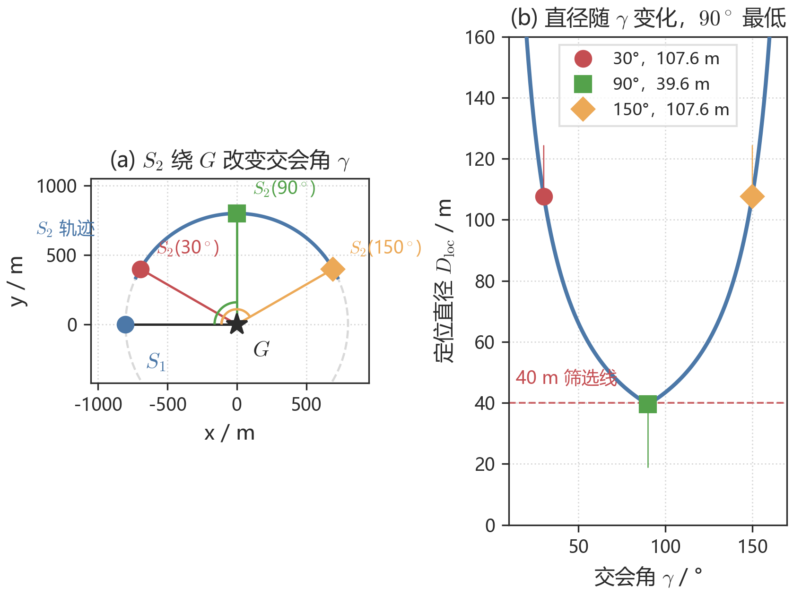
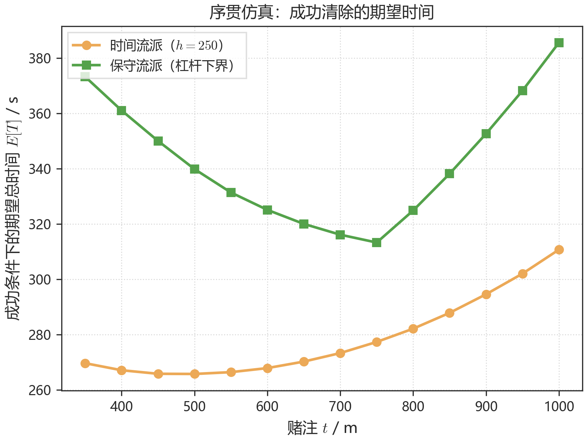

# 第二问　单点示向度下第二个检测点的候选区域与选择策略

> 2026 年高教社杯 B 题问题 2。图见 `figs/`，数值复现见附录 C。文献 [1][2] 只作交叉验证，选题依据仍是问题一的多边形直径与最小包围圆。

---

## 1　问题重述

已知某全向干扰源已在检测点 $S_1$ 测得示向度 $\theta_1$，测向误差有界 $[-1^\circ,1^\circ]$。要求：

1. 给出第二个检测点的选择策略，使对该源有较好的定位效果；
2. 给出第二个检测点的候选区域。

较好的定位，落实为：两次（必要时三次）测向后，定位区域的最小包围圆半径不超过 $20$ m，从而一次进圈即可清除；并在此前提下缩短移动与测量时间。

---

## 2　问题分析

第一次测向之后，干扰源的方位已知而距离未知，可行域收缩为以 $S_1$ 为顶点的细长楔形，见图 1。因此第二检测点不存在唯一最优坐标，而应落在由交会角约束确定的候选区域内；再根据对未知距离的假设，从该区域内选出具体测点。这就是选择策略。

交会角 $\gamma=\angle S_1GS_2$ 决定定位区域的形状。将小角度误差映成平行四边形，可写出直径关于 $\gamma$ 的闭式，从而说明 $\gamma=90^\circ$ 时定位效果最好。距离未知时，为使各种可能距离仍保持可用的交会角，第二点必须离开示向度射线足够远，候选区因此分居两侧，呈蝶形。四种假设对应四个具体点；仿真表明时间代价最低的是 $(t,h)=(500,250)$，供问题三调用。问题四因定向波束不能沿用该侧偏。两次测向仍不能把最小包围圆压进 $20$ m 时，沿当前长轴法向再设一站。

---

## 3　模型假设

| 编号 | 假设 | 依据 |
|---|---|---|
| H1 | 示向度误差有界 $[-\delta,\delta]$，$\delta=1^\circ$；同点重复测量不变 | 题面附录 2 |
| H2 | $R\in[1000,1500]$ m，未知但对该源固定 | 题面附录 2 |
| H3 | 干扰源全向，接收只取决于距离 | 问题 2 设定 |
| H4 | 直线移动、$5$ m/s；单次测量 $5$ s；距源 $\le 20$ m 时清除必成功 | 题面附录 2 |
| H5 | 一阶平行四边形用于写出闭式；最终判定仍用问题一的多边形与最小包围圆 | 近场 $d\lesssim 20$ m 已进入清除作用域 |
| H6 | 仅先验版采用：$G$ 在圆域 $\cap$ 楔形内按面积均匀 | 题目未给先验，涉及概率的结论须声明 |
| H7 | 达到最大测量次数后若仍 $R_{\mathrm{MEC}}>20$，记为未完成，不进入平均清除时间 | 建模设定 |
| H8 | 两步成功指交会区域最小包围圆半径 $\le 20$ m | 与光学清除作用域衔接 |

---

## 4　符号说明

| 符号 | 含义 |
|---|---|
| $S_1,\ S_2$ | 第一、第二检测点；$S_2$ 为决策变量 |
| $\theta_1$ | 在 $S_1$ 处测得的示向度 |
| $G,\ D$ | 干扰源位置；$D=\|G-S_1\|$ |
| $d_i=\|G-S_i\|$ | 测点到源的距离 |
| $\gamma$ | 交会角 $\angle S_1GS_2$ |
| $\delta=1^\circ$ | 误差半宽 |
| $t,\ h$ | 第二点局部坐标：沿示向度的赌注，垂直于示向度的侧偏 |
| $D_{\mathrm{loc}}$ | 定位区域直径 |
| $K$ | 两步成功常数，$K=40/(2\tan 1^\circ)\approx 1146$ m |
| $W,\ \mathcal{C}$ | 干扰源候选集；第二检测点候选区域 |
| $\rho$ | 救援测点相对当前最小包围圆圆心的偏移 |
| $E[T]$ | 单目标定位清除总时间的期望 |

---

## 5　模型建立

### 5.1　距离未知：源在楔形里，第二点在候选区里

在 $S_1$ 处获得示向度，意味着

$$
G\in W=\{\theta_1-\delta\le\arg(G-S_1)\le\theta_1+\delta\}\cap\{5<\|G-S_1\|\le 1500\}\cap\{\|G\|\le 1800\}.
$$

这是一条细长方向条。$1500$ m 处真实半宽约 $26$ m。未知量只是标量 $D=\|G-S_1\|$。图 1 标出了 $S_1$ 和示向度：空心圆表示源可能落在楔形内任意远处。

**图 1**　$S_1$ 与示向度 $\theta_1$。真实张角仅 $\pm 1^\circ$，图中放大至 $\pm 7^\circ$ 以便观察。空心圆表示距离未知。

以 $S_1$ 为原点、测得的示向度方向为极轴，第二点写成

$$
S_2=S_1+t\,\mathbf{e}_\theta+h\,\mathbf{e}_\theta^{\perp}.
$$

$t$ 是对未知 $D$ 的纵向猜测，$h$ 是侧偏。沿示向度前进（$h=0$）两次测量共线，交会区域无界，所以第二点必须带非零侧偏。在 $S_2$ 处有信号则与新楔形求交；无信号只能推出 $\|G-S_2\|>1000$；过近则直接清除。

### 5.2　交会角：$\sin\gamma$ 由侧偏决定

记 $\varepsilon$ 为真实方向相对测得轴的偏角。$\varepsilon=0$ 时，图 2(a) 的直角关系给出

$$
\sin\gamma=\frac{\lvert h\rvert}{d_2}.
$$

一般情形 $\sin\gamma=\lvert h\cos\varepsilon-t\sin\varepsilon\rvert/d_2$。侧偏越大、第二点越靠近源，交会角越接近直角；沿射线走则 $\gamma\to 0^\circ$ 或 $180^\circ$。这就是“第二点必须离开示向度”的定量形式。

**图 2**　(a) 同一组 $S_1,S_2,G$：赌注 $t$、侧偏 $h$ 与交会角 $\gamma$；(b) 小角度误差方块映成的平行四边形（虚线）几乎重合于问题一的交会多边形（实线），直径闭式由此写出。

### 5.3　直径闭式，以及为什么 $90^\circ$ 最好

精确的定位区域仍是问题一的凸多边形，直径取顶点对最大值，用作最终判定。设计阶段需要一个能直接看出 $(t,h,D)$ 如何影响直径的公式。两次测向的雅可比第 $i$ 行是视线法向除以 $d_i$。把误差方块 $[-\delta,\delta]^2$ 经 $J^{-1}$ 映过去，得到以 $\pm\delta a\pm\delta b$ 为顶点的平行四边形，见图 2(b)。两条对角线长 $2\delta\|a\pm b\|$，直径取较长者：

$$
D_{\mathrm{loc}}=2\delta\max\bigl(\|a+b\|,\|a-b\|\bigr)=2\delta\sqrt{\frac{d_1^2+d_2^2+2d_1 d_2\lvert\cos\gamma\rvert}{\sin^2\gamma}}.
$$

分子在 $\gamma=90^\circ$ 时最小，分母 $\sin\gamma$ 在此时最大，因此等距条件下直角交会直径最短；共线时公式发散。数值上，该闭式相对多边形直径的误差不超过 $0.43\%$。对本问的平行四边形，最小包围圆半径等于直径之半，故设计阶段可用直径 $\le 40$ m 代替半径 $\le 20$ m；程序终判仍逐例计算最小包围圆。

图 3 把闭式画成几何：左边 $S_1$ 固定、$S_2$ 绕 $G$ 走一圈改变 $\gamma$，右边是同一过程的直径曲线。$90^\circ$ 时直径 $39.6$ m，刚进入 $40$ m 筛选线；$30^\circ$ 与 $150^\circ$ 被拉到约 $108$ m。

**图 3**　$d_1=d_2=800$ m。(a) $S_1$、$G$ 固定，$S_2$ 沿圆周改变 $\gamma$，标出 $30^\circ$、$90^\circ$、$150^\circ$；(b) 对应的直径曲线，$90^\circ$ 最低。

由此还有一条硬界：固定 $D$ 时，无论怎样放 $S_2$，都有 $\inf D_{\mathrm{loc}}=2\delta D$。因此两步成功的必要条件是 $D\le D^*=20/\tan 1^\circ\approx 1146$ m。更远的源两次测向不可能压进 $20$ m，必须准备第三次测量。

### 5.4　候选区域是示向度两侧的蝶形

距离 $D$ 未知，不能只对某一个 $D$ 去摆 $90^\circ$。要求对全体候选 $D$，交会角仍不太差（取 $\sin\gamma\ge 1/2$，即 $\gamma\in[30^\circ,150^\circ]$），整理得到**杠杆条件**

$$
\lvert h\rvert\ge\frac{s_{\min}}{\sqrt{1-s_{\min}^2}}\max\bigl(\lvert D_{\mathrm{far}}-t\rvert,\lvert t-D_{\mathrm{near}}\rvert\bigr).
$$

几何含义：侧偏必须与距离失配同量级。$D_{\mathrm{far}}=1500$ m、$s_{\min}=0.5$ 时，$h\ge 432$ m 且 $t\in[634,871]$ m。再叠加上节的直径 $\le 40$ m（K-条件）、接收约束和目标圆域，第二点的候选区域为

$$
\mathcal{C}=\bigl\{(t,h):\ \text{K-条件}\ \wedge\ \text{杠杆条件}\ \wedge\ \text{接收约束}\ \wedge\ \|S_2\|\le 1800\bigr\}.
$$

杠杆条件在示向度两侧各给出一条斜带，这就是蝶形。图 4 画在场地坐标系里，并标出 $S_1$ 与示向度，否则看不出蝶形落在楔形的哪一侧。空心标记是关于示向度的对称点：最优解是一个等价类，所以题面问的是区域而不是一个点。

**图 4**　与图 1 同一组 $S_1$、示向度。浅色带为杠杆条件给出的两侧翼；四个实心点是四种策略在上侧的选点，空心点为对称点。时间流派 $(500,250)$ 落在探距带外。

### 5.5　四种假设，四种选点

候选区只说明第二点“可以落在哪里”。落到哪一个具体点，取决于对未知 $D$ 的假设：

**表 1**　第二检测点的四种设计（$E[T]$ 仅对成功样本）

| 流派 | 准则（假设） | 最优赌注 $(t,h)$ | 两步成功区间 | $E[T\mid\mathrm{成功}]$ |
|---|---|---|---|---|
| minimax | 无先验，最坏 $D$ 仍要能两步成功 | $(550,498)$ | $[5,732]$ | $320\pm 1$ s |
| 概率最优 | 面积均匀先验下两步成功概率最大 | $(675,476)$ | $[244,815]$ | $320\pm 1$ s |
| 保守 | 杠杆加硬接收下期望时间最小 | $(750,450)$ | $[389,867]$ | $319\pm 1$ s |
| **时间流派（实战）** | 不强制杠杆，只最小化期望时间 | **$(500,250)$** | $[78,680]$ | **$270\pm 3$ s** |

不存在唯一推荐点。minimax 点 $(550,498)$ 对任意 $D\in[5,734]$、任意误差组合，最小包围圆半径都不超过 $20$ m（最坏 $19.93$ m）。时间点 $(500,250)$ 路更短，对远端不保证两步成功，依赖下一节的补测。图 6 的仿真表明，计入补测之后时间流派仍最低，问题三采用该点。问题四的定向波束要求下一站留在已点亮的半平面内，改用小侧偏，不再沿用 $(500,250)$。

### 5.6　两次不够时沿长轴再切一刀

每个测点沿视线法向把区域压到约 $2\delta d_i$ 宽。若两次交会后最小包围圆仍大于 $20$ m，新测点取当前区域长轴的法向、朝来路一侧：

$$
S_{\mathrm{new}}=C+\rho\,\hat n,\qquad \rho=\max(50,\ 0.5L),
$$

$C$ 为当前最小包围圆圆心，$L$ 为长轴长度。图 5(a) 给出 $D=1500$ m 时 $S_1$、$S_2$、示向度与交会区的全局位置；(b) 是虚线框的放大：两次后直径 $164.5$ m，按 $\rho\approx 82$ m 再测一次后直径 $33.1$ m、半径 $16.5$ m，落入 $20$ m 清除圆。

**图 5**　$D=1500$ m，第二点 $(700,462)$。(a) 全局：$S_1$、$S_2$、示向度 $\theta_1$ 与交会区，紫框为 (b) 的范围，$S_{\mathrm{new}}$ 在长轴法向；(b) 蓝色虚线为两次后的细长区域，第三次后落入清除圆。

单目标时间 $T=\sum\|S_{k+1}-S_k\|/5+5n_{\mathrm{meas}}+5$。仅当最终半径 $\le 20$ m 时计入平均；否则记未完成。

---

## 6　模型求解与主要结果

图 6 是面积先验下、成功样本的期望时间。时间流派谷底在 $t=500$ m，$h=250$ m，约 $270$ s；杠杆加硬接收约 $319$ s。四流派在所扫描网格上最终都能压进 $20$ m，成功概率为 $1$，排序不变。差距主要来自前期少走的路，而不是两步失败的惩罚。各设计期望测量次数都在 $2.7$–$2.9$。

**图 6**　面积先验 $f_D\propto D$，自适应 $\rho=0.5L$，仅当最小包围圆半径不超过 $20$ m 才计时。时间流派谷底在 $t=500$ m，用于问题三。

主要核对：闭式对多边形相对误差 $\le 0.43\%$；$D^*$ 边界在 $1146$ m；$(550,498)$ 全误差组合最坏半径 $19.93$ m；$\kappa=\mathrm{MEC}/(D/2)$ 在 $2760$ 样本上恒为 $1$；误差蒙特卡洛下各流派期望时间变化不超过 $1.5\%$。

问题 3 的单目标子程序：取时间赌注 $(500,250)$（需要硬保证则改 $(550,498)$）；有示向度则按问题一计算多边形，半径不超过 $20$ m 则进圈，否则按 $\rho=\max(50,0.5L)$ 切割；无信号则在剩余候选上重新选点；过近则直接清除。

---

## 7　灵敏度

两步成功上界随距离先验 $f_D\propto d^\alpha$ 在 $18.8\%$–$90.3\%$ 之间变化，最优赌注在 $550$–$850$ m 之间移动。凡涉及概率的数字均冠以先验。误差蒙特卡洛中各流派 $E[T]$ 变化不超过 $3$ s。$\rho$ 的比例系数在 $[0.3,0.5]$ 内变动时，$E[T]$ 变化小于 $5\%$。

---

## 8　模型评价

建模主线是：第一次测向后源落在楔形里；第二点的候选区是示向度两侧的蝶形；再按假设选出一个点，两次不够就沿长轴再测。闭式用来说明 $90^\circ$ 最好，终判据回到问题一的多边形。时间赌注与硬保证赌注分开给出，问题三采用前者。

局限：$(500,250)$ 不满足杠杆条件，远端交会角偏小，安全性靠自适应救援；平均时间是成功样本上的条件期望。

---

## 9　参考文献

[1] WANG S, et al. Optimal geometry and motion coordination for multisensor target tracking with bearings-only measurements[J]. Sensors, 2023, 23(13): 4347.

[2] BISHOP A N, FIDAN B, ANDERSON B D O, et al. Optimality analysis of sensor-target localization geometries[J]. Automatica, 2010, 46(6): 1169-1177.

正文引用：5.3 节对照 [1][2] 关于交会角 $90^\circ$ 最优、测点宜近的结论。选题依据仍是多边形直径与最小包围圆。

---

## 附录 A　公式速查

| 用途 | 公式 |
|---|---|
| 交会角正弦 | $\sin\gamma=\lvert h\cos\varepsilon-t\sin\varepsilon\rvert/d_2$ |
| 定位直径 | $D_{\mathrm{loc}}=2\delta\sqrt{(d_1^2+d_2^2+2d_1 d_2\lvert\cos\gamma\rvert)/\sin^2\gamma}$ |
| 两步成功（设计） | 上式根号内 $\le K\approx 1146$ m |
| 杠杆条件 | $\lvert h\rvert\ge\dfrac{s_{\min}}{\sqrt{1-s_{\min}^2}}\max(\lvert D_{\mathrm{far}}-t\rvert,\lvert t-D_{\mathrm{near}}\rvert)$ |
| 必要距离界 | $D\le D^*=20/\tan 1^\circ\approx 1146$ m |
| 全局变换 | $S_2=(x_1+t\cos\theta_1-h\sin\theta_1,\ y_1+t\sin\theta_1+h\cos\theta_1)$ |

## 附录 B　默认参数

| 参数 | 取值 |
|---|---|
| $\delta$ | $1^\circ$ |
| $K$ | $1146$ m |
| $s_{\min}$ | $0.5$（$30^\circ$–$150^\circ$） |
| $\rho$ | $\max(50,0.5L)$ |
| 实战赌注 | $(500,250)$；硬保证 $(550,498)$ |

## 附录 C　复现脚本与图

| 文件 | 内容 |
|---|---|
| `q2/geometry.py` | 楔形、直径、最小包围圆、闭式、单目标仿真 |
| `q2/figure_story.py` | 图 1–5 |
| `q2/design_chart.py` | 图 6 |
| `q2/figs/fig_q2_wedge.png` | 图 1　楔形（$S_1$、示向度） |
| `q2/figs/fig_q2_geom.png` | 图 2　$\sin\gamma$ 与平行四边形 |
| `q2/figs/fig_q2_gamma.png` | 图 3　$S_2$ 轨迹与直径曲线 |
| `q2/figs/fig_q2_candidate.png` | 图 4　蝶形候选区 |
| `q2/figs/fig_q2_rescue.png` | 图 5　长轴切割 |
| `q2/figs/fig_q2_et.png` | 图 6　$E[T]$ |
