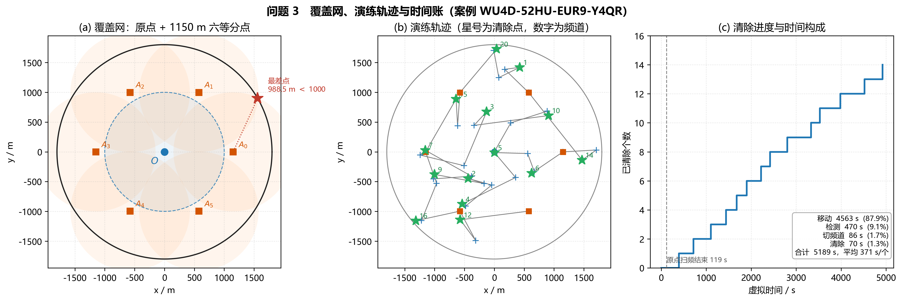

# 第三问　全向干扰源的搜索、交会定位与清除

> 问题 3 的机器狗程序：`python q3/run_q3.py`。几何复用第一问半平面交会、第二问第二检测点与长轴切割。演练日志见 `q3/logs/`。

---

## 1　问题重述

目标区域是半径 $1800$ m 的圆盘，圆心为原点。圆内有 $10$–$16$ 个**全向**干扰源，分别占用频道 $1$–$20$ 中的若干个，每频道至多一个源。有效接收半径 $R\in[1000,1500]$ m，各源不同且接口不返回。机器狗从 $(0,0)$、频道 $1$ 出发，用 `/measure` 测向、`/clear` 在 $20$ m 内清除。要求在虚拟时间与 $20$ 分钟现实时限内，尽可能提高清除比例、缩短平均定位清除时间。

## 2　问题分析

全向条件下，`no_signal` 只有两种可能：该频道没有未清除源，或检测点超出该源的 $R$。因此只要一组监听点能用半径 $1000$ m（$R$ 的下界）盖住整个 $1800$ m 圆盘，某个频道在**所有**监听点都无信号，即可判定该频道为空。这把“未知总数”变成了覆盖论证，不必猜测还剩几个源。

听到示向度之后，定位与清除与问题 1、2 相同：误差锥交会得到凸多边形 $P$，最小覆盖圆半径 $\le 20$ m 即可 `/clear`。第二检测点用第二问的时间赌注 $(t,h)=(500,250)$；两步不够则按长轴再切一刀。

真正要新做的只有三件事：覆盖网、扫频与追击的分工、频道账本。

## 3　模型假设

| 编号 | 假设 | 依据 |
|---|---|---|
| H1 | 测向误差有界 $\pm 1^\circ$，同点重复测量不变 | 题面 |
| H2 | 全向源、接收只取决于距离；$R\in[1000,1500]$ | 问题 3 |
| H3 | 本问定位区域仍是角度交会多边形，不把 $1800$ m 圆域切进 $P$；圆域只约束搜索范围 | 与第一问 H6 一致 |
| H4 | 第二点采用时间流派赌注 $(500,250)$，救援用 $\rho=\max(50,0.5L)$ 的长轴切割 | 第二问表 1、实验 3 |
| H5 | 覆盖判定用最坏接收半径 $1000$ m；间隙小于 $1000$ 则无信号可判空 | $R$ 下界 |

## 4　覆盖网

监听点取原点加半径 $1150$ m 圆周上均匀 $6$ 点（夹角 $60^\circ$），见图 1(a)。用半径 $1000$ m 的接收圆盘覆盖半径 $1800$ m 的目标圆域：原点管住 $\|X\|\le 1000$；环上最差点出现在外缘角平分线。设环半径为 $r$，该点到最近环站的距离满足

$$
d(r)^2=1800^2+r^2-2\cdot 1800\cdot r\cdot\cos 30^\circ.
$$

令 $d(r)=1000$，较小正根 $r^*\approx 1123$ m，再小则外缘会破 $1000$ m。取 $r=1150$ m 留出约 $27$ m 余量，此时

$$
d(1150)=\sqrt{1800^{2}+1150^{2}-2\cdot 1800\cdot 1150\cdot\cos 30^{\circ}}\approx 988.5\text{ m}<1000\text{ m}.
$$

网格核验与上式一致。径向：边界点到正对环站为 $1800-1150=650$ m。因此某频道在这 $7$ 个点都返回 `no_signal`，该频道没有未清除的全向源。

## 5　算法

### 5.1　频道状态

每个频道独立：`unknown → heard → cleared`，或 `unknown → empty`。

### 5.2　三阶段

1. **原点扫频。** 不移动，频道 $1$ 到 $20$ 各测一次。虚拟耗时 $20\times 5+19\times 1=119$ s。听到的源满足 $\|G\|\le R\le 1500$。`near` 则就地清除。
2. **追击已听频道。** 按示向度排序，减少第二点之间的空驶。对每个源：从听测点走第二问赌注点再测；两锥交会后算 MEC；$>20$ m 则在长轴法向再下一站；$\le 20$ m 则到圆心 `/clear`。原点已听到时，$(500,250)$ 相对源的距离不超过 $R$（源刚好处在接收边缘时仍听得到第二点）。
3. **环网补漏。** 按当前点最近的环站起绕一圈。每点先把剩余频道扫完再搬家（切频道 $1$ s，搬家动辄一两百秒）。听到就插入追击；七点都无信号则标 `empty`。

停机：已清除数达到 $16$（题面源数上界），或二十个频道都是 `cleared` 或 `empty`，然后 `/exit`。

### 5.3　与第一、二问的衔接

- 交会、直径、退化：直接调用 `q1/solver.py` 的 `locate`。
- MEC 与长轴：调用 `q2/geometry.py`。
- 清除半径 $20$ m 对应第二问的两步成功判据（MEC $\le 20$）。

虚拟 $5$ s 检测不在现实中等待；程序只受 `/enter` 返回的 `remaining_real_duration_s` 约束。

## 6　演练与对照

**图 1**　(a) 原点加 $1150$ m 六等分点，$1000$ m 接收圆盘盖住 $1800$ m 目标圆域，最差点 $988.5$ m；(b) 官方演练轨迹，星号为清除点、数字为频道；(c) 清除进度。该局移动占虚拟时间 $87.9\%$。

一局问题 3 官方演练（案例 `WU4D-52HU-EUR9-Y4QR`）：

| 量 | 结果 |
|---|---|
| 原点听到并清除 | 频道 $2,3,4,5,6,7,9,10$（$8$ 个） |
| 环网听到并清除 | 频道 $1,12,14,15,16,20$（$6$ 个） |
| 覆盖后判空 | 频道 $8,11,13,17,18,19$（$6$ 个） |
| 清除数 / 失败 / 剩余 | $14$ / $0$ / $0$ |
| 虚拟时间 | $5189$ s（平均 $371$ s/个） |
| 时间构成 | 移动 $4563$ s（$87.9\%$），检测 $470$ s，切频道 $86$ s，清除 $70$ s |
| 程序墙钟 | $2.8$ s |

$14$ 个源落在题面 $10$–$16$ 的范围内，空频道与占用频道合计 $20$，账本闭合。多数源两次测量即可清；较远的源第三次长轴切割后 MEC 降到 $10$ m 量级。

同一套程序按附件规则在本地随机生成全向源（$n\sim U\{10,\ldots,16\}$，$R\sim U[1000,1500]$，示向度误差 $U[-1^\circ,1^\circ]$）跑了 $24$ 局，见图 2：**24/24 全清**，平均定位清除时间均值 $399$ s（$10\%$–$90\%$ 分位 $354$–$459$ s），与官方该局 $371$ s 同量级。

**图 2**　本地对照直方图。红虚线为官方演练 $371$ s/个，黑实线为 $24$ 局均值 $399$ s/个。

## 7　小结

1. 用 $1000$ m 覆盖论证把“未知总数”变成有限监听网；原点加 $1150$ m 六等分点的最坏间隙 $988.5$ m。
2. 扫频与追击分开：先在一点扫完再搬家，先听完原点再按方位追；清满 $16$ 个可提前结束环网。
3. 定位清除不重写：第一问交会 + 第二问赌注与长轴切割，MEC $\le 20$ m 即清。
4. 程序入口 `python q3/run_q3.py`，正式测试时把 `ROBOT_ID` 设为参赛队号即可。

---

## 附录　程序与图

| 文件 | 内容 |
|---|---|
| `q3/run_q3.py` | 机器狗：原点扫频、追击、环网补漏 |
| `q3/figure_q3.py` | 图 1、图 2 |
| `q3/mc_study.py`、`q3/local_world.py` | 本地 $24$ 局对照 |
| `q3/figs/fig_q3_overview.png` | 图 1　覆盖网、轨迹、时间账 |
| `q3/figs/fig_q3_mc.png` | 图 2　本地平均时间直方图 |
