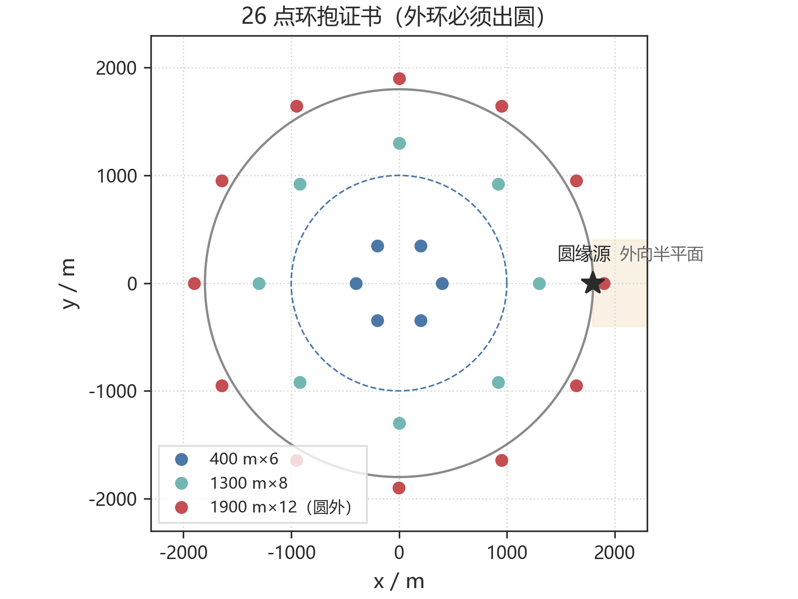
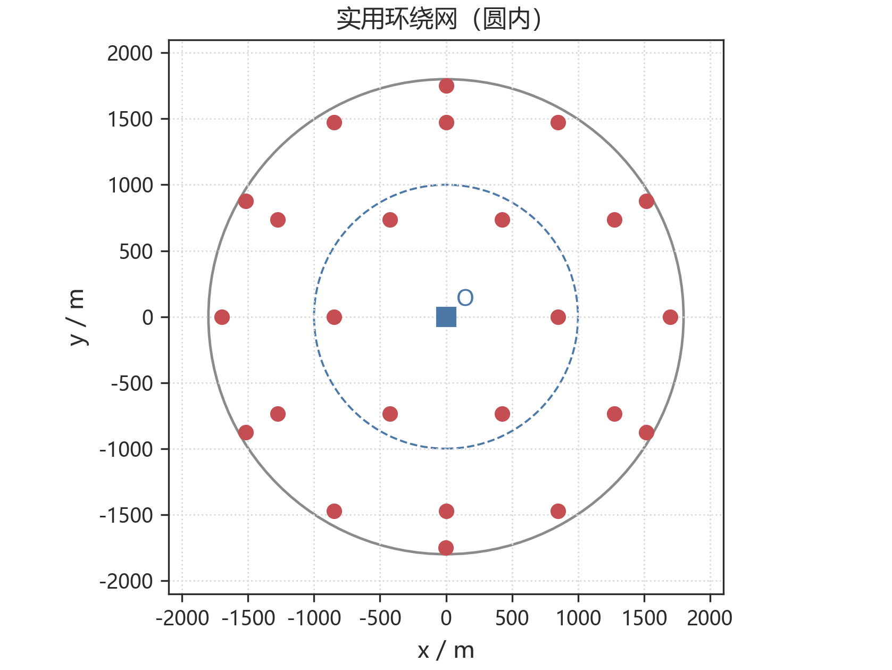
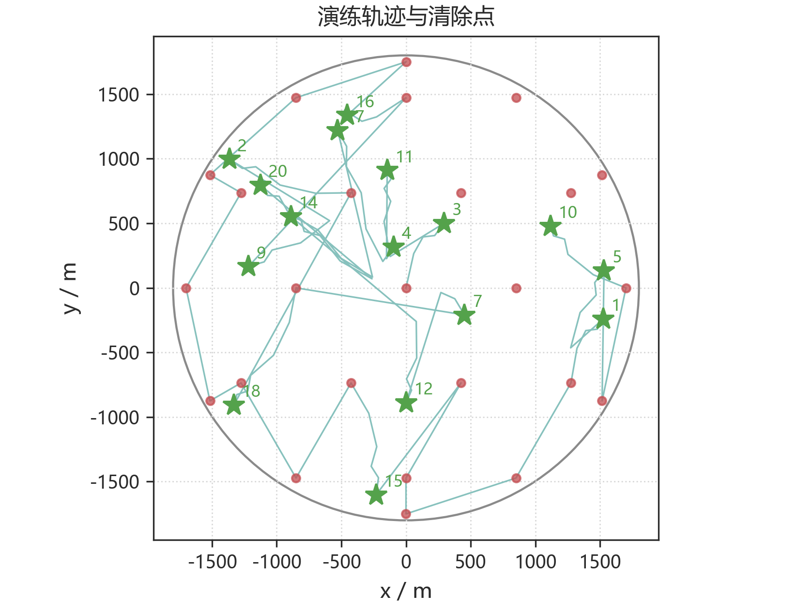
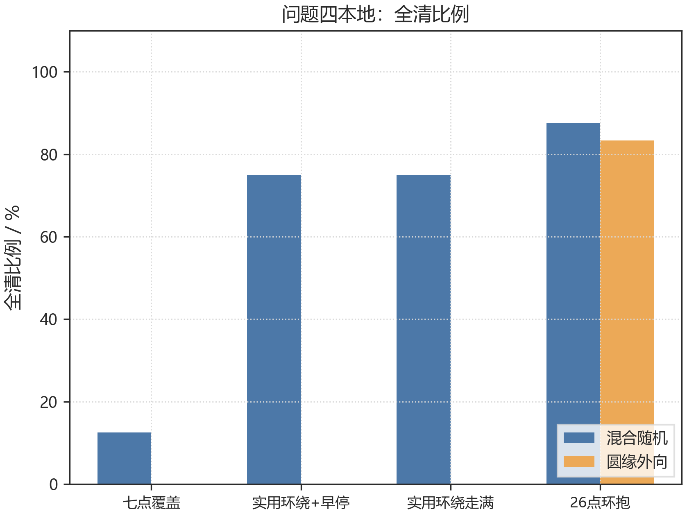

# 第四问　全向与定向混合干扰源的搜索、交会定位与清除

> 问题 4 的机器狗程序：`python q4/run_q4.py`（默认 $26$ 点环抱证书）。交会仍调用第一问 `locate`，最小包围圆调用第二问 `mec`。演练日志见 `q4/logs/`。

---

## 1　问题重述

目标圆域、机器狗运动与测向规则与问题 3 相同。圆内仍有 $10$–$16$ 个干扰源，占用频道 $1$–$20$ 中的若干个，每频道至多一个。不同的是：源分成全向与定向两类，定向源的个数和定向方向事先都不知道。定向源只在定向方向两侧各 $90^\circ$ 内辐射，也就是一张角 $180^\circ$ 的闭半平面；检测点一旦落到背向阴影里，即使距离很近也会返回无信号。

其它条件不变：有效接收半径 $R\in[1000,1500]$ m 且不返回；测向误差有界 $\pm 1^\circ$；走到距源 $\le 20$ m 即可 `/clear`。硬约束是清除比例 $100\%$，并在此前提下缩短平均定位清除时间。

## 2　问题分析

问题三把无信号读成“该点 $1000$ m 内没有尚未清除的全向源”，所以七点覆盖网就能判空。定向源把这句话作废了：无信号还可以是“源在附近，但波束朝另一边”。单个阴性观测几乎不携带位置信息，问题三的圆盘覆盖因此不再构成判空证书。

要把任意朝向的定向源找出来，监听点不能只满足距离覆盖，还要在各个方向上把候选位置围住。对圆域内任意点 $G$，看所有满足 $\|S_i-G\|\le 1000$ 的探针：若它们绕 $G$ 的最大方位间隙不超过 $180^\circ$，则任意 $180^\circ$ 闭半平面里至少有一个探针，于是无论朝向如何都能被听到。全向源是其特例。

源贴在 $r=1800$ m 且指向圆外时，可检半平面与目标圆域几乎不相交。任何纯圆内探针集合对此类源的最大间隙为 $360^\circ$，故证书必须包含圆外停点。题面允许检测坐标超出 $1800$ m 圆域。

一旦听到示向度，定位几何与问题一、二相同。第二检测点却不能再沿用 $(500,250)$：侧偏过大、纵向过长，容易沿着示向度走过源点，掉进背向阴影。本问把第二点收到已点亮的一侧，侧偏收小。

## 3　模型假设

| 编号 | 假设 | 依据 |
|---|---|---|
| H1 | 测向误差有界 $\pm 1^\circ$，同点重复测量不变 | 题面 |
| H2 | 定向源可检区域是以源为顶点、张角 $180^\circ$ 的闭半平面，与距离圆盘的交；朝向固定但未知 | 题面：两侧各 $90^\circ$ |
| H3 | 检测点 $S$ 收到定向源 $G$（指向 $\mathbf{u}$）当且仅当 $\|S-G\|\le R$ 且 $(S-G)\cdot\mathbf{u}\ge 0$ | 半平面含边界 |
| H4 | 定位区域仍是示向度误差锥的交会多边形，不把目标圆域切进 $P$ | 与第一问一致 |
| H5 | 第二检测点取小侧偏、少越过源，优先留在已听到的那一侧半平面里 | 避免阴影失联 |
| H6 | 清除只看距离 $\le 20$ m，与源朝向无关 | 题面光学清除 |
| H7 | 检测点允许在圆域外；环抱证书的外环取 $1900$ m | 题面坐标范围 |
| H8 | 清满 $16$ 个后剩余频道按题面源数上界判空 | 题面源数上界 |

## 4　符号说明

| 符号 | 含义 |
|---|---|
| $G$ | 圆域内候选源位置 |
| $\mathcal{N}(G)$ | $\|S_i-G\|\le 1000$ 的探针集合 |
| $\mathrm{maxgap}(G)$ | $\mathcal{N}(G)$ 绕 $G$ 的最大方位间隙 |
| $\mathcal{S}$ | $26$ 点证书骨架 $\mathrm{ring}(400,6)\cup\mathrm{ring}(1300,8)\cup\mathrm{ring}(1900,12)$ |
| $R_{\mathrm{MEC}}$ | 交会区域最小包围圆半径 |

## 5　环抱证书

### 5.1　判据

频道为空，当且仅当对目标圆域内任意 $G$，

$$
\max_{G\in\mathrm{disk}(1800)}\ \mathrm{maxgap}\bigl(\mathcal{N}(G)\bigr)\le 180^\circ.
$$

充分性：最大间隙不超过 $180^\circ$ 时，任意闭半平面与 $\mathcal{N}(G)$ 的交非空，故任意朝向的定向源必被检出；全向源自然包含。必要性：若某 $G$ 的最大间隙大于 $180^\circ$，取定向方向背对那条空隙，则全部探针都在盲侧，可能漏检。

原点落在某探针上时，该点对任意朝向都可检（方向向量为零，落在闭半平面边界上）。网格核验时需把这种退化与圆缘外向的真正空隙分开。

### 5.2　圆外停点是必要的

源在 $G=(1800,0)$、朝向 $\mathbf{u}=(1,0)$ 时，可检半平面为 $x\ge 1800$，与圆域的交几乎只剩下 $G$ 自身。圆内探针对此源的 $\mathrm{maxgap}=360^\circ$。因此，只用问题三的七点网，或把外圈停在 $1750$ m 的圆内实用网，都不能给出完整保证。

### 5.3　$26$ 点骨架

取

$$
\mathcal{S}=\mathrm{ring}(400,6)\cup\mathrm{ring}(1300,8)\cup\mathrm{ring}(1900,12),
$$

共 $26$ 点，见图 1。外环 $1900$ m 在圆域之外，用来照亮圆缘外向源。在半径方向 $19$ 层、每层至多 $96$ 个方位的 $1825$ 个网格点上核验：$\mathcal{S}$ 的最坏 $\mathrm{maxgap}$ 恰为 $180.0^\circ$，全部通过；圆缘点 $(1800,0)$ 处为 $99.2^\circ$。对照见表 1。

**表 1**　网格上的最大方位间隙（$R=1000$ m）

| 探针网 | 点数 | 最坏 $\mathrm{maxgap}$ | 圆缘 $(1800,0)$ | 未通过格点数 |
|---|---|---|---|---|
| 问题三七点覆盖 | $7$ | $360^\circ$ | $360^\circ$ | $1069/1825$ |
| 圆内实用环绕 | $25$ | $239.6^\circ$ | $216.0^\circ$ | $174/1825$ |
| $26$ 点环抱证书 | $26$ | $180.0^\circ$ | $99.2^\circ$ | $0/1825$ |

圆内 $25$ 点网在内部大致满足环绕，失败格点集中在外缘带。它可以作为缩短巡线的实用方案，但**不是**处处可证的包围证书。

**图 1**　内环 $400$ m、中环 $1300$ m、外环 $1900$ m。阴影表示圆缘源的外向半平面，圆内探针落不进去。

## 6　算法

### 6.1　频道账本

每个频道仍是 `unknown → heard → cleared`。采用环抱网时，若某频道在 $26$ 个证书点上都无信号，即可标为 `empty`。清满 $16$ 个时，剩余频道按题面上界判空。圆内实用网没有这一证书，不能凭全网无信号判空。

### 6.2　原点扫频后合并巡回

先在原点扫频道 $1$–$20$（虚拟 $119$ s），再按最近邻把证书点排成一条巡线。每到一点，先把尚未结束的频道扫完，再对刚听到的频道就近追击，然后搬家。清满 $16$ 个就停网。这样把侦察与清除并在同一条路上，避免先走完全部探针再回头。

### 6.3　定向友好的第二点

第一站 $S_1$ 测到示向度 $\theta_1$ 之后，第二点仍写成 $S_2=S_1+t\mathbf{e}_\theta+h\mathbf{e}_\theta^{\perp}$，但 $(t,h)$ 改用

$$
(260,\pm 80),\ (160,\pm 55),\ (360,\pm 45),\ \ldots
$$

优先离机器狗更近、且留在已点亮一侧的那一个。沿示向度推进时步长随交会区缩小；若下一点无信号，说明走过了源或掉进背向，在「最近一次有效测站→失联点」的线段上搜索清除，不再对远处的无信号一律 `/clear`，也不在两个阴影点之间打转。交会后最小包围圆半径 $\le 20$ m 则到圆心清除。整张网走完仍未清掉、且已经有过示向度，才沿示向度做折线 `/clear`。

## 7　演练与对照

### 7.1　官方模拟器

早期演练采用圆内实用环绕（七点覆盖后再走 $1750$ m 外圈，连续空转则早停）。官方 $8$ 局清除数与模拟器回写的源数一致，失败为 $0$，见表 2。局 1 清满 $16$ 个后提前停网，平均 $541$ s/个；源较少的局仍把网走完，空频道扫频把平均时间抬到 $1000$ s 量级。这是“不能判空就不敢停”的代价。这些案例没有暴露圆缘外向源，**不能**外推成任意朝向都保证发现。

**图 2**　$850$ m 六角格加 $1750$ m 外圈。外圈仍在圆内，对圆缘外向源不是证书。

**图 3**　官方局 1 轨迹，星号为清除点。

**表 2**　问题 4 官方模拟器演练（实用环绕网）

| 局次 | 案例 | 源数（全向/定向） | 清除 | 失败 | 剩余频道 | 虚拟时间 (s) | 平均 (s/个) | 墙钟 (s) |
|---|---|---|---|---|---|---|---|---|
| 1 | `BQVK-CMS4-C6AB-STKE` | $16$（$10/6$） | $16$ | $0$ | $0$ | $8661$ | $541$ | $6.0$ |
| 2 | `HNMA-FQRN-CS87-DMKW` | $10$（$8/2$） | $10$ | $0$ | $10$ | $12994$ | $1299$ | $6.8$ |
| 3 | `K2KV-ZS6Y-3W9T-9J65` | $11$（$10/1$） | $11$ | $0$ | $9$ | $8161$ | $742$ | $3.2$ |
| 4 | `HGRX-X5P5-GBFD-Q6ET` | $12$（$8/4$） | $12$ | $0$ | $8$ | $8653$ | $721$ | $3.8$ |
| 5 | `K8BU-RQEJ-GRVG-FYRH` | $11$（$10/1$） | $11$ | $0$ | $9$ | $8058$ | $733$ | $3.3$ |
| 6 | `FEMW-7NES-HNHA-C4FV` | $11$（$10/1$） | $11$ | $0$ | $9$ | $7242$ | $658$ | $4.1$ |
| 7 | `SDVM-J45S-3892-ZCUT` | $12$（$8/4$） | $12$ | $0$ | $8$ | $8324$ | $694$ | $3.7$ |
| 8 | `2PKZ-WTFE-WPX8-KJB5` | $11$（$6/5$） | $11$ | $0$ | $9$ | $11517$ | $1047$ | $4.9$ |

### 7.2　本地策略对照

自建混合环境（定向占比约一半）与圆缘外向应力场景（强制 $2$ 个源在 $r=1760$ m、朝向径向朝外）上，比较四种搜索网，见图 4、表 3。本地结果**不是**官方成功率。

- 七点覆盖：混合世界 $1/8$ 全清，圆缘外向 $0/6$。它只对全向源充分。
- 实用环绕（含走满）：混合世界 $6/8$ 全清，圆缘外向 $0/6$。早停能缩短时间，但不能补上外缘空隙。
- $26$ 点环抱：混合世界 $7/8$ 全清，圆缘外向 $5/6$ 全清。两例未全清的源都已经被听到（分别有 $3$ 次、$2$ 次示向度），失败发生在定向追击的末轮楔形清除，而不是证书漏检。

因此，在“确保全部清除”的硬约束下，程序默认改为环抱证书；实用环绕只作为时间对照。

**图 4**　混合随机 $8$ 局、圆缘外向 $6$ 局。环抱网是唯一能在外向应力下稳定全清的策略。

**表 3**　问题四本地策略对照

| 策略 | 混合全清 | 混合平均 (s/个) | 外向全清 | 外向平均 (s/个) |
|---|---|---|---|---|
| 七点覆盖 | $1/8$ | $409$ | $0/6$ | $455$ |
| 实用环绕+早停 | $6/8$ | $648$ | $0/6$ | $702$ |
| 实用环绕走满 | $6/8$ | $775$ | $0/6$ | $811$ |
| $26$ 点环抱（采用） | $7/8$ | $681$ | $5/6$ | $720$ |

## 8　小结

1. 定向源让无信号失去距离含义。判空改为环抱条件：探针绕候选点的最大方位间隙不超过 $180^\circ$。
2. 纯圆内停点无法照亮圆缘外向源。$26$ 点骨架把外环放到 $1900$ m，网格上最坏间隙 $180^\circ$。
3. 追击改用小侧偏，交会仍用问题一多边形和最小包围圆。个别定向源可能在末轮楔形清除中失败，这是追击缺口，不是证书失效。
4. 程序入口 `python q4/run_q4.py`；正式测试把 `ROBOT_ID` 设为参赛队号。

---

## 附录　程序与图

| 文件 | 内容 |
|---|---|
| `q4/run_q4.py` | 机器狗：环抱网 / 实用环绕、定向第二点 |
| `q4/cert_check.py` | 网格最大间隙核验 |
| `q4/compare_strats.py` | 本地四种策略对照 |
| `q4/figs/fig_q4_cert.png` | 图 1　$26$ 点证书 |
| `q4/figs/fig_q4_strat_rate.png` | 图 4　全清比例 |
